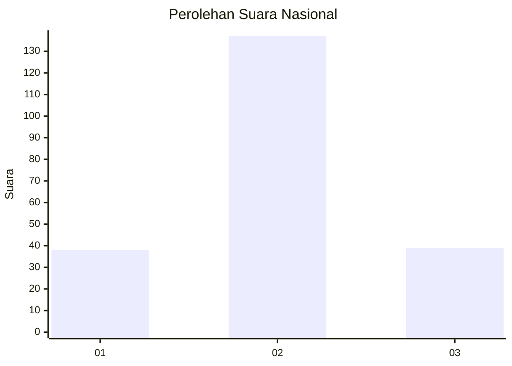
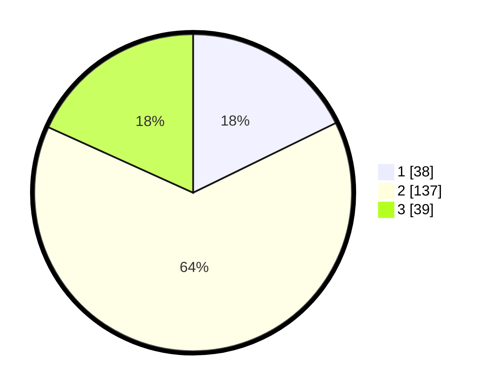

# Hasil

## Grafik

## Tabel

| No. | Nama Paslon    | Suara | Suara (raw) | Persentase |
|:--- |:-------------- | -----:| -----------:| ----------:|
| 1   | ANIES MUHAIMIN | 38    | [38][p-1]   | 17,76      |
| 2   | PRABOWO GIBRAN | 137   | [137][p-2]  | 64,02      |
| 3   | GANJAR MAHFUD  | 39    | [39][p-3]   | 18,22      |

[p-1]: https://github.com/gigit-pemilu/pemilu-2024/blob/main/pilpres/hitung-suara/sub/52-nusa-tenggara-barat/sub/04-sumbawa/sub/12-lape/sub/2003-lape/sub/002-tps/sub/paslon-1.txt
[p-2]: https://github.com/gigit-pemilu/pemilu-2024/blob/main/pilpres/hitung-suara/sub/52-nusa-tenggara-barat/sub/04-sumbawa/sub/12-lape/sub/2003-lape/sub/002-tps/sub/paslon-2.txt
[p-3]: https://github.com/gigit-pemilu/pemilu-2024/blob/main/pilpres/hitung-suara/sub/52-nusa-tenggara-barat/sub/04-sumbawa/sub/12-lape/sub/2003-lape/sub/002-tps/sub/paslon-3.txt

## Foto C Plano

https://sirekap-obj-formc.kpu.go.id/1b33/pemilu/ppwp/52/04/12/20/03/5204122003002-20240220-195447--aa6e1183-514f-4304-ab90-2e25da338c53.jpg

https://sirekap-obj-formc.kpu.go.id/1b33/pemilu/ppwp/52/04/12/20/03/5204122003002-20240220-195523--00e72f6c-5731-4653-aacc-a9f8b4e1f822.jpg

https://sirekap-obj-formc.kpu.go.id/1b33/pemilu/ppwp/52/04/12/20/03/5204122003002-20240220-195607--f8c85711-fec1-435a-9523-84b1af969fa4.jpg

## Metadata

| Key        | Value               |
| ---------- | ------------------- |
| Time Stamp | 2024-02-24 22:31:28 |

