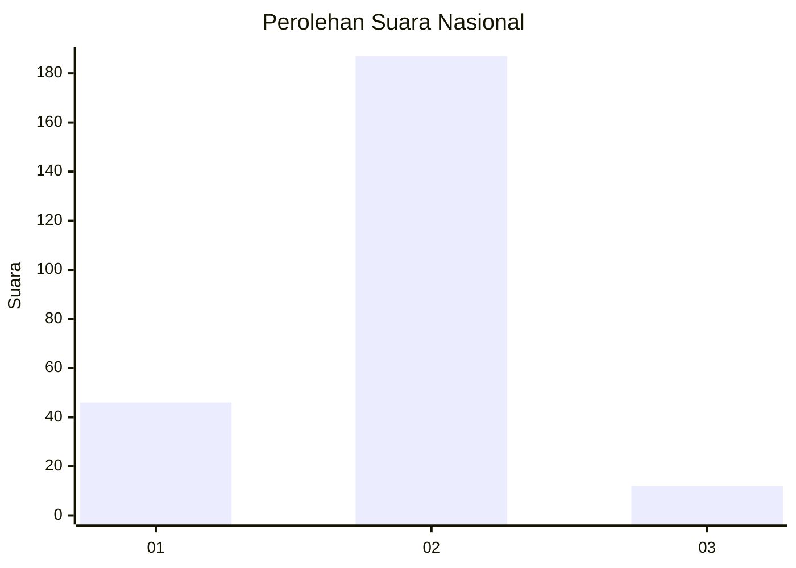
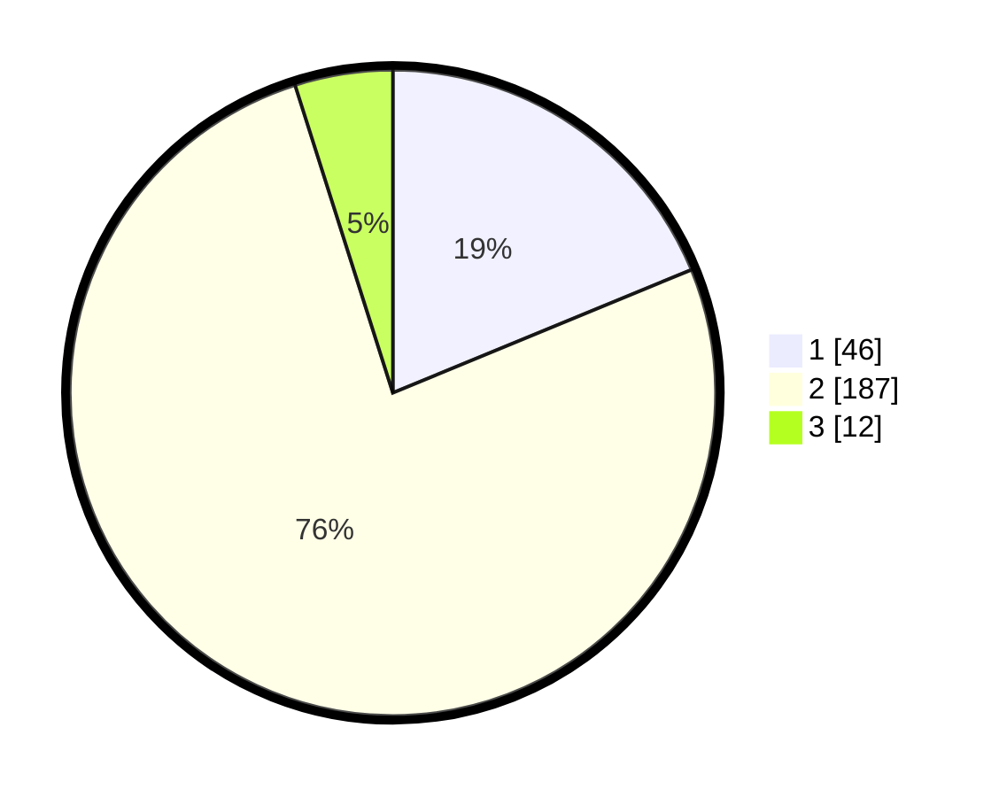

# Hasil

## Grafik

## Tabel

| No. | Nama Paslon    | Suara | Suara (raw) | Persentase |
|:--- |:-------------- | -----:| -----------:| ----------:|
| 1   | ANIES MUHAIMIN | 46    | [46][p-1]   | 18,78      |
| 2   | PRABOWO GIBRAN | 187   | [187][p-2]  | 76,33      |
| 3   | GANJAR MAHFUD  | 12    | [12][p-3]   | 4,90       |

[p-1]: https://github.com/gigit-pemilu/pemilu-2024/blob/main/pilpres/hitung-suara/sub/52-nusa-tenggara-barat/sub/04-sumbawa/sub/12-lape/sub/2005-labuhan-kuris/sub/005-tps/sub/paslon-1.txt
[p-2]: https://github.com/gigit-pemilu/pemilu-2024/blob/main/pilpres/hitung-suara/sub/52-nusa-tenggara-barat/sub/04-sumbawa/sub/12-lape/sub/2005-labuhan-kuris/sub/005-tps/sub/paslon-2.txt
[p-3]: https://github.com/gigit-pemilu/pemilu-2024/blob/main/pilpres/hitung-suara/sub/52-nusa-tenggara-barat/sub/04-sumbawa/sub/12-lape/sub/2005-labuhan-kuris/sub/005-tps/sub/paslon-3.txt

## Foto C Plano

https://sirekap-obj-formc.kpu.go.id/71b5/pemilu/ppwp/52/04/12/20/05/5204122005005-20240214-220418--6b0c6f7b-e980-4de9-9082-5b95dd915a37.jpg

https://sirekap-obj-formc.kpu.go.id/71b5/pemilu/ppwp/52/04/12/20/05/5204122005005-20240214-220600--c945cc96-3e35-47fb-b0d0-de33f2417414.jpg

https://sirekap-obj-formc.kpu.go.id/71b5/pemilu/ppwp/52/04/12/20/05/5204122005005-20240214-220644--1c445b8c-9f7a-442f-99bf-152c47e89a02.jpg

## Metadata

| Key        | Value               |
| ---------- | ------------------- |
| Time Stamp | 2024-02-15 17:30:25 |

