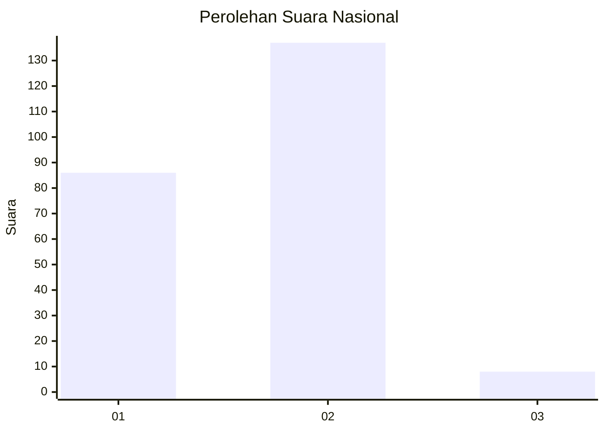
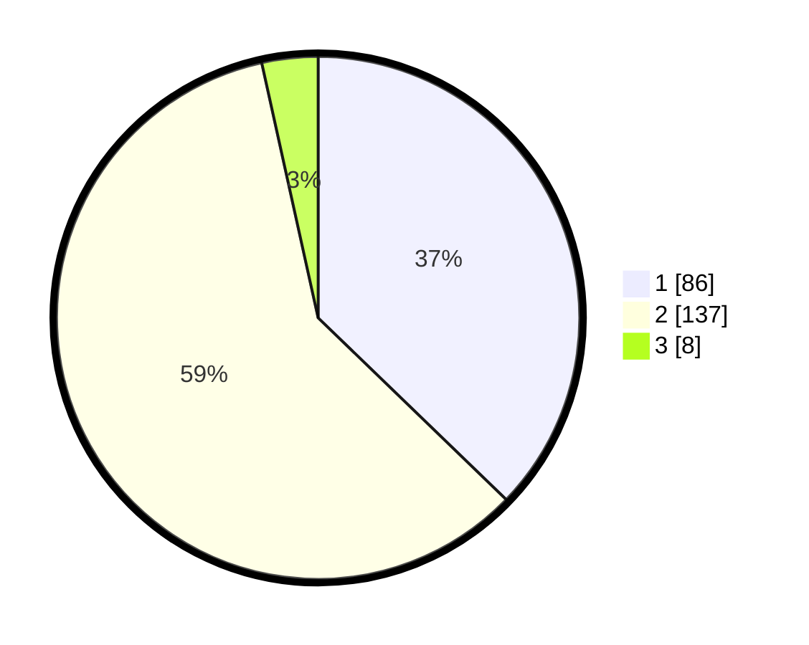

# Hasil

## Grafik

## Tabel

| No. | Nama Paslon    | Suara | Suara (raw) | Persentase |
|:--- |:-------------- | -----:| -----------:| ----------:|
| 1   | ANIES MUHAIMIN | 86    | [86][p-1]   | 37,23      |
| 2   | PRABOWO GIBRAN | 137   | [137][p-2]  | 59,31      |
| 3   | GANJAR MAHFUD  | 8     | [8][p-3]    | 3,46       |

[p-1]: https://github.com/gigit-pemilu/pemilu-2024/blob/main/pilpres/hitung-suara/sub/52-nusa-tenggara-barat/sub/04-sumbawa/sub/17-alas-barat/sub/2001-mapin-rea/sub/002-tps/sub/paslon-1.txt
[p-2]: https://github.com/gigit-pemilu/pemilu-2024/blob/main/pilpres/hitung-suara/sub/52-nusa-tenggara-barat/sub/04-sumbawa/sub/17-alas-barat/sub/2001-mapin-rea/sub/002-tps/sub/paslon-2.txt
[p-3]: https://github.com/gigit-pemilu/pemilu-2024/blob/main/pilpres/hitung-suara/sub/52-nusa-tenggara-barat/sub/04-sumbawa/sub/17-alas-barat/sub/2001-mapin-rea/sub/002-tps/sub/paslon-3.txt

## Foto C Plano

https://sirekap-obj-formc.kpu.go.id/82c8/pemilu/ppwp/52/04/17/20/01/5204172001002-20240215-093754--d60700bf-0a43-4108-890e-0a7b7c151f5c.jpg

https://sirekap-obj-formc.kpu.go.id/82c8/pemilu/ppwp/52/04/17/20/01/5204172001002-20240215-094108--b4e9e34d-75fa-4e34-b2b8-585d615e93df.jpg

https://sirekap-obj-formc.kpu.go.id/82c8/pemilu/ppwp/52/04/17/20/01/5204172001002-20240215-094249--de951ccc-fecd-488a-b3e9-7dc8981cd2c2.jpg

## Metadata

| Key        | Value               |
| ---------- | ------------------- |
| Time Stamp | 2024-02-15 16:30:25 |

