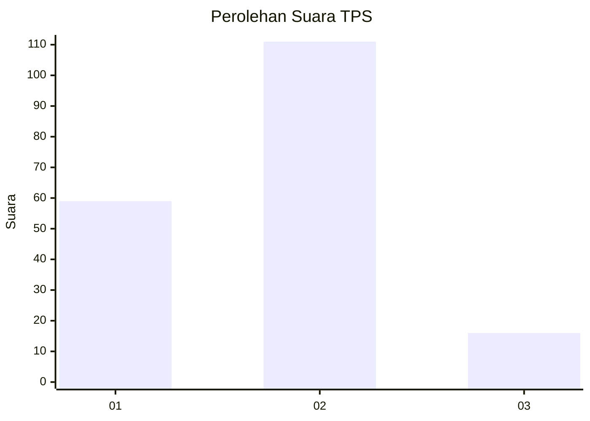
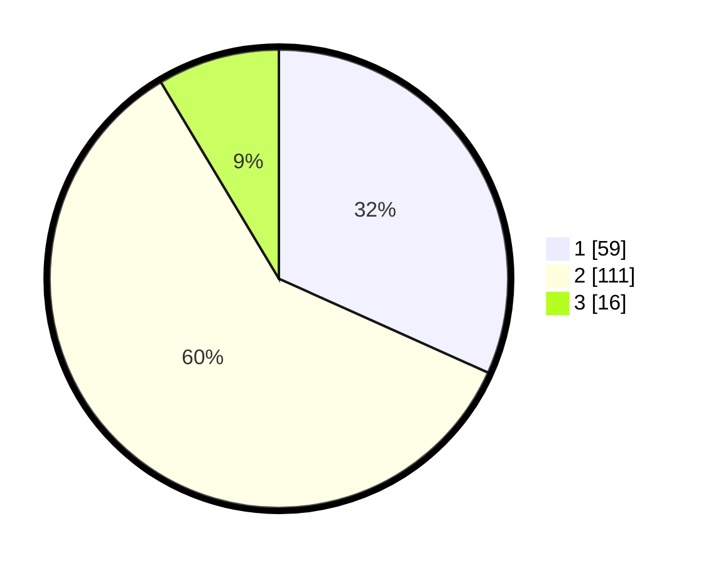

# Hasil

## Grafik

## Tabel

| No. | Nama Paslon    | Suara | Suara (raw) | Persentase |
|:--- |:-------------- | -----:| -----------:| ----------:|
| 1   | ANIES MUHAIMIN | 59    | [59][p-1]   | 31,72      |
| 2   | PRABOWO GIBRAN | 111   | [111][p-2]  | 59,68      |
| 3   | GANJAR MAHFUD  | 16    | [16][p-3]   | 8,60       |

[p-1]: https://github.com/gigit-pemilu/pemilu-2024-52-nusa-tenggara-barat/blob/main/pilpres/hitung-suara/sub/52-nusa-tenggara-barat/sub/04-sumbawa/sub/17-alas-barat/sub/2001-mapin-rea/sub/005-tps/sub/paslon-1.txt
[p-2]: https://github.com/gigit-pemilu/pemilu-2024-52-nusa-tenggara-barat/blob/main/pilpres/hitung-suara/sub/52-nusa-tenggara-barat/sub/04-sumbawa/sub/17-alas-barat/sub/2001-mapin-rea/sub/005-tps/sub/paslon-2.txt
[p-3]: https://github.com/gigit-pemilu/pemilu-2024-52-nusa-tenggara-barat/blob/main/pilpres/hitung-suara/sub/52-nusa-tenggara-barat/sub/04-sumbawa/sub/17-alas-barat/sub/2001-mapin-rea/sub/005-tps/sub/paslon-3.txt

## Foto C Plano

https://sirekap-obj-formc.kpu.go.id/f84b/pemilu/ppwp/52/04/17/20/01/5204172001005-20240215-120145--b11fab1d-6ce1-4ca7-96c6-bf56774c03e9.jpg

https://sirekap-obj-formc.kpu.go.id/f84b/pemilu/ppwp/52/04/17/20/01/5204172001005-20240215-120514--4ed59ee5-1bdc-4f38-9486-4173a14f2a17.jpg

https://sirekap-obj-formc.kpu.go.id/f84b/pemilu/ppwp/52/04/17/20/01/5204172001005-20240215-120602--7cb19855-558a-4f4d-9715-e1239b223065.jpg

## Metadata

| Key        | Value               |
| ---------- | ------------------- |
| Time Stamp | 2024-02-15 18:00:26 |

