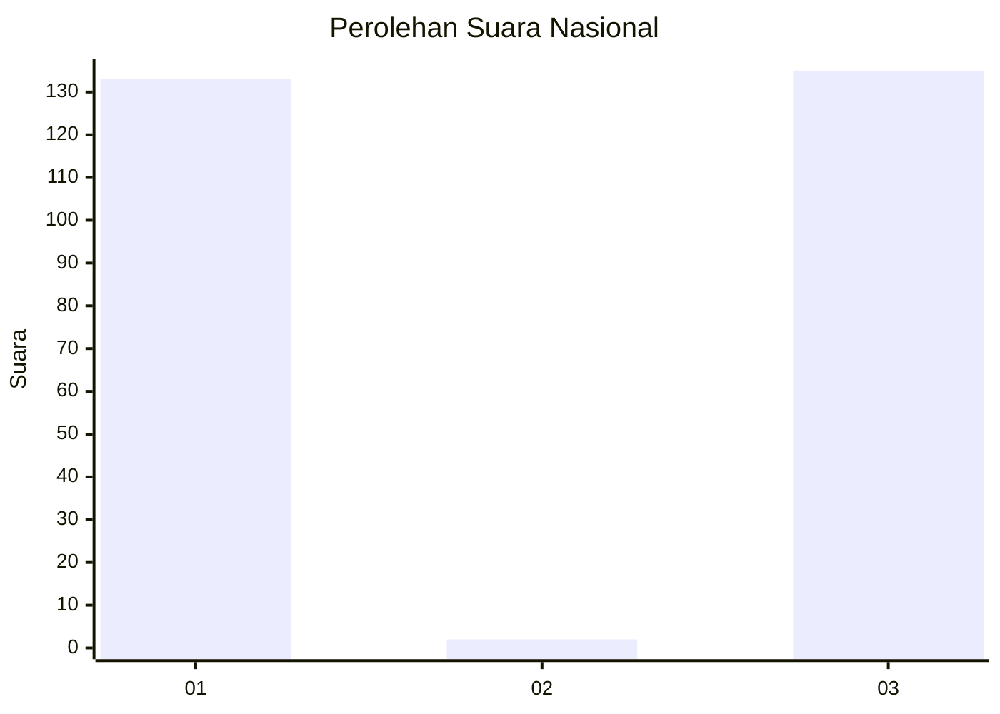
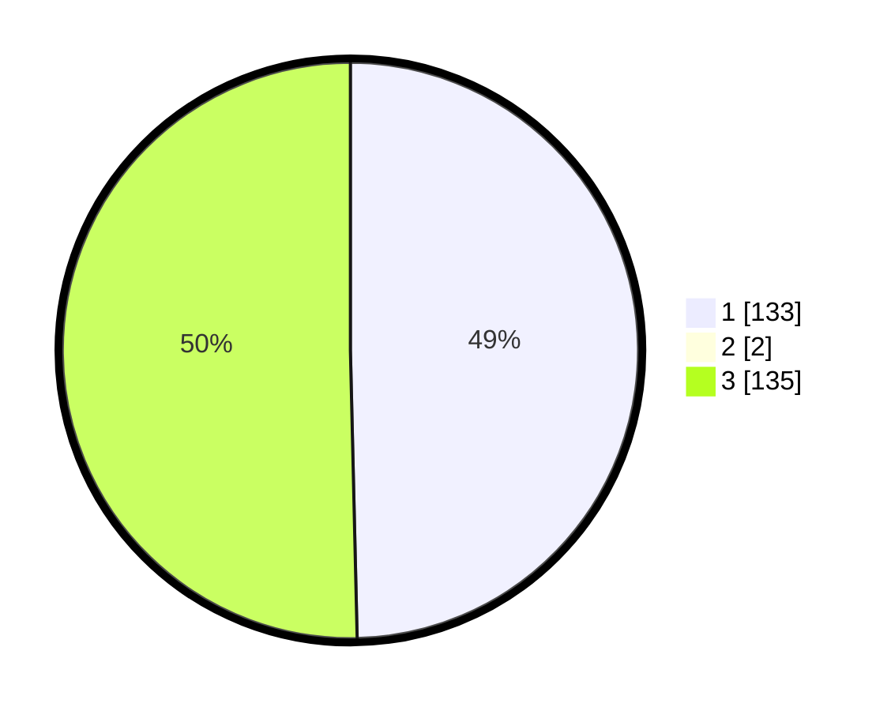

# Hasil

## Grafik

## Tabel

| No. | Nama Paslon    | Suara | Suara (raw) | Persentase |
|:--- |:-------------- | -----:| -----------:| ----------:|
| 1   | ANIES MUHAIMIN | 133   | [133][p-1]  | 49,26      |
| 2   | PRABOWO GIBRAN | 2     | [2][p-2]    | 0,74       |
| 3   | GANJAR MAHFUD  | 135   | [135][p-3]  | 50,00      |

[p-1]: https://github.com/gigit-pemilu/pemilu-2024/blob/main/pilpres/hitung-suara/sub/52-nusa-tenggara-barat/sub/04-sumbawa/sub/18-labuhan-badas/sub/2003-labuhan-sumbawa/sub/033-tps/sub/paslon-1.txt
[p-2]: https://github.com/gigit-pemilu/pemilu-2024/blob/main/pilpres/hitung-suara/sub/52-nusa-tenggara-barat/sub/04-sumbawa/sub/18-labuhan-badas/sub/2003-labuhan-sumbawa/sub/033-tps/sub/paslon-2.txt
[p-3]: https://github.com/gigit-pemilu/pemilu-2024/blob/main/pilpres/hitung-suara/sub/52-nusa-tenggara-barat/sub/04-sumbawa/sub/18-labuhan-badas/sub/2003-labuhan-sumbawa/sub/033-tps/sub/paslon-3.txt

## Foto C Plano

https://sirekap-obj-formc.kpu.go.id/7757/pemilu/ppwp/52/04/18/20/03/5204182003033-20240215-095537--7765c869-d627-4e9b-845f-a0a45635e8e8.jpg

https://sirekap-obj-formc.kpu.go.id/7757/pemilu/ppwp/52/04/18/20/03/5204182003033-20240215-095659--0a12b823-9b5f-4787-9381-6816ae966140.jpg

https://sirekap-obj-formc.kpu.go.id/7757/pemilu/ppwp/52/04/18/20/03/5204182003033-20240215-095749--879b153b-e0e6-4375-8307-1e82320a09d4.jpg

## Metadata

| Key        | Value               |
| ---------- | ------------------- |
| Time Stamp | 2024-02-24 22:31:28 |

