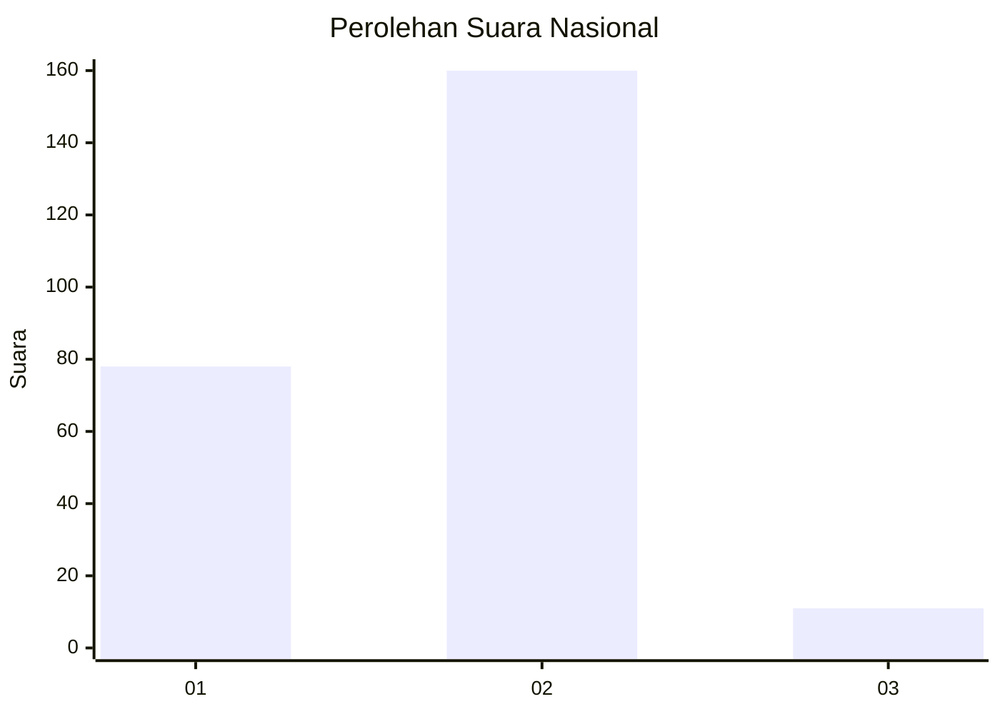
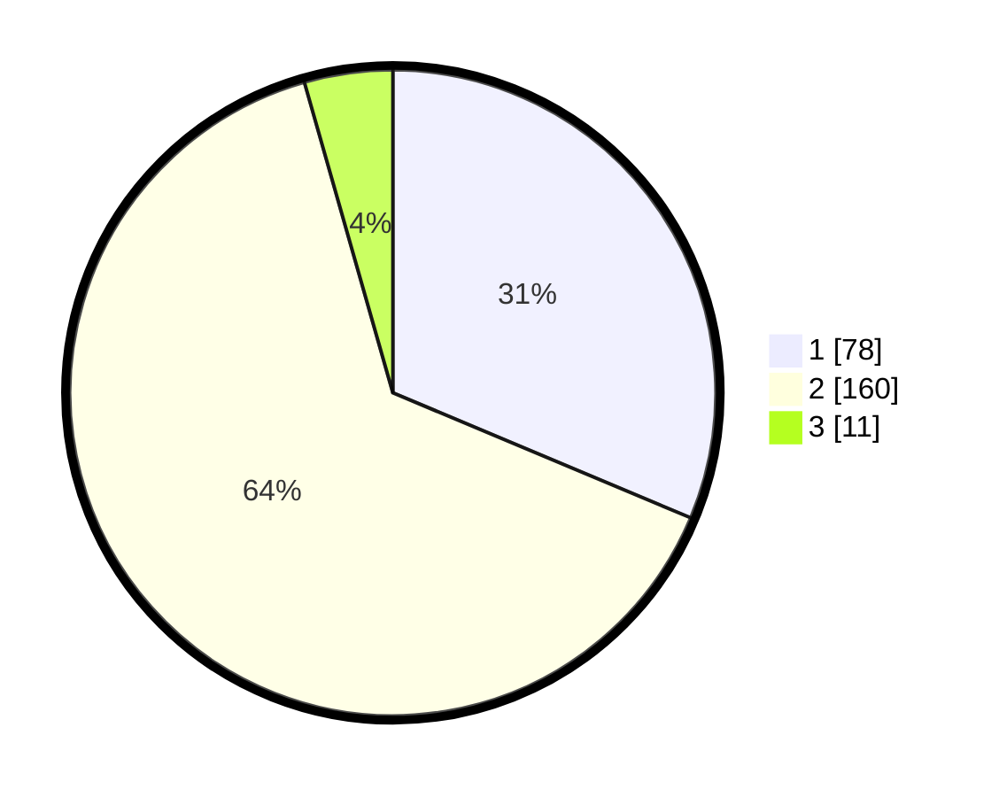

# Hasil

## Grafik

## Tabel

| No. | Nama Paslon    | Suara | Suara (raw) | Persentase |
|:--- |:-------------- | -----:| -----------:| ----------:|
| 1   | ANIES MUHAIMIN | 78    | [78][p-1]   | 31,33      |
| 2   | PRABOWO GIBRAN | 160   | [160][p-2]  | 64,26      |
| 3   | GANJAR MAHFUD  | 11    | [11][p-3]   | 4,42       |

[p-1]: https://github.com/gigit-pemilu/pemilu-2024/blob/main/pilpres/hitung-suara/sub/52-nusa-tenggara-barat/sub/04-sumbawa/sub/23-moyo-utara/sub/2001-pungkit/sub/001-tps/sub/paslon-1.txt
[p-2]: https://github.com/gigit-pemilu/pemilu-2024/blob/main/pilpres/hitung-suara/sub/52-nusa-tenggara-barat/sub/04-sumbawa/sub/23-moyo-utara/sub/2001-pungkit/sub/001-tps/sub/paslon-2.txt
[p-3]: https://github.com/gigit-pemilu/pemilu-2024/blob/main/pilpres/hitung-suara/sub/52-nusa-tenggara-barat/sub/04-sumbawa/sub/23-moyo-utara/sub/2001-pungkit/sub/001-tps/sub/paslon-3.txt

## Foto C Plano

https://sirekap-obj-formc.kpu.go.id/a943/pemilu/ppwp/52/04/23/20/01/5204232001001-20240214-212027--e4446d81-53cf-4582-8b30-b98baadfbb12.jpg

https://sirekap-obj-formc.kpu.go.id/a943/pemilu/ppwp/52/04/23/20/01/5204232001001-20240214-212218--a63efd5d-c1a4-4e40-b022-c02b67df9bdc.jpg

https://sirekap-obj-formc.kpu.go.id/a943/pemilu/ppwp/52/04/23/20/01/5204232001001-20240214-212323--d3be3cb3-b0c4-4d81-96f0-394569e35fd1.jpg

## Metadata

| Key        | Value               |
| ---------- | ------------------- |
| Time Stamp | 2024-02-15 21:01:18 |

