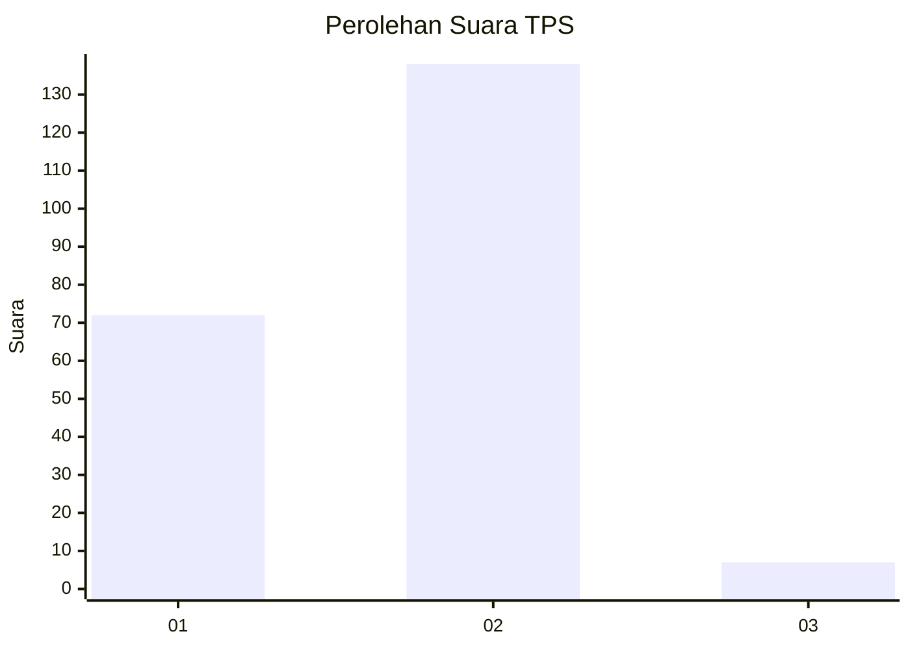
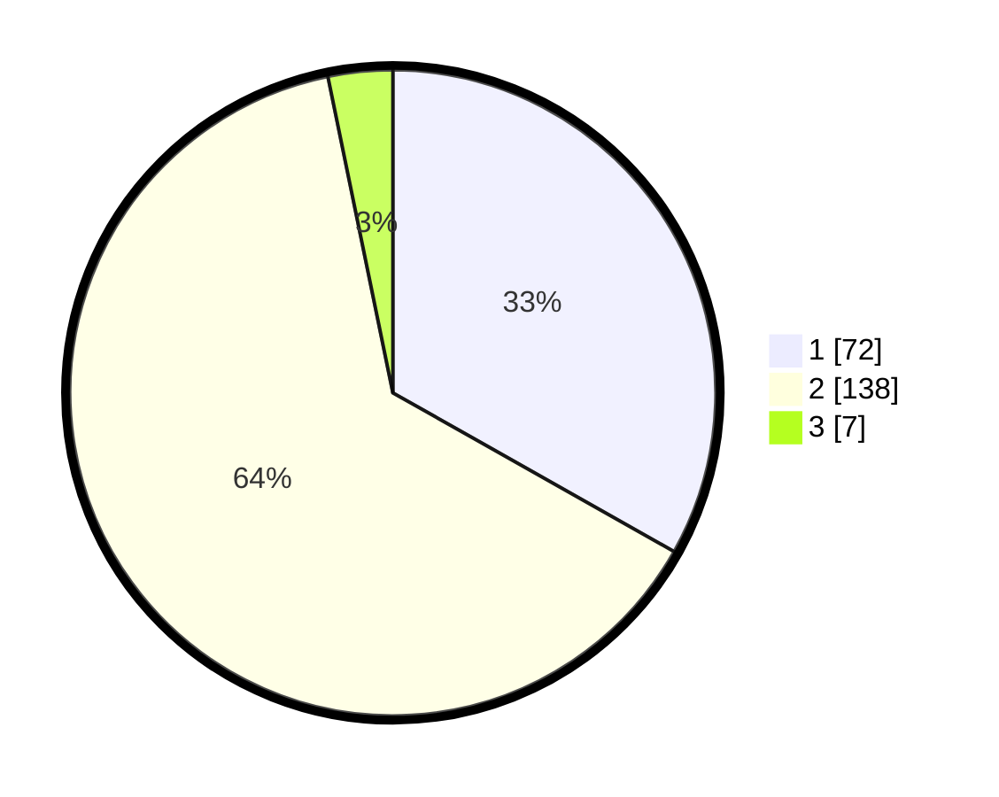

# Hasil

## Grafik

## Tabel

| No. | Nama Paslon    | Suara | Suara (raw) | Persentase |
|:--- |:-------------- | -----:| -----------:| ----------:|
| 1   | ANIES MUHAIMIN | 72    | [72][p-1]   | 33,18      |
| 2   | PRABOWO GIBRAN | 138   | [138][p-2]  | 63,59      |
| 3   | GANJAR MAHFUD  | 7     | [7][p-3]    | 3,23       |

[p-1]: https://github.com/gigit-pemilu/pemilu-2024-52-nusa-tenggara-barat/blob/main/pilpres/hitung-suara/sub/52-nusa-tenggara-barat/sub/04-sumbawa/sub/23-moyo-utara/sub/2001-pungkit/sub/004-tps/sub/paslon-1.txt
[p-2]: https://github.com/gigit-pemilu/pemilu-2024-52-nusa-tenggara-barat/blob/main/pilpres/hitung-suara/sub/52-nusa-tenggara-barat/sub/04-sumbawa/sub/23-moyo-utara/sub/2001-pungkit/sub/004-tps/sub/paslon-2.txt
[p-3]: https://github.com/gigit-pemilu/pemilu-2024-52-nusa-tenggara-barat/blob/main/pilpres/hitung-suara/sub/52-nusa-tenggara-barat/sub/04-sumbawa/sub/23-moyo-utara/sub/2001-pungkit/sub/004-tps/sub/paslon-3.txt

## Foto C Plano

https://sirekap-obj-formc.kpu.go.id/acae/pemilu/ppwp/52/04/23/20/01/5204232001004-20240221-141321--62de24e2-54b6-4619-91b1-0758930d2dc7.jpg

https://sirekap-obj-formc.kpu.go.id/acae/pemilu/ppwp/52/04/23/20/01/5204232001004-20240221-141331--e7eaa17b-6364-4b7d-9b20-70557a8a3de1.jpg

https://sirekap-obj-formc.kpu.go.id/acae/pemilu/ppwp/52/04/23/20/01/5204232001004-20240221-141341--47b85199-950a-4164-94d6-1fa8b412fa57.jpg

## Metadata

| Key        | Value               |
| ---------- | ------------------- |
| Time Stamp | 2024-02-24 22:31:28 |

