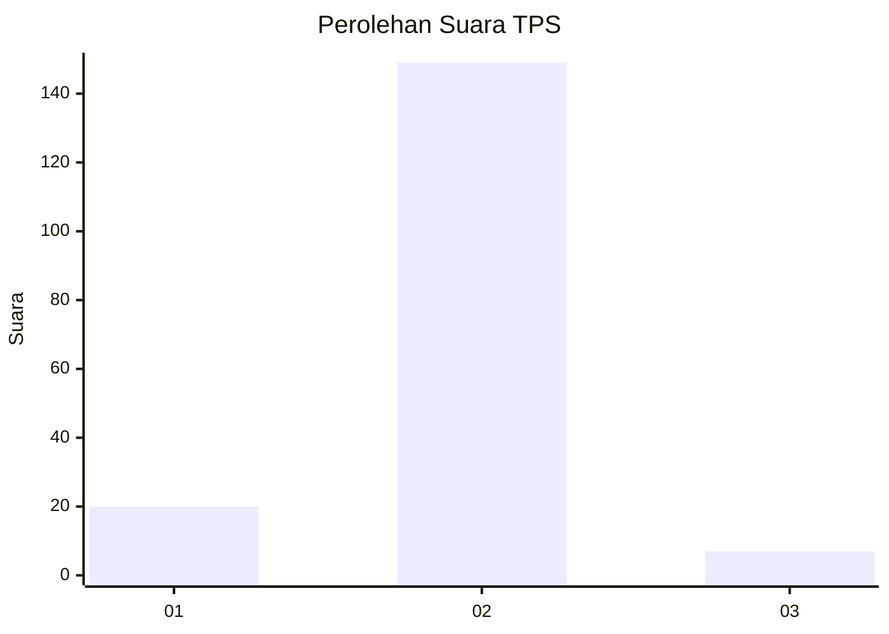
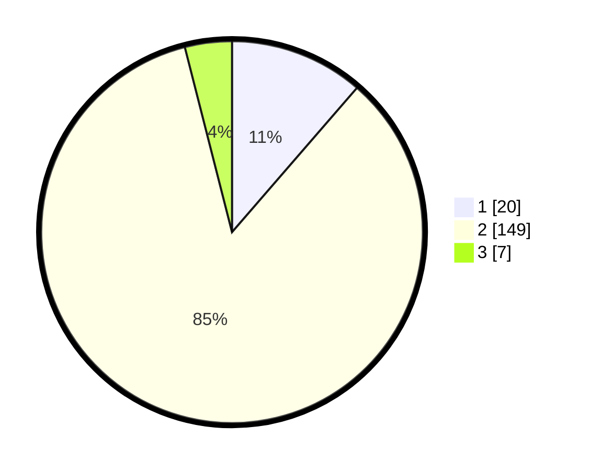

# Hasil

## Grafik

## Tabel

| No. | Nama Paslon    | Suara | Suara (raw) | Persentase |
|:--- |:-------------- | -----:| -----------:| ----------:|
| 1   | ANIES MUHAIMIN | 20    | [20][p-1]   | 11,36      |
| 2   | PRABOWO GIBRAN | 149   | [149][p-2]  | 84,66      |
| 3   | GANJAR MAHFUD  | 7     | [7][p-3]    | 3,98       |

[p-1]: https://github.com/gigit-pemilu/pemilu-2024-52-nusa-tenggara-barat/blob/main/pilpres/hitung-suara/sub/52-nusa-tenggara-barat/sub/04-sumbawa/sub/25-tarano/sub/2001-bantulanteh/sub/006-tps/sub/paslon-1.txt
[p-2]: https://github.com/gigit-pemilu/pemilu-2024-52-nusa-tenggara-barat/blob/main/pilpres/hitung-suara/sub/52-nusa-tenggara-barat/sub/04-sumbawa/sub/25-tarano/sub/2001-bantulanteh/sub/006-tps/sub/paslon-2.txt
[p-3]: https://github.com/gigit-pemilu/pemilu-2024-52-nusa-tenggara-barat/blob/main/pilpres/hitung-suara/sub/52-nusa-tenggara-barat/sub/04-sumbawa/sub/25-tarano/sub/2001-bantulanteh/sub/006-tps/sub/paslon-3.txt

## Foto C Plano

https://sirekap-obj-formc.kpu.go.id/762b/pemilu/ppwp/52/04/25/20/01/5204252001006-20240215-173739--4e2c37d9-14e7-4597-a69c-d7cfc31f39b8.jpg

https://sirekap-obj-formc.kpu.go.id/762b/pemilu/ppwp/52/04/25/20/01/5204252001006-20240214-141231--c9b3d8b5-4189-430d-80b7-baa21c8f447a.jpg

https://sirekap-obj-formc.kpu.go.id/762b/pemilu/ppwp/52/04/25/20/01/5204252001006-20240216-102605--2f0a0078-0c64-4083-bea2-7e3d7098196a.jpg

## Metadata

| Key        | Value               |
| ---------- | ------------------- |
| Time Stamp | 2024-02-16 10:30:29 |

