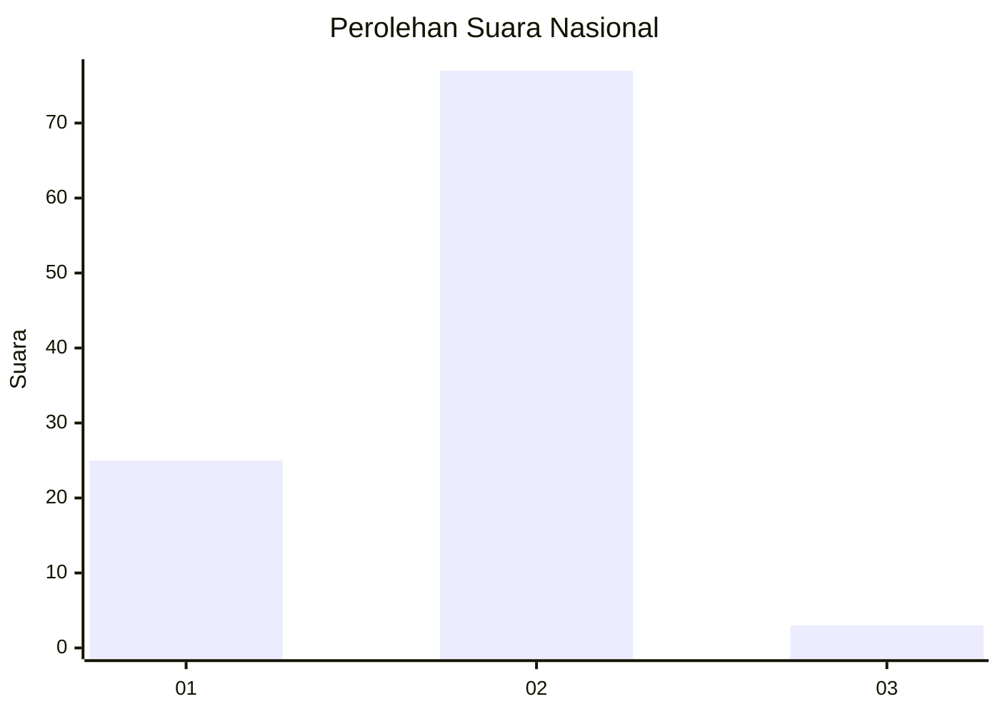
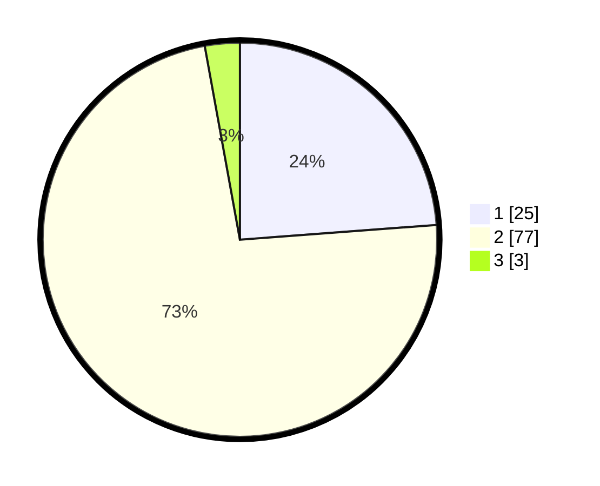

# Hasil

## Grafik

## Tabel

| No. | Nama Paslon    | Suara | Suara (raw) | Persentase |
|:--- |:-------------- | -----:| -----------:| ----------:|
| 1   | ANIES MUHAIMIN | 25    | [25][p-1]   | 23,81      |
| 2   | PRABOWO GIBRAN | 77    | [77][p-2]   | 73,33      |
| 3   | GANJAR MAHFUD  | 3     | [3][p-3]    | 2,86       |

[p-1]: https://github.com/gigit-pemilu/pemilu-2024/blob/main/pilpres/hitung-suara/sub/52-nusa-tenggara-barat/sub/04-sumbawa/sub/25-tarano/sub/2005-mata/sub/005-tps/sub/paslon-1.txt
[p-2]: https://github.com/gigit-pemilu/pemilu-2024/blob/main/pilpres/hitung-suara/sub/52-nusa-tenggara-barat/sub/04-sumbawa/sub/25-tarano/sub/2005-mata/sub/005-tps/sub/paslon-2.txt
[p-3]: https://github.com/gigit-pemilu/pemilu-2024/blob/main/pilpres/hitung-suara/sub/52-nusa-tenggara-barat/sub/04-sumbawa/sub/25-tarano/sub/2005-mata/sub/005-tps/sub/paslon-3.txt

## Foto C Plano

https://sirekap-obj-formc.kpu.go.id/5666/pemilu/ppwp/52/04/25/20/05/5204252005005-20240215-082727--8976dcb0-f23c-4f6f-a9f6-78473cb9675a.jpg

https://sirekap-obj-formc.kpu.go.id/5666/pemilu/ppwp/52/04/25/20/05/5204252005005-20240215-082800--43e0c10e-c6c4-4d1e-9aa3-4050fe4f57d8.jpg

https://sirekap-obj-formc.kpu.go.id/5666/pemilu/ppwp/52/04/25/20/05/5204252005005-20240215-082814--d8c227a9-2ed4-41f9-a3cd-5eeddd4b8333.jpg

## Metadata

| Key        | Value               |
| ---------- | ------------------- |
| Time Stamp | 2024-02-15 22:00:27 |

