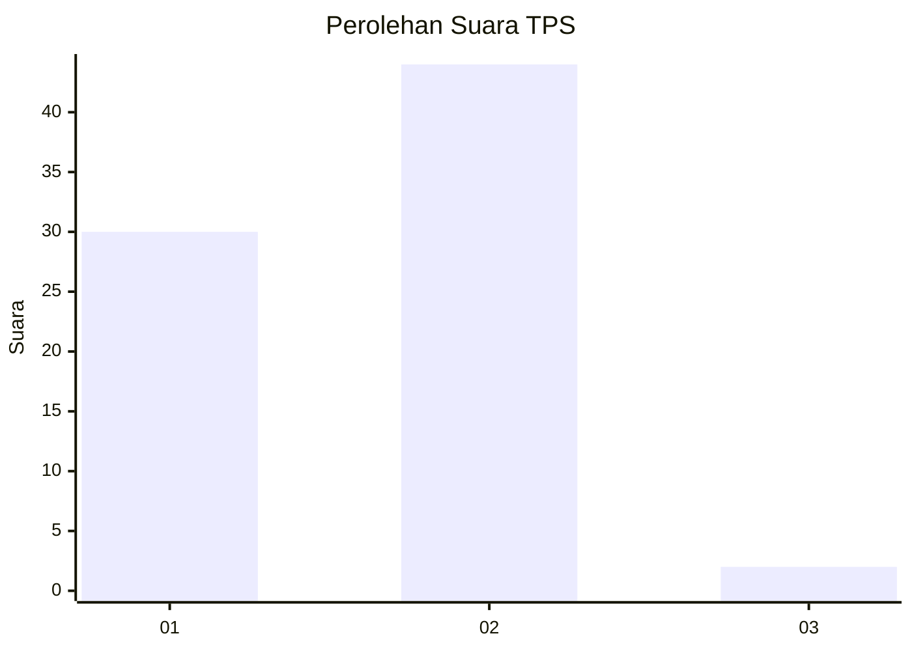
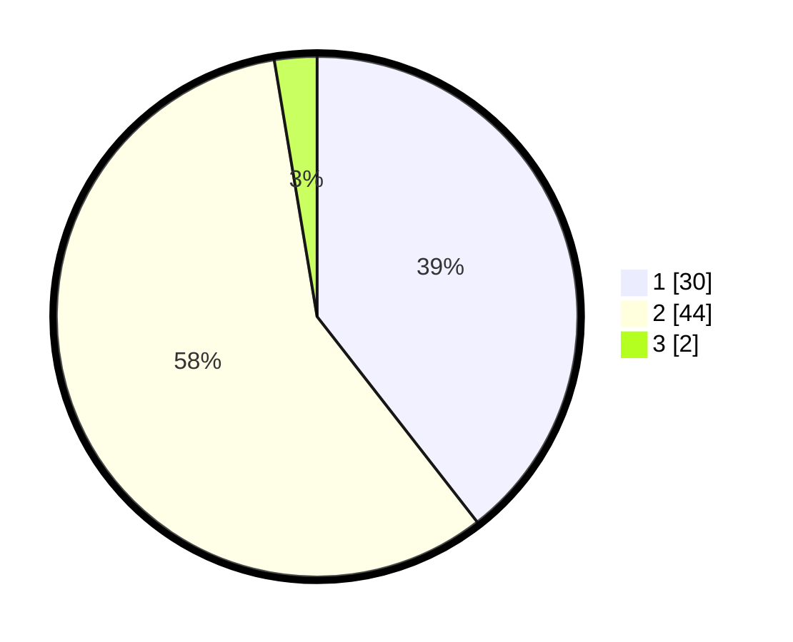

# Hasil

## Grafik

## Tabel

| No. | Nama Paslon    | Suara | Suara (raw) | Persentase |
|:--- |:-------------- | -----:| -----------:| ----------:|
| 1   | ANIES MUHAIMIN | 30    | [30][p-1]   | 39,47      |
| 2   | PRABOWO GIBRAN | 44    | [44][p-2]   | 57,89      |
| 3   | GANJAR MAHFUD  | 2     | [2][p-3]    | 2,63       |

[p-1]: https://github.com/gigit-pemilu/pemilu-2024-52-nusa-tenggara-barat/blob/main/pilpres/hitung-suara/sub/52-nusa-tenggara-barat/sub/04-sumbawa/sub/27-lenangguar/sub/2003-ledang/sub/902-tps/sub/paslon-1.txt
[p-2]: https://github.com/gigit-pemilu/pemilu-2024-52-nusa-tenggara-barat/blob/main/pilpres/hitung-suara/sub/52-nusa-tenggara-barat/sub/04-sumbawa/sub/27-lenangguar/sub/2003-ledang/sub/902-tps/sub/paslon-2.txt
[p-3]: https://github.com/gigit-pemilu/pemilu-2024-52-nusa-tenggara-barat/blob/main/pilpres/hitung-suara/sub/52-nusa-tenggara-barat/sub/04-sumbawa/sub/27-lenangguar/sub/2003-ledang/sub/902-tps/sub/paslon-3.txt

## Foto C Plano

https://sirekap-obj-formc.kpu.go.id/17af/pemilu/ppwp/52/04/27/20/03/5204272003902-20240214-201859--19f7eb5d-c2bf-4d32-aa95-6c4a7f54178d.jpg

https://sirekap-obj-formc.kpu.go.id/17af/pemilu/ppwp/52/04/27/20/03/5204272003902-20240214-202010--cec5fac4-a667-4c3d-951d-360c2984d833.jpg

https://sirekap-obj-formc.kpu.go.id/17af/pemilu/ppwp/52/04/27/20/03/5204272003902-20240214-202045--0c57c3de-3c5b-4366-b777-42a6a5aabbe1.jpg

## Metadata

| Key        | Value               |
| ---------- | ------------------- |
| Time Stamp | 2024-02-15 16:00:26 |

