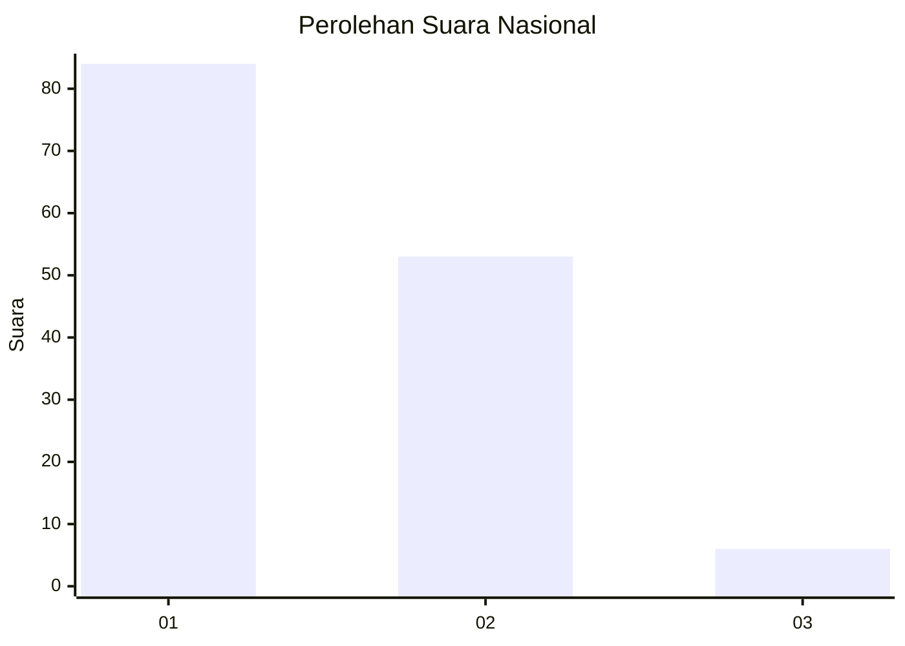
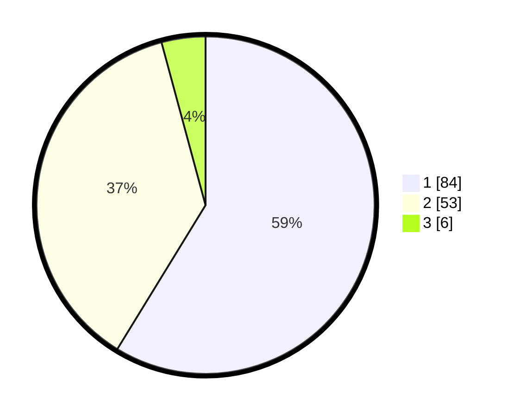

# Hasil

## Grafik

## Tabel

| No. | Nama Paslon    | Suara | Suara (raw) | Persentase |
|:--- |:-------------- | -----:| -----------:| ----------:|
| 1   | ANIES MUHAIMIN | 84    | [84][p-1]   | 58,74      |
| 2   | PRABOWO GIBRAN | 53    | [53][p-2]   | 37,06      |
| 3   | GANJAR MAHFUD  | 6     | [6][p-3]    | 4,20       |

[p-1]: https://github.com/gigit-pemilu/pemilu-2024/blob/main/pilpres/hitung-suara/sub/52-nusa-tenggara-barat/sub/04-sumbawa/sub/28-orong-telu/sub/2002-kelawis/sub/001-tps/sub/paslon-1.txt
[p-2]: https://github.com/gigit-pemilu/pemilu-2024/blob/main/pilpres/hitung-suara/sub/52-nusa-tenggara-barat/sub/04-sumbawa/sub/28-orong-telu/sub/2002-kelawis/sub/001-tps/sub/paslon-2.txt
[p-3]: https://github.com/gigit-pemilu/pemilu-2024/blob/main/pilpres/hitung-suara/sub/52-nusa-tenggara-barat/sub/04-sumbawa/sub/28-orong-telu/sub/2002-kelawis/sub/001-tps/sub/paslon-3.txt

## Foto C Plano

https://sirekap-obj-formc.kpu.go.id/7b42/pemilu/ppwp/52/04/28/20/02/5204282002001-20240215-072736--ee078310-b332-464d-af51-5c408cedea09.jpg

https://sirekap-obj-formc.kpu.go.id/7b42/pemilu/ppwp/52/04/28/20/02/5204282002001-20240215-072741--db08a48d-a49e-4c60-887a-c6a02f152346.jpg

https://sirekap-obj-formc.kpu.go.id/7b42/pemilu/ppwp/52/04/28/20/02/5204282002001-20240215-072748--b3e65990-cb0a-421f-a2cf-ac172bb6540e.jpg

## Metadata

| Key        | Value               |
| ---------- | ------------------- |
| Time Stamp | 2024-02-15 17:30:25 |

