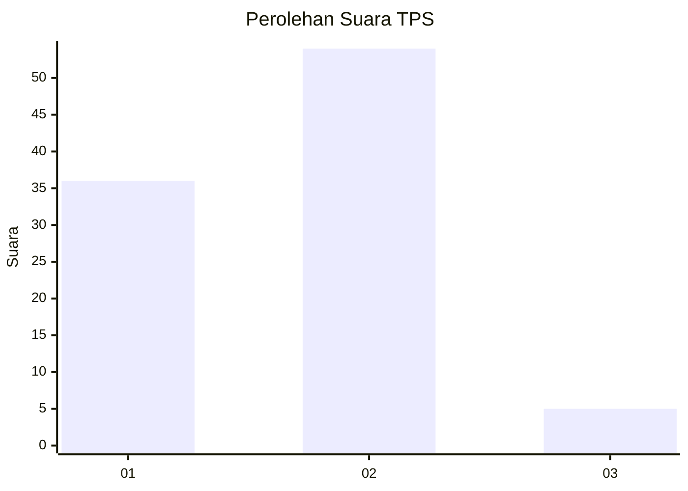
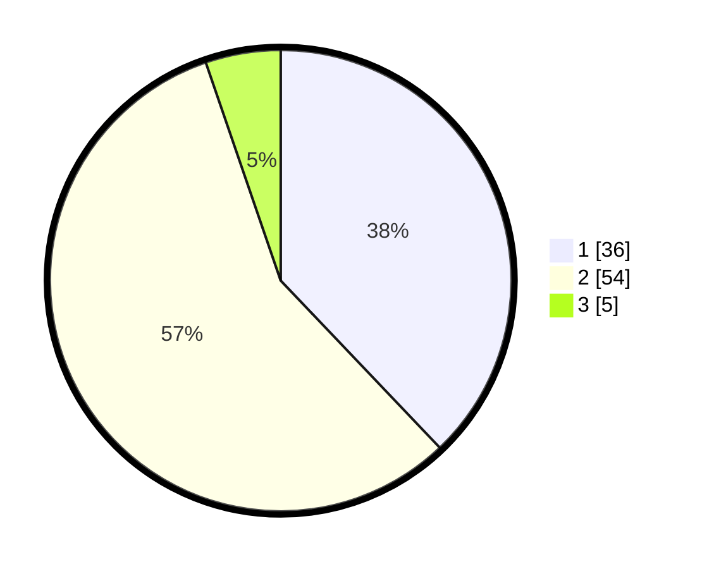

# Hasil

## Grafik

## Tabel

| No. | Nama Paslon    | Suara | Suara (raw) | Persentase |
|:--- |:-------------- | -----:| -----------:| ----------:|
| 1   | ANIES MUHAIMIN | 36    | [36][p-1]   | 37,89      |
| 2   | PRABOWO GIBRAN | 54    | [54][p-2]   | 56,84      |
| 3   | GANJAR MAHFUD  | 5     | [5][p-3]    | 5,26       |

[p-1]: https://github.com/gigit-pemilu/pemilu-2024-52-nusa-tenggara-barat/blob/main/pilpres/hitung-suara/sub/52-nusa-tenggara-barat/sub/04-sumbawa/sub/28-orong-telu/sub/2004-sebeok/sub/004-tps/sub/paslon-1.txt
[p-2]: https://github.com/gigit-pemilu/pemilu-2024-52-nusa-tenggara-barat/blob/main/pilpres/hitung-suara/sub/52-nusa-tenggara-barat/sub/04-sumbawa/sub/28-orong-telu/sub/2004-sebeok/sub/004-tps/sub/paslon-2.txt
[p-3]: https://github.com/gigit-pemilu/pemilu-2024-52-nusa-tenggara-barat/blob/main/pilpres/hitung-suara/sub/52-nusa-tenggara-barat/sub/04-sumbawa/sub/28-orong-telu/sub/2004-sebeok/sub/004-tps/sub/paslon-3.txt

## Foto C Plano

https://sirekap-obj-formc.kpu.go.id/bce1/pemilu/ppwp/52/04/28/20/04/5204282004004-20240215-024202--bff7cdd8-5516-4142-a0aa-f7af0244518d.jpg

https://sirekap-obj-formc.kpu.go.id/bce1/pemilu/ppwp/52/04/28/20/04/5204282004004-20240215-024220--4b37c69d-7beb-4ff2-a2a3-3182e6663bc4.jpg

https://sirekap-obj-formc.kpu.go.id/bce1/pemilu/ppwp/52/04/28/20/04/5204282004004-20240215-024236--aba59684-8dba-4604-931f-d2cd09c1350e.jpg

## Metadata

| Key        | Value               |
| ---------- | ------------------- |
| Time Stamp | 2024-02-19 06:16:00 |

