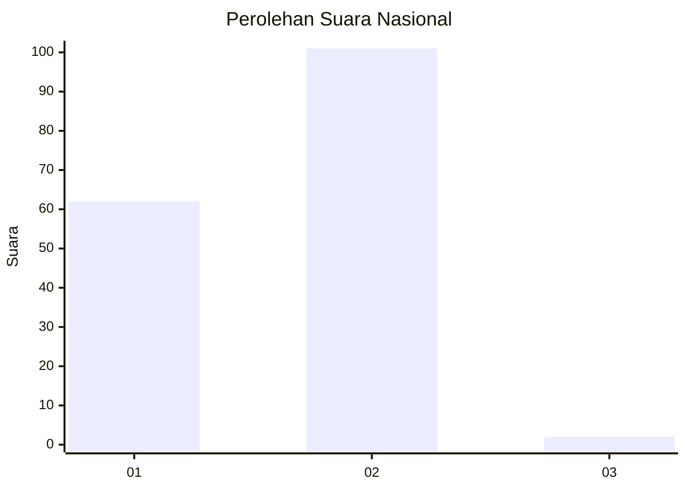
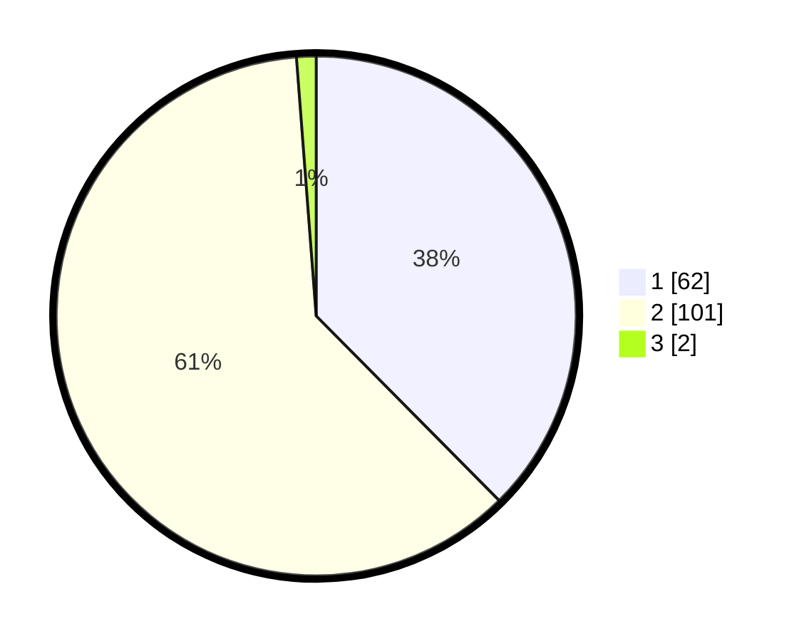

# Hasil

## Grafik

## Tabel

| No. | Nama Paslon    | Suara | Suara (raw) | Persentase |
|:--- |:-------------- | -----:| -----------:| ----------:|
| 1   | ANIES MUHAIMIN | 62    | [62][p-1]   | 37,58      |
| 2   | PRABOWO GIBRAN | 101   | [101][p-2]  | 61,21      |
| 3   | GANJAR MAHFUD  | 2     | [2][p-3]    | 1,21       |

[p-1]: https://github.com/gigit-pemilu/pemilu-2024/blob/main/pilpres/hitung-suara/sub/52-nusa-tenggara-barat/sub/05-dompu/sub/04-kilo/sub/2001-malaju/sub/004-tps/sub/paslon-1.txt
[p-2]: https://github.com/gigit-pemilu/pemilu-2024/blob/main/pilpres/hitung-suara/sub/52-nusa-tenggara-barat/sub/05-dompu/sub/04-kilo/sub/2001-malaju/sub/004-tps/sub/paslon-2.txt
[p-3]: https://github.com/gigit-pemilu/pemilu-2024/blob/main/pilpres/hitung-suara/sub/52-nusa-tenggara-barat/sub/05-dompu/sub/04-kilo/sub/2001-malaju/sub/004-tps/sub/paslon-3.txt

## Foto C Plano

https://sirekap-obj-formc.kpu.go.id/f20e/pemilu/ppwp/52/05/04/20/01/5205042001004-20240215-121841--b2d30dff-7b7c-49f3-ad7d-8888256f1be6.jpg

https://sirekap-obj-formc.kpu.go.id/f20e/pemilu/ppwp/52/05/04/20/01/5205042001004-20240215-121949--12864174-514b-4c12-8aa8-9ca6bd5c32b0.jpg

https://sirekap-obj-formc.kpu.go.id/f20e/pemilu/ppwp/52/05/04/20/01/5205042001004-20240215-211743--bf5119ac-c810-4f65-aff7-6486ce91498b.jpg

## Metadata

| Key        | Value               |
| ---------- | ------------------- |
| Time Stamp | 2024-02-15 21:30:27 |

