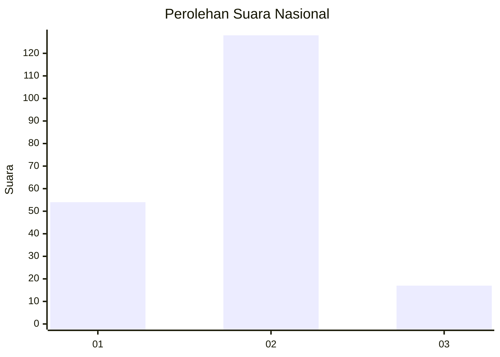
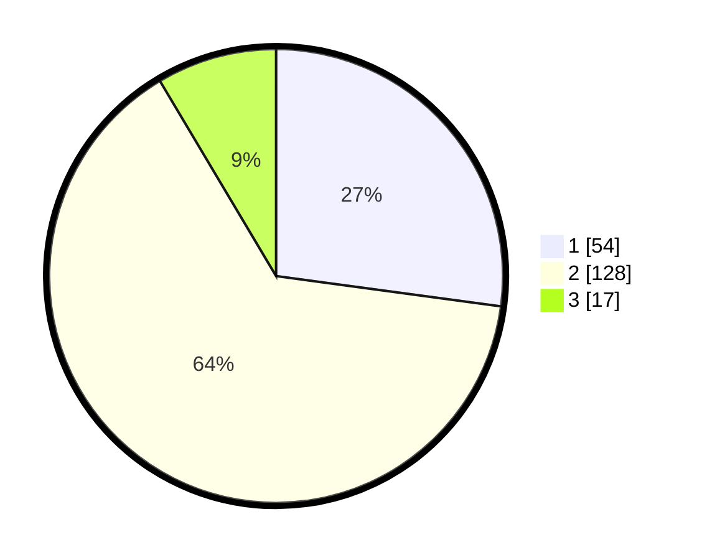

# Hasil

## Grafik

## Tabel

| No. | Nama Paslon    | Suara | Suara (raw) | Persentase |
|:--- |:-------------- | -----:| -----------:| ----------:|
| 1   | ANIES MUHAIMIN | 54    | [54][p-1]   | 27,14      |
| 2   | PRABOWO GIBRAN | 128   | [128][p-2]  | 64,32      |
| 3   | GANJAR MAHFUD  | 17    | [17][p-3]   | 8,54       |

[p-1]: https://github.com/gigit-pemilu/pemilu-2024/blob/main/pilpres/hitung-suara/sub/52-nusa-tenggara-barat/sub/06-bima/sub/01-monta/sub/2005-tolotangga/sub/004-tps/sub/paslon-1.txt
[p-2]: https://github.com/gigit-pemilu/pemilu-2024/blob/main/pilpres/hitung-suara/sub/52-nusa-tenggara-barat/sub/06-bima/sub/01-monta/sub/2005-tolotangga/sub/004-tps/sub/paslon-2.txt
[p-3]: https://github.com/gigit-pemilu/pemilu-2024/blob/main/pilpres/hitung-suara/sub/52-nusa-tenggara-barat/sub/06-bima/sub/01-monta/sub/2005-tolotangga/sub/004-tps/sub/paslon-3.txt

## Foto C Plano

https://sirekap-obj-formc.kpu.go.id/4ea8/pemilu/ppwp/52/06/01/20/05/5206012005004-20240216-065426--75eea04e-d0ad-4f50-9915-a3e8495795d6.jpg

https://sirekap-obj-formc.kpu.go.id/4ea8/pemilu/ppwp/52/06/01/20/05/5206012005004-20240215-112814--9e4dbe82-24d8-4d25-b51e-019e221ca264.jpg

https://sirekap-obj-formc.kpu.go.id/4ea8/pemilu/ppwp/52/06/01/20/05/5206012005004-20240215-112948--3a527816-e033-4bc1-94b8-3f7614bf9e45.jpg

## Metadata

| Key        | Value               |
| ---------- | ------------------- |
| Time Stamp | 2024-02-16 08:00:28 |

