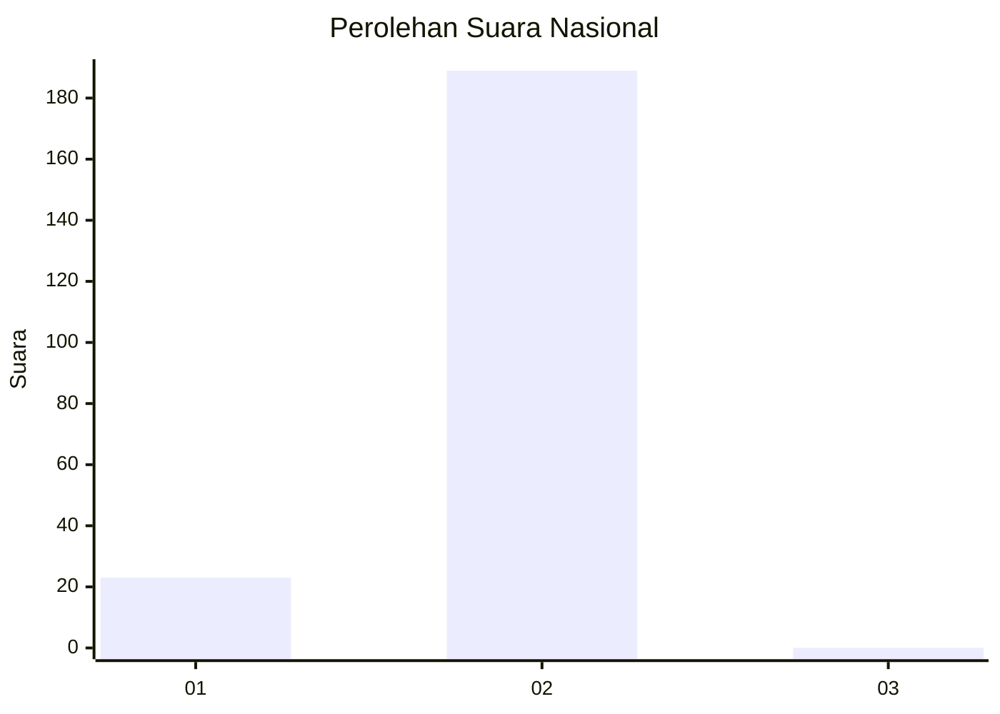
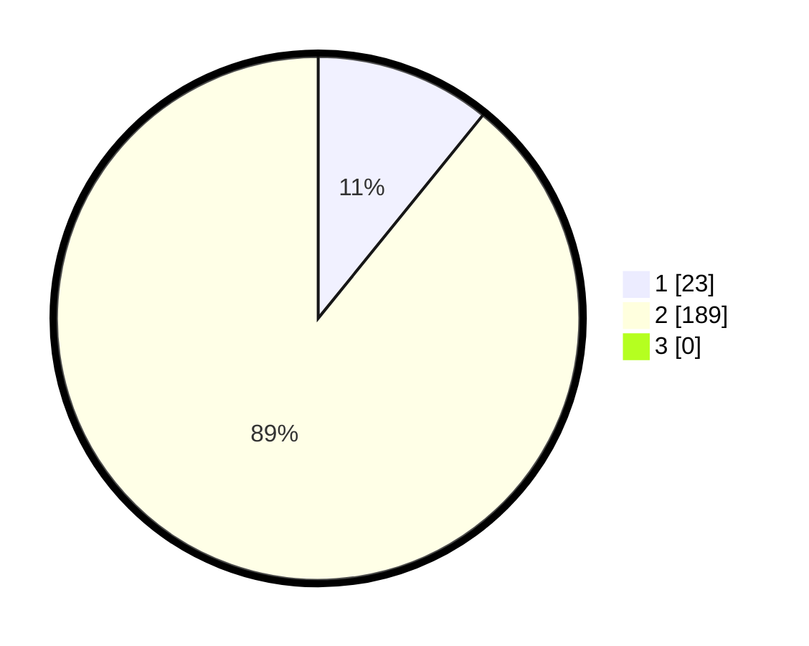

# Hasil

## Grafik

## Tabel

| No. | Nama Paslon    | Suara | Suara (raw) | Persentase |
|:--- |:-------------- | -----:| -----------:| ----------:|
| 1   | ANIES MUHAIMIN | 23    | [23][p-1]   | 10,85      |
| 2   | PRABOWO GIBRAN | 189   | [189][p-2]  | 89,15      |
| 3   | GANJAR MAHFUD  | 0     | [0][p-3]    | 0,00       |

[p-1]: https://github.com/gigit-pemilu/pemilu-2024/blob/main/pilpres/hitung-suara/sub/52-nusa-tenggara-barat/sub/06-bima/sub/01-monta/sub/2012-baralau/sub/001-tps/sub/paslon-1.txt
[p-2]: https://github.com/gigit-pemilu/pemilu-2024/blob/main/pilpres/hitung-suara/sub/52-nusa-tenggara-barat/sub/06-bima/sub/01-monta/sub/2012-baralau/sub/001-tps/sub/paslon-2.txt
[p-3]: https://github.com/gigit-pemilu/pemilu-2024/blob/main/pilpres/hitung-suara/sub/52-nusa-tenggara-barat/sub/06-bima/sub/01-monta/sub/2012-baralau/sub/001-tps/sub/paslon-3.txt

## Foto C Plano

https://sirekap-obj-formc.kpu.go.id/3dc3/pemilu/ppwp/52/06/01/20/12/5206012012001-20240214-220232--55bf48b8-14ae-420e-87bc-596d28d619a1.jpg

https://sirekap-obj-formc.kpu.go.id/3dc3/pemilu/ppwp/52/06/01/20/12/5206012012001-20240214-214536--1251574e-9d4d-4e37-a409-0b8b6ca0a63e.jpg

https://sirekap-obj-formc.kpu.go.id/3dc3/pemilu/ppwp/52/06/01/20/12/5206012012001-20240214-220341--6e01cc0f-a6a3-4dda-82f7-8b8eb2c35b37.jpg

## Metadata

| Key        | Value               |
| ---------- | ------------------- |
| Time Stamp | 2024-02-16 00:30:27 |

