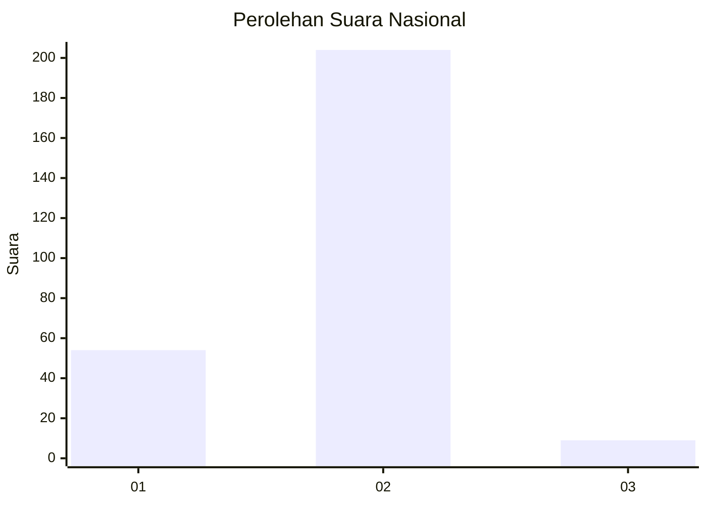
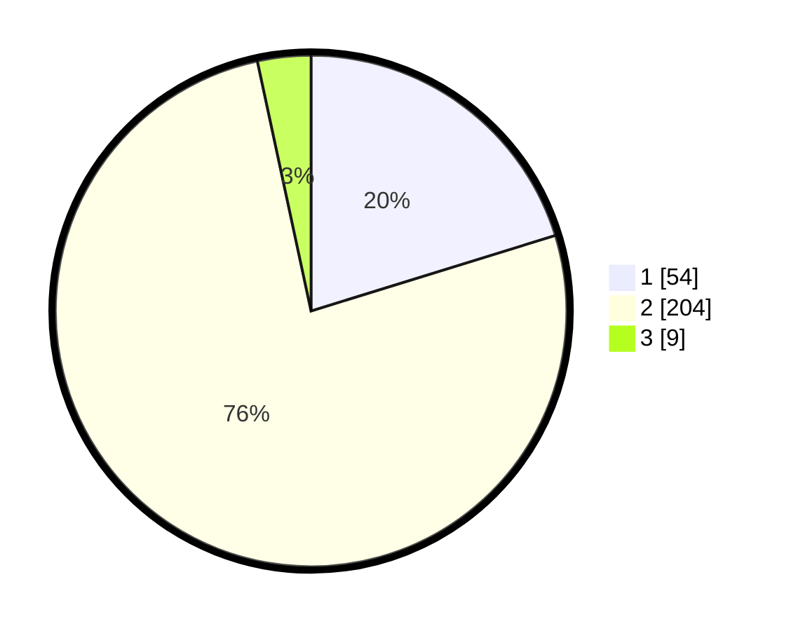

# Hasil

## Grafik

## Tabel

| No. | Nama Paslon    | Suara | Suara (raw) | Persentase |
|:--- |:-------------- | -----:| -----------:| ----------:|
| 1   | ANIES MUHAIMIN | 54    | [54][p-1]   | 20,22      |
| 2   | PRABOWO GIBRAN | 204   | [204][p-2]  | 76,40      |
| 3   | GANJAR MAHFUD  | 9     | [9][p-3]    | 3,37       |

[p-1]: https://github.com/gigit-pemilu/pemilu-2024/blob/main/pilpres/hitung-suara/sub/52-nusa-tenggara-barat/sub/06-bima/sub/01-monta/sub/2012-baralau/sub/007-tps/sub/paslon-1.txt
[p-2]: https://github.com/gigit-pemilu/pemilu-2024/blob/main/pilpres/hitung-suara/sub/52-nusa-tenggara-barat/sub/06-bima/sub/01-monta/sub/2012-baralau/sub/007-tps/sub/paslon-2.txt
[p-3]: https://github.com/gigit-pemilu/pemilu-2024/blob/main/pilpres/hitung-suara/sub/52-nusa-tenggara-barat/sub/06-bima/sub/01-monta/sub/2012-baralau/sub/007-tps/sub/paslon-3.txt

## Foto C Plano

https://sirekap-obj-formc.kpu.go.id/fd9e/pemilu/ppwp/52/06/01/20/12/5206012012007-20240215-111611--efb99cbe-d128-4163-b6b2-3cb4e25d8a1f.jpg

https://sirekap-obj-formc.kpu.go.id/fd9e/pemilu/ppwp/52/06/01/20/12/5206012012007-20240215-111720--c22af0ca-1f2b-4835-90c8-08fa20678e73.jpg

https://sirekap-obj-formc.kpu.go.id/fd9e/pemilu/ppwp/52/06/01/20/12/5206012012007-20240215-111859--43154f02-e1cb-42c1-bd05-9ba410fa0fbb.jpg

## Metadata

| Key        | Value               |
| ---------- | ------------------- |
| Time Stamp | 2024-02-15 20:30:46 |

