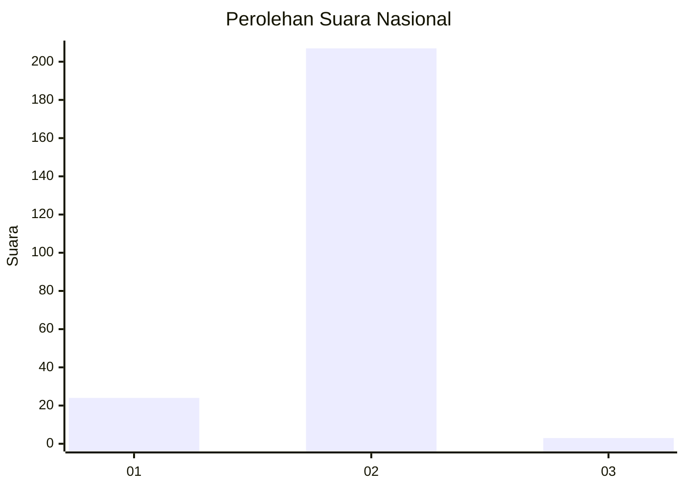
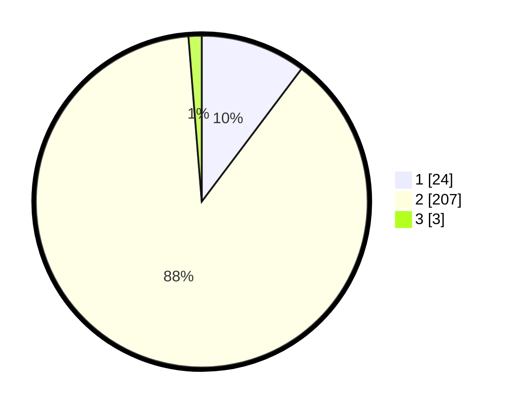

# Hasil

## Grafik

## Tabel

| No. | Nama Paslon    | Suara | Suara (raw) | Persentase |
|:--- |:-------------- | -----:| -----------:| ----------:|
| 1   | ANIES MUHAIMIN | 24    | [24][p-1]   | 10,26      |
| 2   | PRABOWO GIBRAN | 207   | [207][p-2]  | 88,46      |
| 3   | GANJAR MAHFUD  | 3     | [3][p-3]    | 1,28       |

[p-1]: https://github.com/gigit-pemilu/pemilu-2024/blob/main/pilpres/hitung-suara/sub/52-nusa-tenggara-barat/sub/06-bima/sub/01-monta/sub/2015-wilamaci/sub/001-tps/sub/paslon-1.txt
[p-2]: https://github.com/gigit-pemilu/pemilu-2024/blob/main/pilpres/hitung-suara/sub/52-nusa-tenggara-barat/sub/06-bima/sub/01-monta/sub/2015-wilamaci/sub/001-tps/sub/paslon-2.txt
[p-3]: https://github.com/gigit-pemilu/pemilu-2024/blob/main/pilpres/hitung-suara/sub/52-nusa-tenggara-barat/sub/06-bima/sub/01-monta/sub/2015-wilamaci/sub/001-tps/sub/paslon-3.txt

## Foto C Plano

https://sirekap-obj-formc.kpu.go.id/85ec/pemilu/ppwp/52/06/01/20/15/5206012015001-20240215-171151--ed973769-b2f4-4f2f-aa38-48ef02a888bd.jpg

https://sirekap-obj-formc.kpu.go.id/85ec/pemilu/ppwp/52/06/01/20/15/5206012015001-20240215-171822--232dbfed-1bc7-4ac5-b7cb-b5ff1dc4b5d9.jpg

https://sirekap-obj-formc.kpu.go.id/85ec/pemilu/ppwp/52/06/01/20/15/5206012015001-20240215-171925--feb305f9-bcdf-48cf-b112-4f2cf602a351.jpg

## Metadata

| Key        | Value               |
| ---------- | ------------------- |
| Time Stamp | 2024-02-15 21:01:18 |

