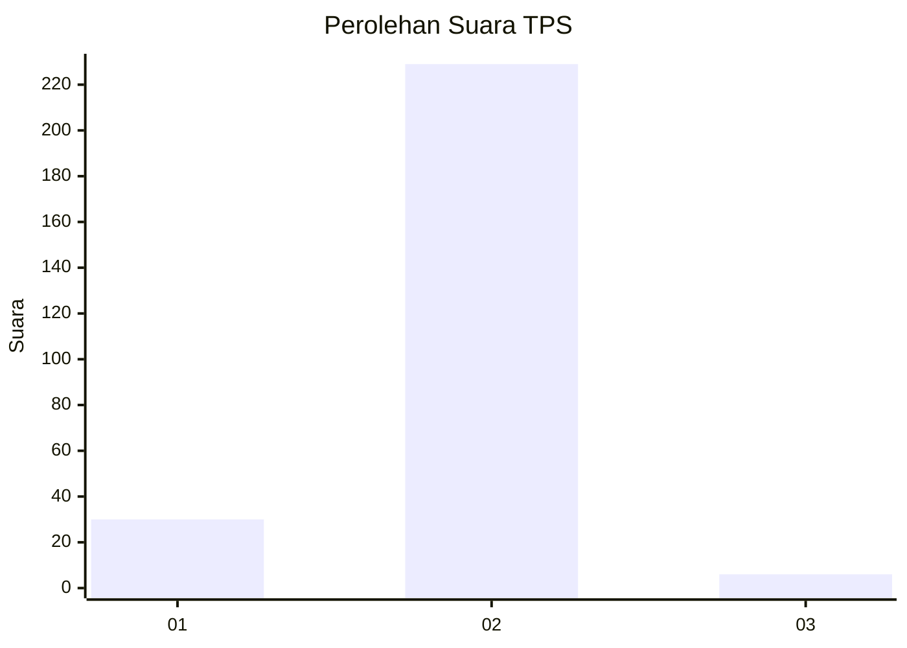
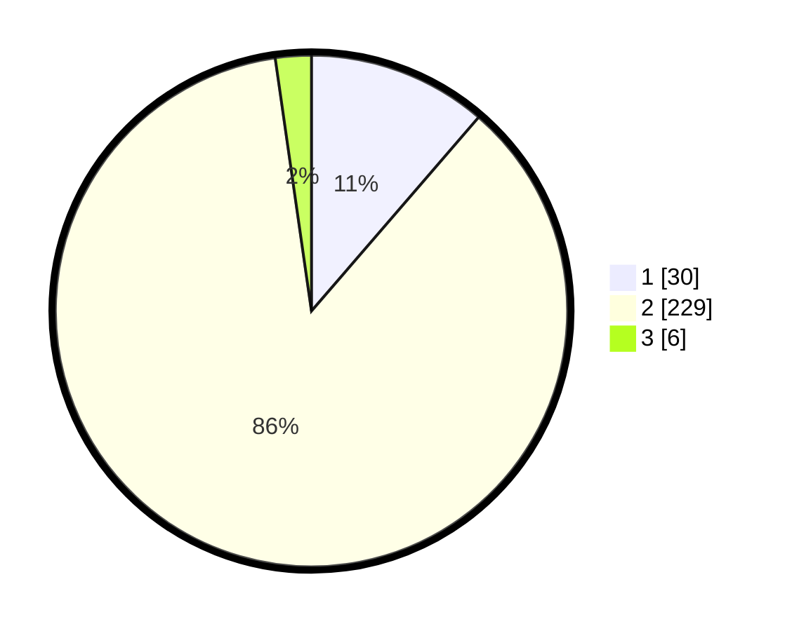

# Hasil

## Grafik

## Tabel

| No. | Nama Paslon    | Suara | Suara (raw) | Persentase |
|:--- |:-------------- | -----:| -----------:| ----------:|
| 1   | ANIES MUHAIMIN | 30    | [30][p-1]   | 11,32      |
| 2   | PRABOWO GIBRAN | 229   | [229][p-2]  | 86,42      |
| 3   | GANJAR MAHFUD  | 6     | [6][p-3]    | 2,26       |

[p-1]: https://github.com/gigit-pemilu/pemilu-2024-52-nusa-tenggara-barat/blob/main/pilpres/hitung-suara/sub/52-nusa-tenggara-barat/sub/06-bima/sub/04-belo/sub/2004-renda/sub/001-tps/sub/paslon-1.txt
[p-2]: https://github.com/gigit-pemilu/pemilu-2024-52-nusa-tenggara-barat/blob/main/pilpres/hitung-suara/sub/52-nusa-tenggara-barat/sub/06-bima/sub/04-belo/sub/2004-renda/sub/001-tps/sub/paslon-2.txt
[p-3]: https://github.com/gigit-pemilu/pemilu-2024-52-nusa-tenggara-barat/blob/main/pilpres/hitung-suara/sub/52-nusa-tenggara-barat/sub/06-bima/sub/04-belo/sub/2004-renda/sub/001-tps/sub/paslon-3.txt

## Foto C Plano

https://sirekap-obj-formc.kpu.go.id/e40e/pemilu/ppwp/52/06/04/20/04/5206042004001-20240215-101359--80f9743c-3821-4a74-b288-099687464d86.jpg

https://sirekap-obj-formc.kpu.go.id/e40e/pemilu/ppwp/52/06/04/20/04/5206042004001-20240215-101531--03270274-da82-4a6b-9470-a4b4fdc17173.jpg

https://sirekap-obj-formc.kpu.go.id/e40e/pemilu/ppwp/52/06/04/20/04/5206042004001-20240215-175013--36606463-b3cc-45cf-b0ea-8c3b4cdbba80.jpg

## Metadata

| Key        | Value               |
| ---------- | ------------------- |
| Time Stamp | 2024-02-16 16:25:10 |

