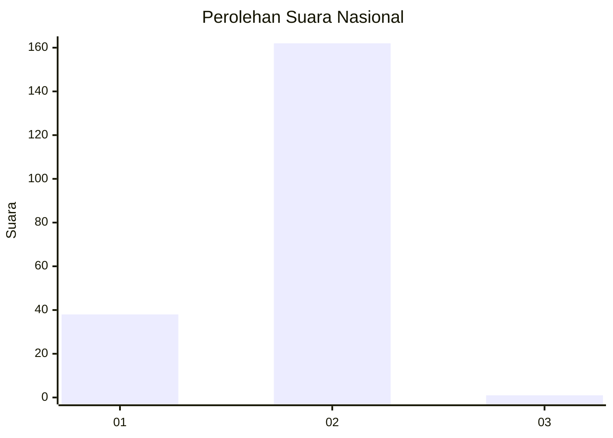
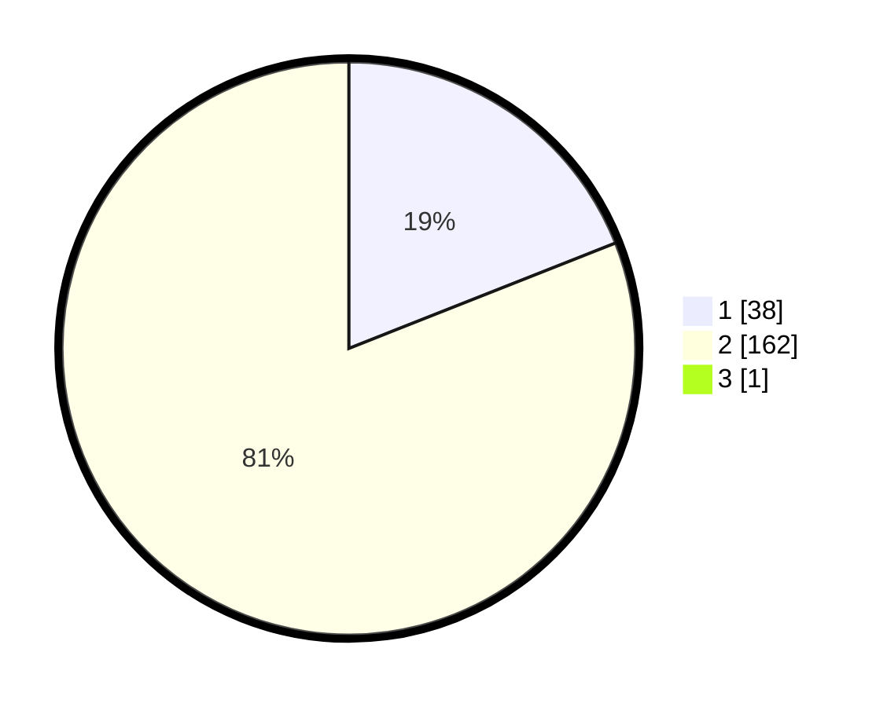

# Hasil

## Grafik

## Tabel

| No. | Nama Paslon    | Suara | Suara (raw) | Persentase |
|:--- |:-------------- | -----:| -----------:| ----------:|
| 1   | ANIES MUHAIMIN | 38    | [38][p-1]   | 18,91      |
| 2   | PRABOWO GIBRAN | 162   | [162][p-2]  | 80,60      |
| 3   | GANJAR MAHFUD  | 1     | [1][p-3]    | 0,50       |

[p-1]: https://github.com/gigit-pemilu/pemilu-2024/blob/main/pilpres/hitung-suara/sub/52-nusa-tenggara-barat/sub/06-bima/sub/06-sape/sub/2001-sari/sub/006-tps/sub/paslon-1.txt
[p-2]: https://github.com/gigit-pemilu/pemilu-2024/blob/main/pilpres/hitung-suara/sub/52-nusa-tenggara-barat/sub/06-bima/sub/06-sape/sub/2001-sari/sub/006-tps/sub/paslon-2.txt
[p-3]: https://github.com/gigit-pemilu/pemilu-2024/blob/main/pilpres/hitung-suara/sub/52-nusa-tenggara-barat/sub/06-bima/sub/06-sape/sub/2001-sari/sub/006-tps/sub/paslon-3.txt

## Foto C Plano

https://sirekap-obj-formc.kpu.go.id/0512/pemilu/ppwp/52/06/06/20/01/5206062001006-20240219-101824--0db1b41e-cbb4-4ffd-b7ce-9175a012885c.jpg

https://sirekap-obj-formc.kpu.go.id/0512/pemilu/ppwp/52/06/06/20/01/5206062001006-20240219-101722--600c9c95-a712-4bbd-9dc1-800abf931d14.jpg

https://sirekap-obj-formc.kpu.go.id/0512/pemilu/ppwp/52/06/06/20/01/5206062001006-20240219-101926--4285c4a9-209a-4df9-a57b-5682bfd3fd36.jpg

## Metadata

| Key        | Value               |
| ---------- | ------------------- |
| Time Stamp | 2024-02-19 18:00:00 |

