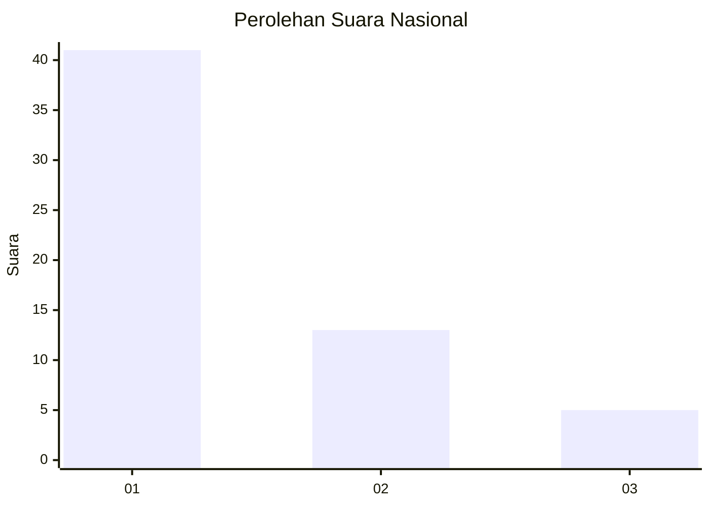
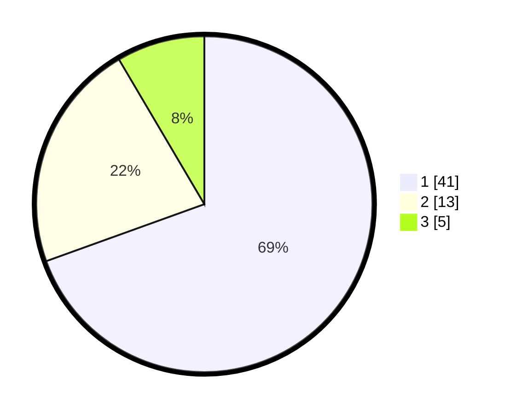

# Hasil

## Grafik

## Tabel

| No. | Nama Paslon    | Suara | Suara (raw) | Persentase |
|:--- |:-------------- | -----:| -----------:| ----------:|
| 1   | ANIES MUHAIMIN | 41    | [41][p-1]   | 69,49      |
| 2   | PRABOWO GIBRAN | 13    | [13][p-2]   | 22,03      |
| 3   | GANJAR MAHFUD  | 5     | [5][p-3]    | 8,47       |

[p-1]: https://github.com/gigit-pemilu/pemilu-2024/blob/main/pilpres/hitung-suara/sub/52-nusa-tenggara-barat/sub/06-bima/sub/07-wera/sub/2007-sangiang/sub/007-tps/sub/paslon-1.txt
[p-2]: https://github.com/gigit-pemilu/pemilu-2024/blob/main/pilpres/hitung-suara/sub/52-nusa-tenggara-barat/sub/06-bima/sub/07-wera/sub/2007-sangiang/sub/007-tps/sub/paslon-2.txt
[p-3]: https://github.com/gigit-pemilu/pemilu-2024/blob/main/pilpres/hitung-suara/sub/52-nusa-tenggara-barat/sub/06-bima/sub/07-wera/sub/2007-sangiang/sub/007-tps/sub/paslon-3.txt

## Foto C Plano

https://sirekap-obj-formc.kpu.go.id/313e/pemilu/ppwp/52/06/07/20/07/5206072007007-20240215-121159--d70e6370-21ac-453d-b523-12b5d2306c89.jpg

https://sirekap-obj-formc.kpu.go.id/313e/pemilu/ppwp/52/06/07/20/07/5206072007007-20240215-121411--70174da6-4f03-4bd7-842b-434e09710f60.jpg

https://sirekap-obj-formc.kpu.go.id/313e/pemilu/ppwp/52/06/07/20/07/5206072007007-20240215-121437--b6ff8105-02a7-4380-bba2-5c1f6caef732.jpg

## Metadata

| Key        | Value               |
| ---------- | ------------------- |
| Time Stamp | 2024-02-16 00:30:27 |

