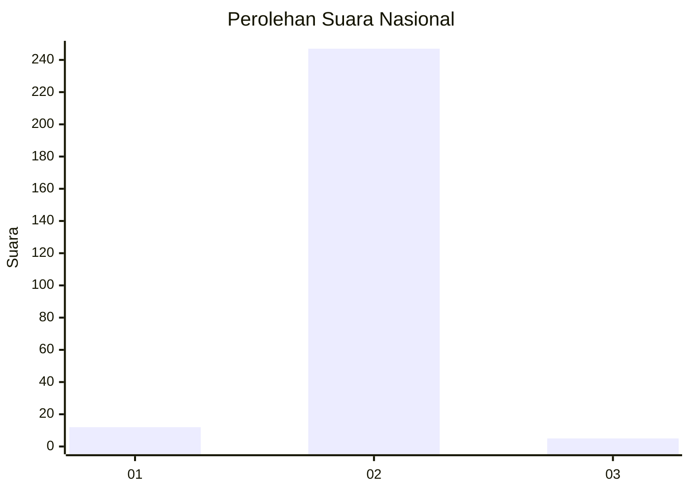
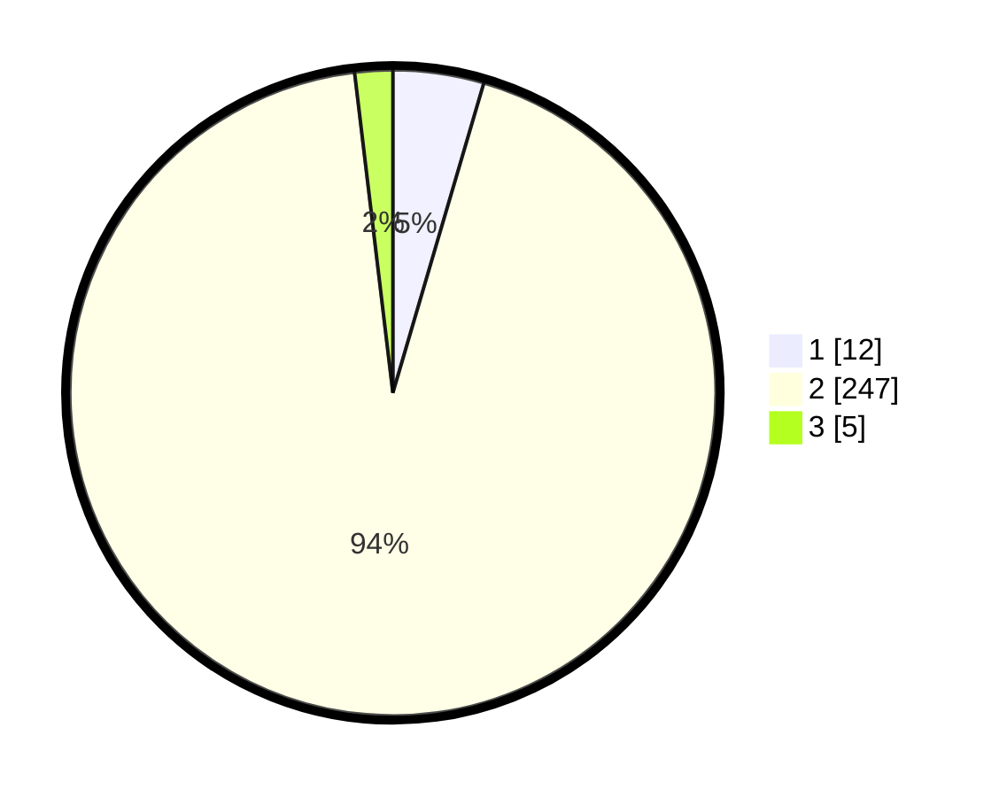

# Hasil

## Grafik

## Tabel

| No. | Nama Paslon    | Suara | Suara (raw) | Persentase |
|:--- |:-------------- | -----:| -----------:| ----------:|
| 1   | ANIES MUHAIMIN | 12    | [12][p-1]   | 4,55       |
| 2   | PRABOWO GIBRAN | 247   | [247][p-2]  | 93,56      |
| 3   | GANJAR MAHFUD  | 5     | [5][p-3]    | 1,89       |

[p-1]: https://github.com/gigit-pemilu/pemilu-2024/blob/main/pilpres/hitung-suara/sub/52-nusa-tenggara-barat/sub/06-bima/sub/07-wera/sub/2011-nanga-wera/sub/002-tps/sub/paslon-1.txt
[p-2]: https://github.com/gigit-pemilu/pemilu-2024/blob/main/pilpres/hitung-suara/sub/52-nusa-tenggara-barat/sub/06-bima/sub/07-wera/sub/2011-nanga-wera/sub/002-tps/sub/paslon-2.txt
[p-3]: https://github.com/gigit-pemilu/pemilu-2024/blob/main/pilpres/hitung-suara/sub/52-nusa-tenggara-barat/sub/06-bima/sub/07-wera/sub/2011-nanga-wera/sub/002-tps/sub/paslon-3.txt

## Foto C Plano

https://sirekap-obj-formc.kpu.go.id/89f9/pemilu/ppwp/52/06/07/20/11/5206072011002-20240215-123816--6606dd64-4af7-4fff-b9b5-b39bb07c5727.jpg

https://sirekap-obj-formc.kpu.go.id/89f9/pemilu/ppwp/52/06/07/20/11/5206072011002-20240215-114127--4dc6bff9-f3f1-48ea-af86-bf082584da63.jpg

https://sirekap-obj-formc.kpu.go.id/89f9/pemilu/ppwp/52/06/07/20/11/5206072011002-20240215-114155--d2903469-541a-48f5-a20c-8de39a2fb2cc.jpg

## Metadata

| Key        | Value               |
| ---------- | ------------------- |
| Time Stamp | 2024-02-15 18:00:26 |

