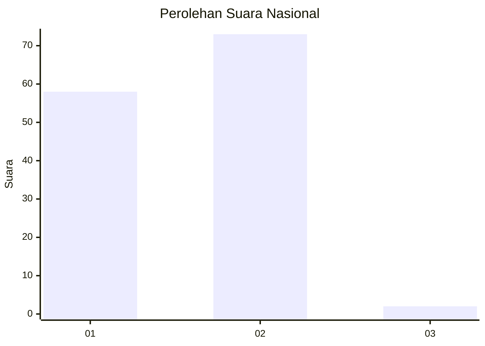
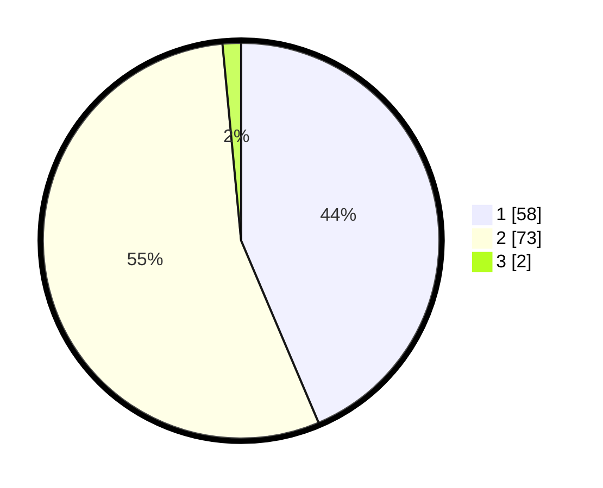

# Hasil

## Grafik

## Tabel

| No. | Nama Paslon    | Suara | Suara (raw) | Persentase |
|:--- |:-------------- | -----:| -----------:| ----------:|
| 1   | ANIES MUHAIMIN | 58    | [58][p-1]   | 43,61      |
| 2   | PRABOWO GIBRAN | 73    | [73][p-2]   | 54,89      |
| 3   | GANJAR MAHFUD  | 2     | [2][p-3]    | 1,50       |

[p-1]: https://github.com/gigit-pemilu/pemilu-2024/blob/main/pilpres/hitung-suara/sub/52-nusa-tenggara-barat/sub/06-bima/sub/07-wera/sub/2012-ranggasolo/sub/004-tps/sub/paslon-1.txt
[p-2]: https://github.com/gigit-pemilu/pemilu-2024/blob/main/pilpres/hitung-suara/sub/52-nusa-tenggara-barat/sub/06-bima/sub/07-wera/sub/2012-ranggasolo/sub/004-tps/sub/paslon-2.txt
[p-3]: https://github.com/gigit-pemilu/pemilu-2024/blob/main/pilpres/hitung-suara/sub/52-nusa-tenggara-barat/sub/06-bima/sub/07-wera/sub/2012-ranggasolo/sub/004-tps/sub/paslon-3.txt

## Foto C Plano

https://sirekap-obj-formc.kpu.go.id/5ca9/pemilu/ppwp/52/06/07/20/12/5206072012004-20240215-113557--f4c0ea9c-2d33-4186-b951-f070364f889b.jpg

https://sirekap-obj-formc.kpu.go.id/5ca9/pemilu/ppwp/52/06/07/20/12/5206072012004-20240215-115702--81e91ca5-5be2-4e87-91cf-ceec9855ee9c.jpg

https://sirekap-obj-formc.kpu.go.id/5ca9/pemilu/ppwp/52/06/07/20/12/5206072012004-20240215-114332--d71ae6ee-61f9-4f19-b5d6-34e2f2395fc4.jpg

## Metadata

| Key        | Value               |
| ---------- | ------------------- |
| Time Stamp | 2024-02-15 22:30:27 |

