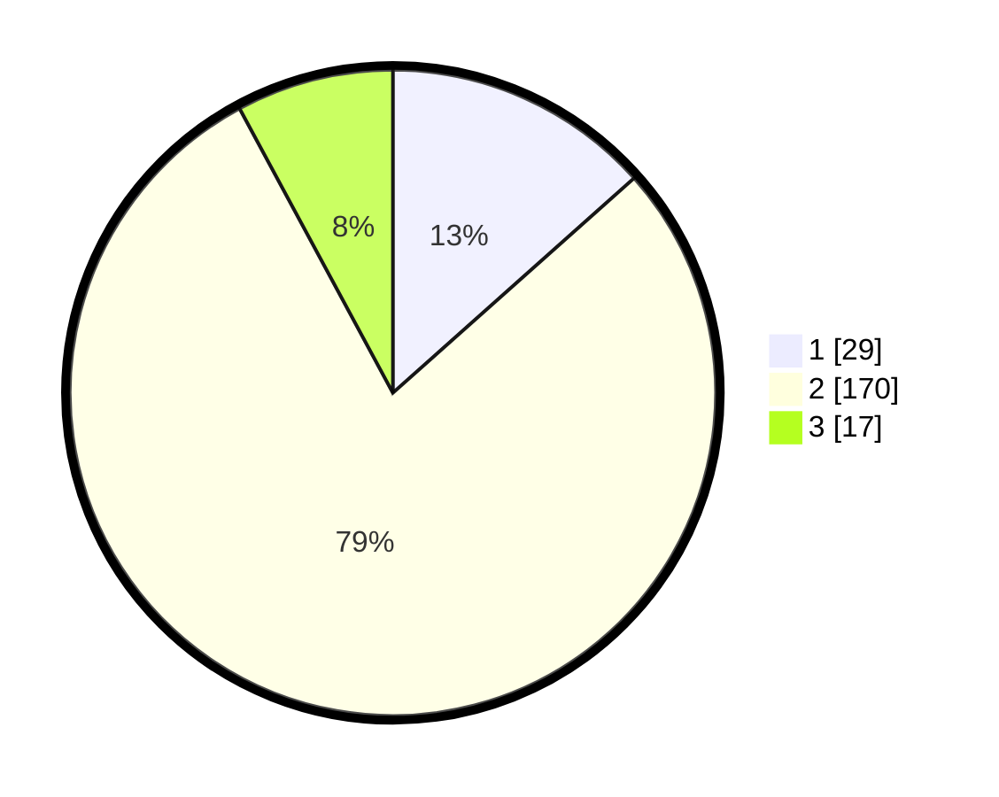

# Hasil

## Grafik

## Tabel

| No. | Nama Paslon    | Suara | Suara (raw) | Persentase |
|:--- |:-------------- | -----:| -----------:| ----------:|
| 1   | ANIES MUHAIMIN | 29    | [29][p-1]   | 13,43      |
| 2   | PRABOWO GIBRAN | 170   | [170][p-2]  | 78,70      |
| 3   | GANJAR MAHFUD  | 17    | [17][p-3]   | 7,87       |

[p-1]: https://github.com/gigit-pemilu/pemilu-2024/blob/main/pilpres/hitung-suara/sub/52-nusa-tenggara-barat/sub/06-bima/sub/10-ambalawi/sub/2001-nipa/sub/002-tps/sub/paslon-1.txt
[p-2]: https://github.com/gigit-pemilu/pemilu-2024/blob/main/pilpres/hitung-suara/sub/52-nusa-tenggara-barat/sub/06-bima/sub/10-ambalawi/sub/2001-nipa/sub/002-tps/sub/paslon-2.txt
[p-3]: https://github.com/gigit-pemilu/pemilu-2024/blob/main/pilpres/hitung-suara/sub/52-nusa-tenggara-barat/sub/06-bima/sub/10-ambalawi/sub/2001-nipa/sub/002-tps/sub/paslon-3.txt

## Foto C Plano

https://sirekap-obj-formc.kpu.go.id/f64a/pemilu/ppwp/52/06/10/20/01/5206102001002-20240225-195725--0415796b-c86b-4cd2-99a1-c861496e4eee.jpg

https://sirekap-obj-formc.kpu.go.id/f64a/pemilu/ppwp/52/06/10/20/01/5206102001002-20240225-195745--5727632f-e55e-4fd4-9b01-245a62d08e16.jpg

https://sirekap-obj-formc.kpu.go.id/f64a/pemilu/ppwp/52/06/10/20/01/5206102001002-20240225-200020--6cb19fd8-cdc6-4c80-bbb5-0fd4d7b1f561.jpg

## Metadata

| Key        | Value               |
| ---------- | ------------------- |
| Time Stamp | 2024-02-28 19:00:00 |

