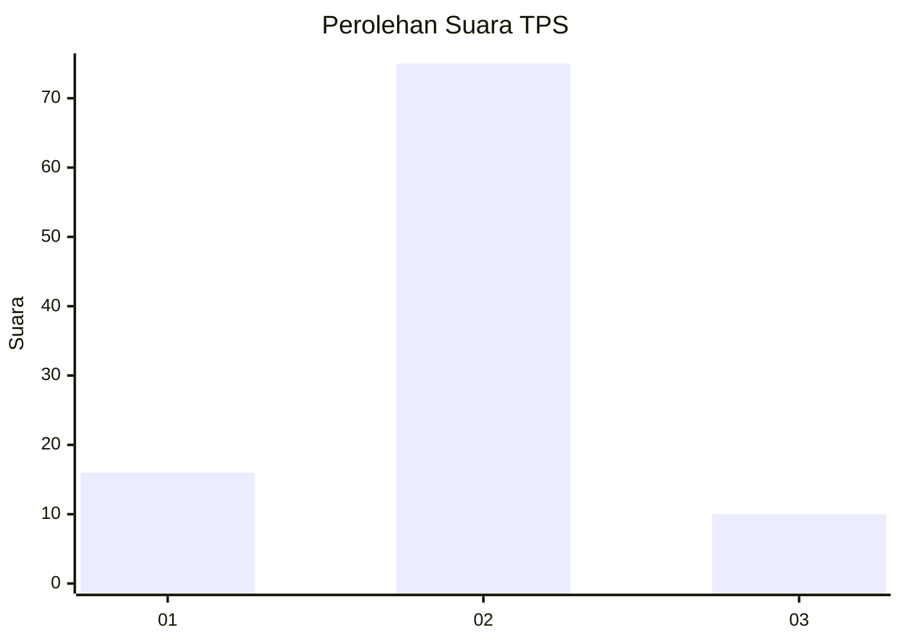
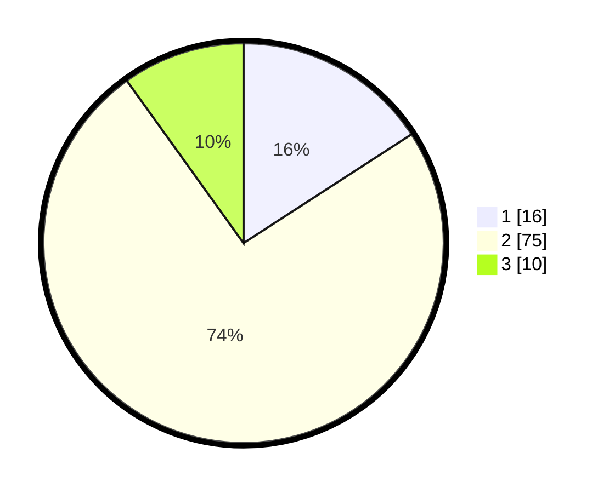

# Hasil

## Grafik

## Tabel

| No. | Nama Paslon    | Suara | Suara (raw) | Persentase |
|:--- |:-------------- | -----:| -----------:| ----------:|
| 1   | ANIES MUHAIMIN | 16    | [16][p-1]   | 15,84      |
| 2   | PRABOWO GIBRAN | 75    | [75][p-2]   | 74,26      |
| 3   | GANJAR MAHFUD  | 10    | [10][p-3]   | 9,90       |

[p-1]: https://github.com/gigit-pemilu/pemilu-2024-52-nusa-tenggara-barat/blob/main/pilpres/hitung-suara/sub/52-nusa-tenggara-barat/sub/06-bima/sub/10-ambalawi/sub/2001-nipa/sub/004-tps/sub/paslon-1.txt
[p-2]: https://github.com/gigit-pemilu/pemilu-2024-52-nusa-tenggara-barat/blob/main/pilpres/hitung-suara/sub/52-nusa-tenggara-barat/sub/06-bima/sub/10-ambalawi/sub/2001-nipa/sub/004-tps/sub/paslon-2.txt
[p-3]: https://github.com/gigit-pemilu/pemilu-2024-52-nusa-tenggara-barat/blob/main/pilpres/hitung-suara/sub/52-nusa-tenggara-barat/sub/06-bima/sub/10-ambalawi/sub/2001-nipa/sub/004-tps/sub/paslon-3.txt

## Foto C Plano

https://sirekap-obj-formc.kpu.go.id/6545/pemilu/ppwp/52/06/10/20/01/5206102001004-20240226-084331--c31be23b-4a90-4f5c-af7d-57bbab18720e.jpg

https://sirekap-obj-formc.kpu.go.id/6545/pemilu/ppwp/52/06/10/20/01/5206102001004-20240226-084405--5d3ae9be-72c4-4d71-9231-3b2ca121782b.jpg

https://sirekap-obj-formc.kpu.go.id/6545/pemilu/ppwp/52/06/10/20/01/5206102001004-20240226-084422--707060c2-77ab-46f2-8615-a60ac5e1c194.jpg

## Metadata

| Key        | Value               |
| ---------- | ------------------- |
| Time Stamp | 2024-02-28 19:00:00 |

