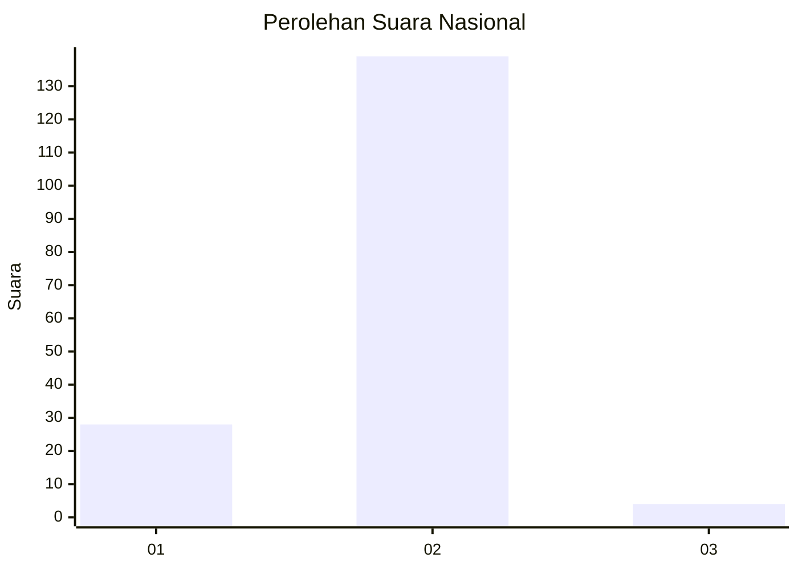
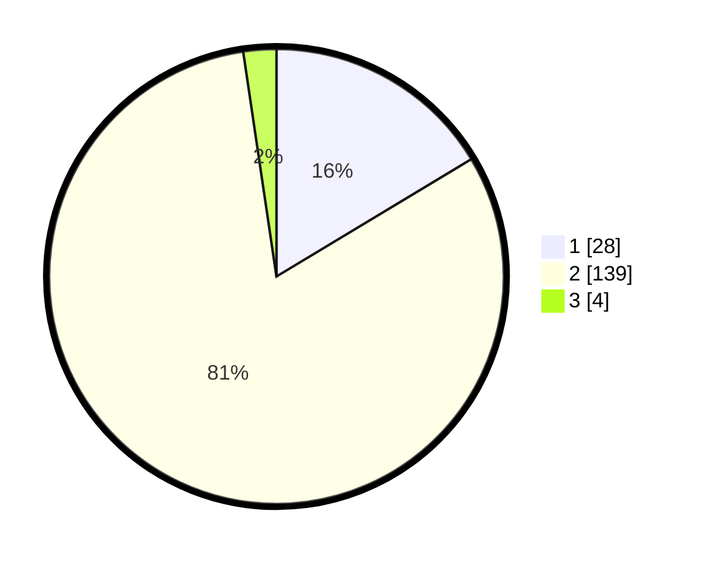

# Hasil

## Grafik

## Tabel

| No. | Nama Paslon    | Suara | Suara (raw) | Persentase |
|:--- |:-------------- | -----:| -----------:| ----------:|
| 1   | ANIES MUHAIMIN | 28    | [28][p-1]   | 16,37      |
| 2   | PRABOWO GIBRAN | 139   | [139][p-2]  | 81,29      |
| 3   | GANJAR MAHFUD  | 4     | [4][p-3]    | 2,34       |

[p-1]: https://github.com/gigit-pemilu/pemilu-2024/blob/main/pilpres/hitung-suara/sub/52-nusa-tenggara-barat/sub/06-bima/sub/10-ambalawi/sub/2001-nipa/sub/006-tps/sub/paslon-1.txt
[p-2]: https://github.com/gigit-pemilu/pemilu-2024/blob/main/pilpres/hitung-suara/sub/52-nusa-tenggara-barat/sub/06-bima/sub/10-ambalawi/sub/2001-nipa/sub/006-tps/sub/paslon-2.txt
[p-3]: https://github.com/gigit-pemilu/pemilu-2024/blob/main/pilpres/hitung-suara/sub/52-nusa-tenggara-barat/sub/06-bima/sub/10-ambalawi/sub/2001-nipa/sub/006-tps/sub/paslon-3.txt

## Foto C Plano

https://sirekap-obj-formc.kpu.go.id/4c65/pemilu/ppwp/52/06/10/20/01/5206102001006-20240226-092032--7ac3ed2d-3755-4809-bfb0-9088804603d1.jpg

https://sirekap-obj-formc.kpu.go.id/4c65/pemilu/ppwp/52/06/10/20/01/5206102001006-20240226-092052--313c7ead-7dc9-4dde-bec7-29bfa8e516ed.jpg

https://sirekap-obj-formc.kpu.go.id/4c65/pemilu/ppwp/52/06/10/20/01/5206102001006-20240226-092115--d06fa14a-ea94-4f5d-850d-d70d4f705fda.jpg

## Metadata

| Key        | Value               |
| ---------- | ------------------- |
| Time Stamp | 2024-02-28 20:00:00 |

