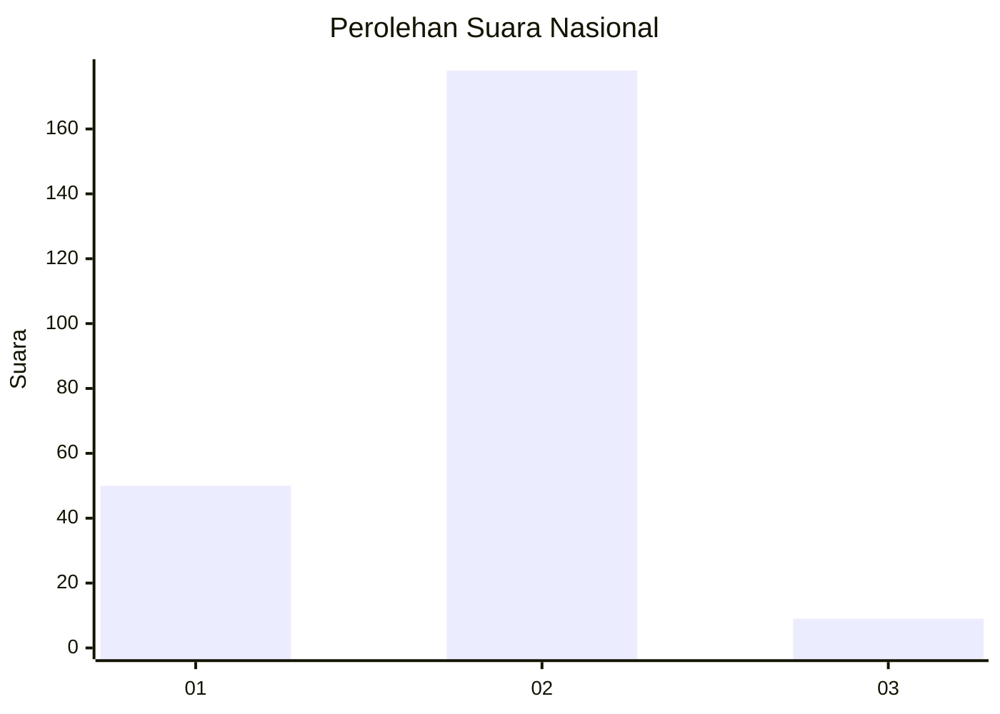

# Hasil

## Grafik

## Tabel

| No. | Nama Paslon    | Suara | Suara (raw) | Persentase |
|:--- |:-------------- | -----:| -----------:| ----------:|
| 1   | ANIES MUHAIMIN | 50    | [50][p-1]   | 21,10      |
| 2   | PRABOWO GIBRAN | 178   | [178][p-2]  | 75,11      |
| 3   | GANJAR MAHFUD  | 9     | [9][p-3]    | 3,80       |

[p-1]: https://github.com/gigit-pemilu/pemilu-2024/blob/main/pilpres/hitung-suara/sub/52-nusa-tenggara-barat/sub/06-bima/sub/12-lambu/sub/2001-kaleo/sub/008-tps/sub/paslon-1.txt
[p-2]: https://github.com/gigit-pemilu/pemilu-2024/blob/main/pilpres/hitung-suara/sub/52-nusa-tenggara-barat/sub/06-bima/sub/12-lambu/sub/2001-kaleo/sub/008-tps/sub/paslon-2.txt
[p-3]: https://github.com/gigit-pemilu/pemilu-2024/blob/main/pilpres/hitung-suara/sub/52-nusa-tenggara-barat/sub/06-bima/sub/12-lambu/sub/2001-kaleo/sub/008-tps/sub/paslon-3.txt

## Foto C Plano

https://sirekap-obj-formc.kpu.go.id/7d13/pemilu/ppwp/52/06/12/20/01/5206122001008-20240215-092043--e30416c4-1341-4250-a9bc-45e678e1a813.jpg

https://sirekap-obj-formc.kpu.go.id/7d13/pemilu/ppwp/52/06/12/20/01/5206122001008-20240215-103216--56d09b3e-27e7-41e6-93c5-aa5329e9d21d.jpg

https://sirekap-obj-formc.kpu.go.id/7d13/pemilu/ppwp/52/06/12/20/01/5206122001008-20240215-092334--4ae0c9e3-bc26-47d7-ab0c-3a2f441aeae3.jpg

## Metadata

| Key        | Value               |
| ---------- | ------------------- |
| Time Stamp | 2024-02-25 14:00:00 |

