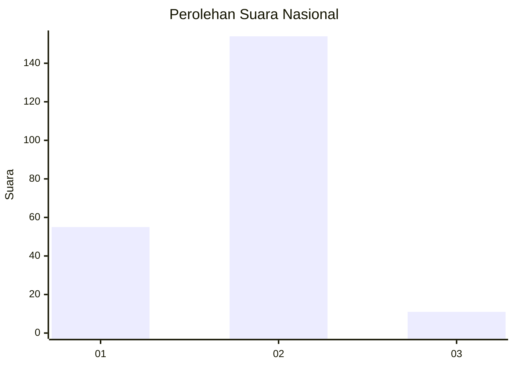
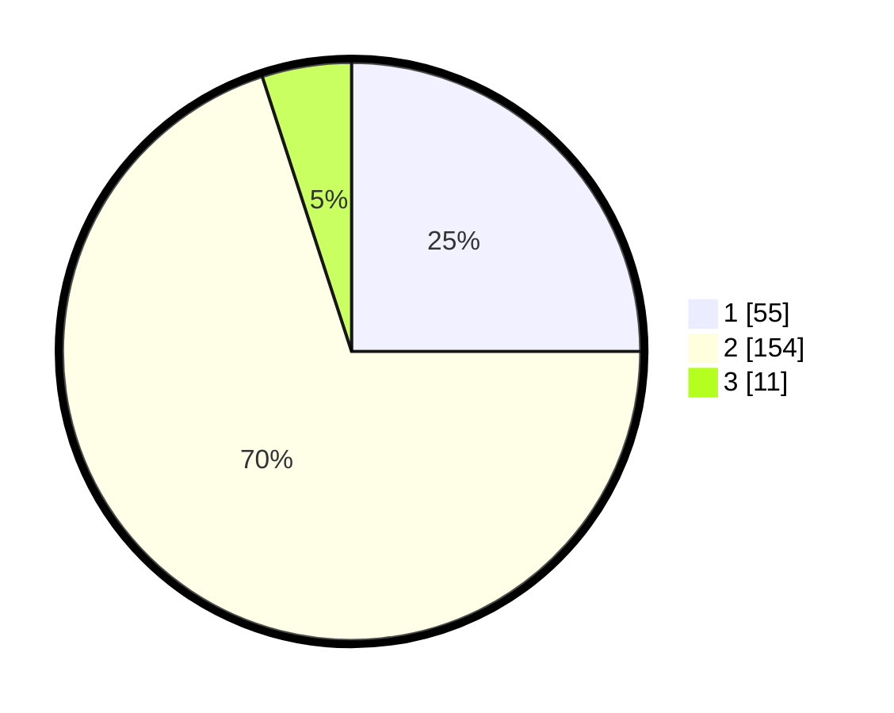

# Hasil

## Grafik

## Tabel

| No. | Nama Paslon    | Suara | Suara (raw) | Persentase |
|:--- |:-------------- | -----:| -----------:| ----------:|
| 1   | ANIES MUHAIMIN | 55    | [55][p-1]   | 25,00      |
| 2   | PRABOWO GIBRAN | 154   | [154][p-2]  | 70,00      |
| 3   | GANJAR MAHFUD  | 11    | [11][p-3]   | 5,00       |

[p-1]: https://github.com/gigit-pemilu/pemilu-2024/blob/main/pilpres/hitung-suara/sub/52-nusa-tenggara-barat/sub/06-bima/sub/17-lambitu/sub/2001-kabaro/sub/002-tps/sub/paslon-1.txt
[p-2]: https://github.com/gigit-pemilu/pemilu-2024/blob/main/pilpres/hitung-suara/sub/52-nusa-tenggara-barat/sub/06-bima/sub/17-lambitu/sub/2001-kabaro/sub/002-tps/sub/paslon-2.txt
[p-3]: https://github.com/gigit-pemilu/pemilu-2024/blob/main/pilpres/hitung-suara/sub/52-nusa-tenggara-barat/sub/06-bima/sub/17-lambitu/sub/2001-kabaro/sub/002-tps/sub/paslon-3.txt

## Foto C Plano

https://sirekap-obj-formc.kpu.go.id/c711/pemilu/ppwp/52/06/17/20/01/5206172001002-20240221-135233--87cbe73e-71af-40b8-ac27-54546820377a.jpg

https://sirekap-obj-formc.kpu.go.id/c711/pemilu/ppwp/52/06/17/20/01/5206172001002-20240221-135413--bc350948-dd3a-434c-8ed0-279cc248e6f7.jpg

https://sirekap-obj-formc.kpu.go.id/c711/pemilu/ppwp/52/06/17/20/01/5206172001002-20240221-135617--d675b47d-0bcb-46af-a9f6-9508ec94a437.jpg

## Metadata

| Key        | Value               |
| ---------- | ------------------- |
| Time Stamp | 2024-02-21 19:00:00 |

