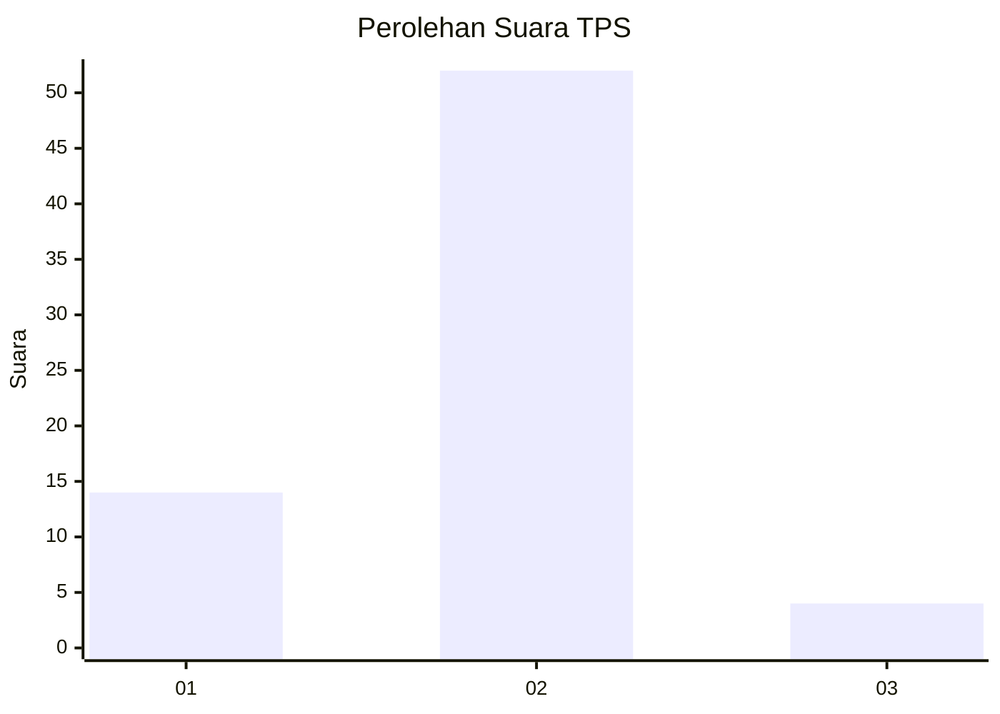
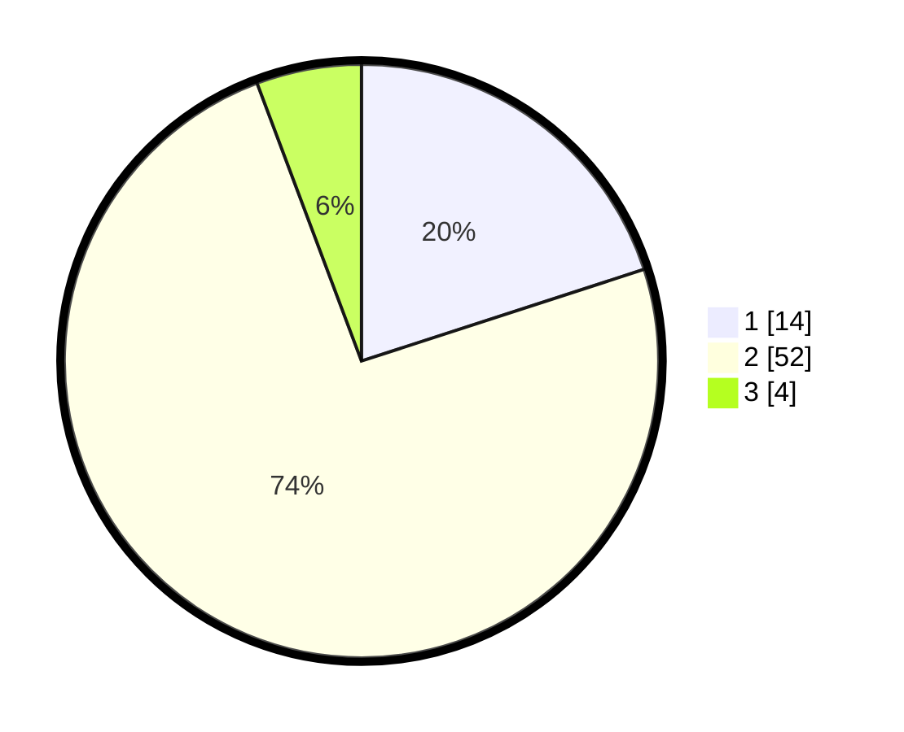

# Hasil

## Grafik

## Tabel

| No. | Nama Paslon    | Suara | Suara (raw) | Persentase |
|:--- |:-------------- | -----:| -----------:| ----------:|
| 1   | ANIES MUHAIMIN | 14    | [14][p-1]   | 20,00      |
| 2   | PRABOWO GIBRAN | 52    | [52][p-2]   | 74,29      |
| 3   | GANJAR MAHFUD  | 4     | [4][p-3]    | 5,71       |

[p-1]: https://github.com/gigit-pemilu/pemilu-2024-52-nusa-tenggara-barat/blob/main/pilpres/hitung-suara/sub/52-nusa-tenggara-barat/sub/06-bima/sub/17-lambitu/sub/2005-ka'owa/sub/003-tps/sub/paslon-1.txt
[p-2]: https://github.com/gigit-pemilu/pemilu-2024-52-nusa-tenggara-barat/blob/main/pilpres/hitung-suara/sub/52-nusa-tenggara-barat/sub/06-bima/sub/17-lambitu/sub/2005-ka'owa/sub/003-tps/sub/paslon-2.txt
[p-3]: https://github.com/gigit-pemilu/pemilu-2024-52-nusa-tenggara-barat/blob/main/pilpres/hitung-suara/sub/52-nusa-tenggara-barat/sub/06-bima/sub/17-lambitu/sub/2005-ka'owa/sub/003-tps/sub/paslon-3.txt

## Foto C Plano

https://sirekap-obj-formc.kpu.go.id/3d87/pemilu/ppwp/52/06/17/20/05/5206172005003-20240215-094745--b5bc83a2-b653-4d35-954c-147fb6ec2afa.jpg

https://sirekap-obj-formc.kpu.go.id/3d87/pemilu/ppwp/52/06/17/20/05/5206172005003-20240215-094853--4ec879d8-2366-4694-b11e-5e032f0b001f.jpg

https://sirekap-obj-formc.kpu.go.id/3d87/pemilu/ppwp/52/06/17/20/05/5206172005003-20240215-094950--8b99b674-b18f-433f-ba31-272fff346351.jpg

## Metadata

| Key        | Value               |
| ---------- | ------------------- |
| Time Stamp | 2024-02-15 16:30:25 |

