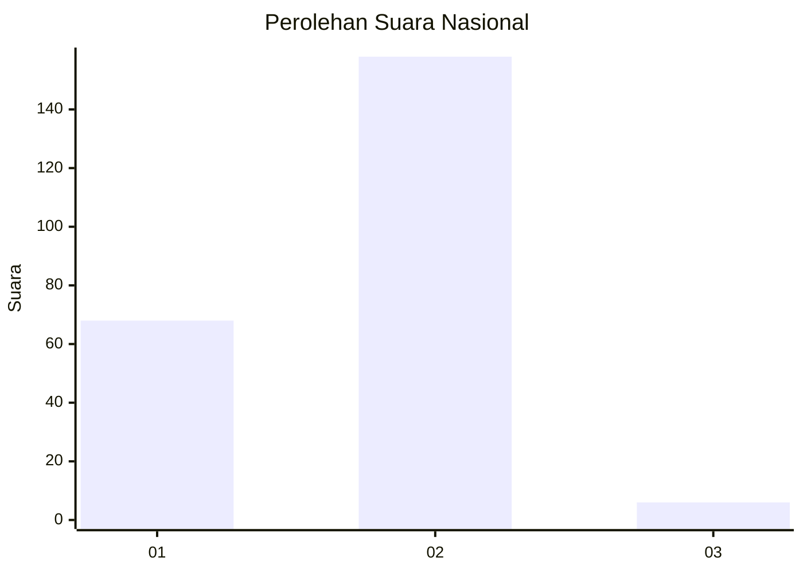
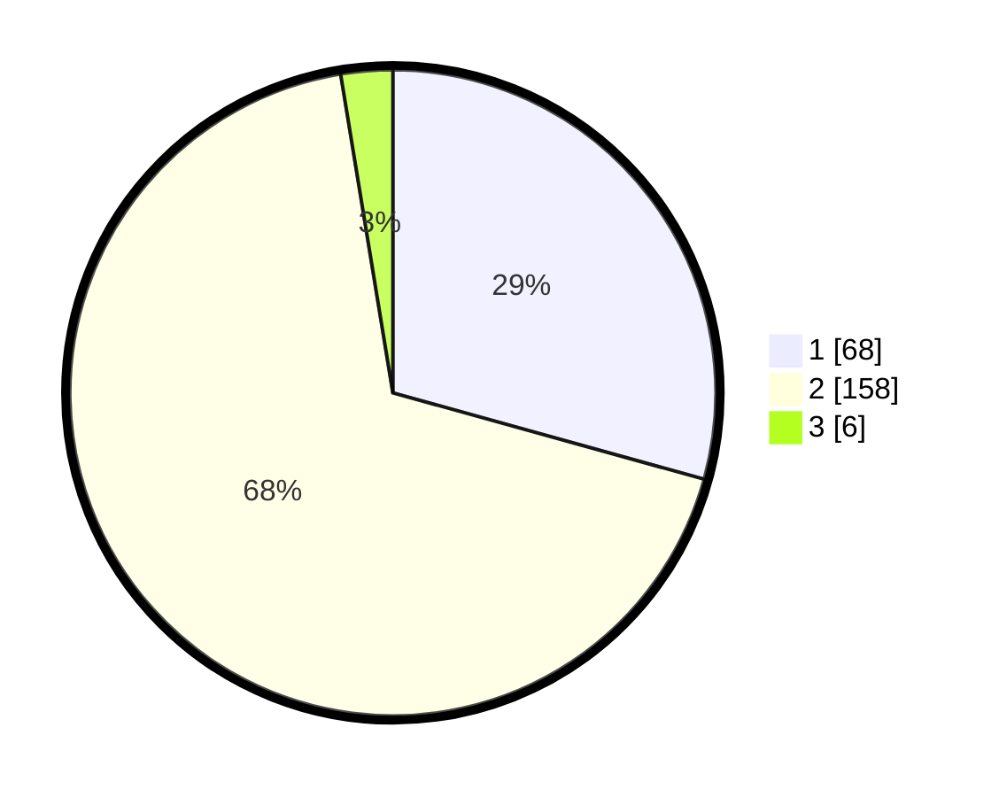

# Hasil

## Grafik

## Tabel

| No. | Nama Paslon    | Suara | Suara (raw) | Persentase |
|:--- |:-------------- | -----:| -----------:| ----------:|
| 1   | ANIES MUHAIMIN | 68    | [68][p-1]   | 29,31      |
| 2   | PRABOWO GIBRAN | 158   | [158][p-2]  | 68,10      |
| 3   | GANJAR MAHFUD  | 6     | [6][p-3]    | 2,59       |

[p-1]: https://github.com/gigit-pemilu/pemilu-2024/blob/main/pilpres/hitung-suara/sub/52-nusa-tenggara-barat/sub/06-bima/sub/18-palibelo/sub/2001-panda/sub/005-tps/sub/paslon-1.txt
[p-2]: https://github.com/gigit-pemilu/pemilu-2024/blob/main/pilpres/hitung-suara/sub/52-nusa-tenggara-barat/sub/06-bima/sub/18-palibelo/sub/2001-panda/sub/005-tps/sub/paslon-2.txt
[p-3]: https://github.com/gigit-pemilu/pemilu-2024/blob/main/pilpres/hitung-suara/sub/52-nusa-tenggara-barat/sub/06-bima/sub/18-palibelo/sub/2001-panda/sub/005-tps/sub/paslon-3.txt

## Foto C Plano

https://sirekap-obj-formc.kpu.go.id/f451/pemilu/ppwp/52/06/18/20/01/5206182001005-20240215-072818--8ee34ed7-261a-4845-837c-b85c9a8b7600.jpg

https://sirekap-obj-formc.kpu.go.id/f451/pemilu/ppwp/52/06/18/20/01/5206182001005-20240215-073213--f1971eed-0dd3-47b9-9591-2561bf27ea02.jpg

https://sirekap-obj-formc.kpu.go.id/f451/pemilu/ppwp/52/06/18/20/01/5206182001005-20240215-073026--8c570031-da80-455f-82ed-140b281b0e8a.jpg

## Metadata

| Key        | Value               |
| ---------- | ------------------- |
| Time Stamp | 2024-02-16 16:25:10 |

