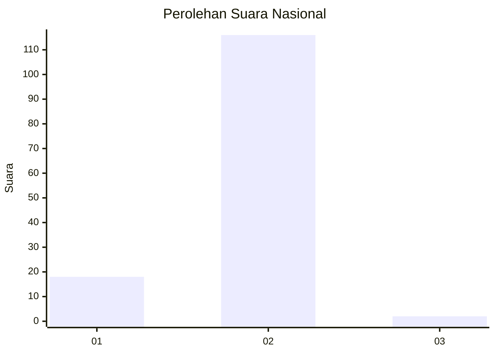
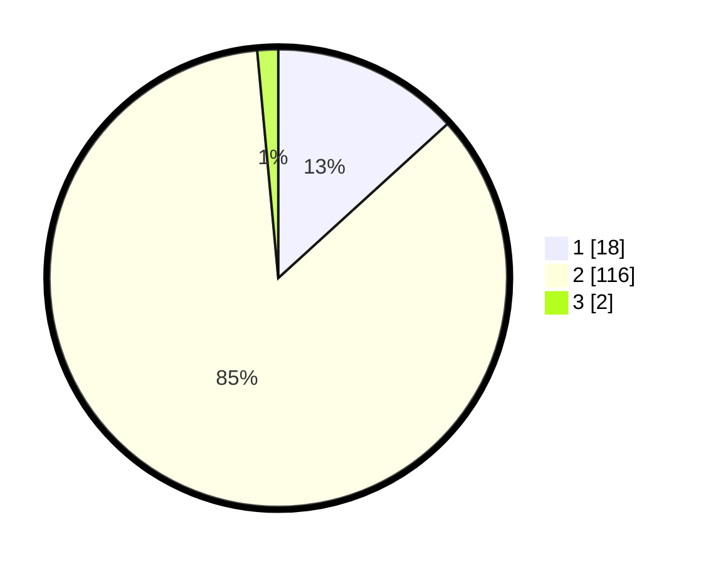

# Hasil

## Grafik

## Tabel

| No. | Nama Paslon    | Suara | Suara (raw) | Persentase |
|:--- |:-------------- | -----:| -----------:| ----------:|
| 1   | ANIES MUHAIMIN | 18    | [18][p-1]   | 13,24      |
| 2   | PRABOWO GIBRAN | 116   | [116][p-2]  | 85,29      |
| 3   | GANJAR MAHFUD  | 2     | [2][p-3]    | 1,47       |

[p-1]: https://github.com/gigit-pemilu/pemilu-2024/blob/main/pilpres/hitung-suara/sub/52-nusa-tenggara-barat/sub/06-bima/sub/18-palibelo/sub/2006-ntonggu/sub/002-tps/sub/paslon-1.txt
[p-2]: https://github.com/gigit-pemilu/pemilu-2024/blob/main/pilpres/hitung-suara/sub/52-nusa-tenggara-barat/sub/06-bima/sub/18-palibelo/sub/2006-ntonggu/sub/002-tps/sub/paslon-2.txt
[p-3]: https://github.com/gigit-pemilu/pemilu-2024/blob/main/pilpres/hitung-suara/sub/52-nusa-tenggara-barat/sub/06-bima/sub/18-palibelo/sub/2006-ntonggu/sub/002-tps/sub/paslon-3.txt

## Foto C Plano

https://sirekap-obj-formc.kpu.go.id/9d79/pemilu/ppwp/52/06/18/20/06/5206182006002-20240215-065846--9ee0157c-4afd-444c-af2f-503578fb5080.jpg

https://sirekap-obj-formc.kpu.go.id/9d79/pemilu/ppwp/52/06/18/20/06/5206182006002-20240215-070207--b11f1ef3-7554-4f7a-b396-1344db3a68ad.jpg

https://sirekap-obj-formc.kpu.go.id/9d79/pemilu/ppwp/52/06/18/20/06/5206182006002-20240215-070418--e0f66b5c-ba50-43d5-9a10-86dd4c260353.jpg

## Metadata

| Key        | Value               |
| ---------- | ------------------- |
| Time Stamp | 2024-02-15 22:40:13 |

