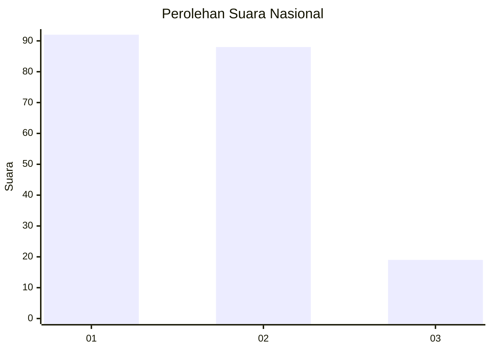
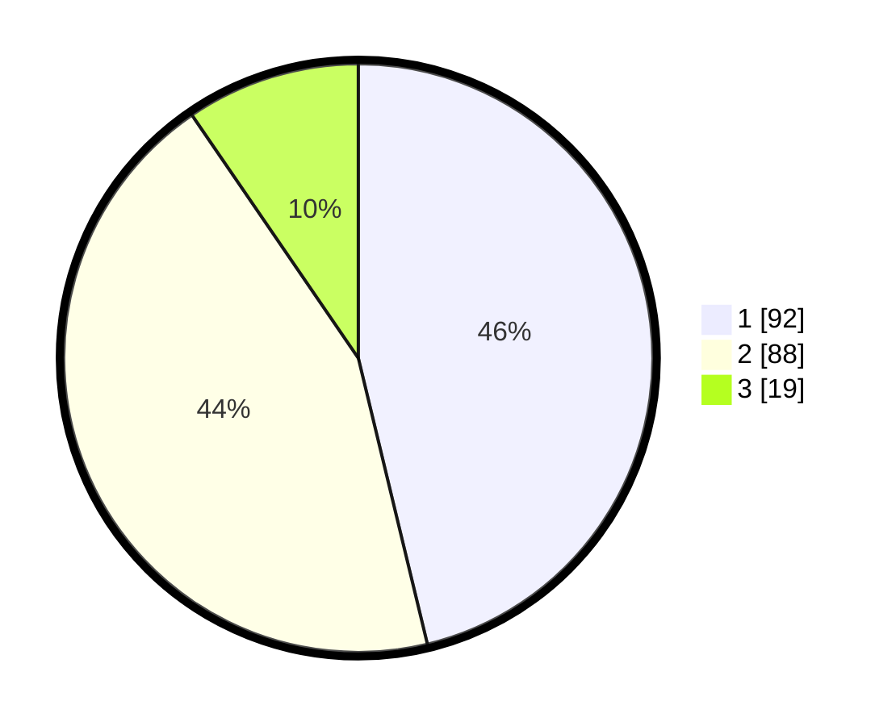

# Hasil

## Grafik

## Tabel

| No. | Nama Paslon    | Suara | Suara (raw) | Persentase |
|:--- |:-------------- | -----:| -----------:| ----------:|
| 1   | ANIES MUHAIMIN | 92    | [92][p-1]   | 46,23      |
| 2   | PRABOWO GIBRAN | 88    | [88][p-2]   | 44,22      |
| 3   | GANJAR MAHFUD  | 19    | [19][p-3]   | 9,55       |

[p-1]: https://github.com/gigit-pemilu/pemilu-2024/blob/main/pilpres/hitung-suara/sub/52-nusa-tenggara-barat/sub/07-sumbawa-barat/sub/02-taliwang/sub/1004-menala/sub/005-tps/sub/paslon-1.txt
[p-2]: https://github.com/gigit-pemilu/pemilu-2024/blob/main/pilpres/hitung-suara/sub/52-nusa-tenggara-barat/sub/07-sumbawa-barat/sub/02-taliwang/sub/1004-menala/sub/005-tps/sub/paslon-2.txt
[p-3]: https://github.com/gigit-pemilu/pemilu-2024/blob/main/pilpres/hitung-suara/sub/52-nusa-tenggara-barat/sub/07-sumbawa-barat/sub/02-taliwang/sub/1004-menala/sub/005-tps/sub/paslon-3.txt

## Foto C Plano

https://sirekap-obj-formc.kpu.go.id/f1b3/pemilu/ppwp/52/07/02/10/04/5207021004005-20240215-030113--c5dd0ede-32ed-4a70-9ee4-65ebc77bf1e7.jpg

https://sirekap-obj-formc.kpu.go.id/f1b3/pemilu/ppwp/52/07/02/10/04/5207021004005-20240215-030212--49171174-ed2b-482b-a4d3-3aadc962972f.jpg

https://sirekap-obj-formc.kpu.go.id/f1b3/pemilu/ppwp/52/07/02/10/04/5207021004005-20240215-030647--c37d883c-f027-4a89-b556-4b3bf9f71626.jpg

## Metadata

| Key        | Value               |
| ---------- | ------------------- |
| Time Stamp | 2024-02-26 15:00:00 |

