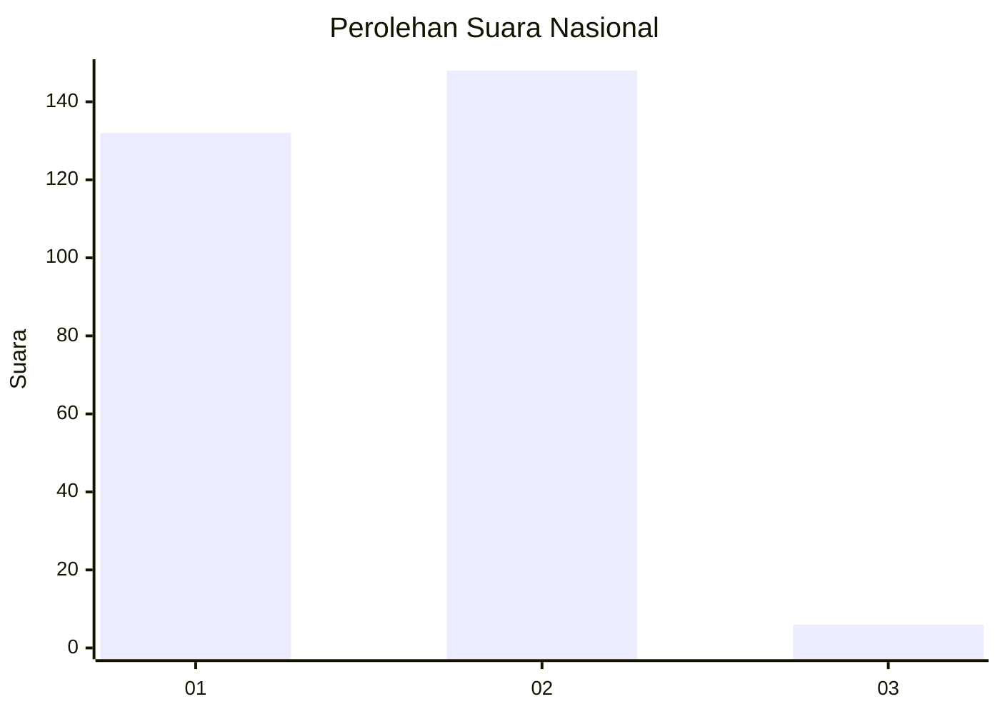
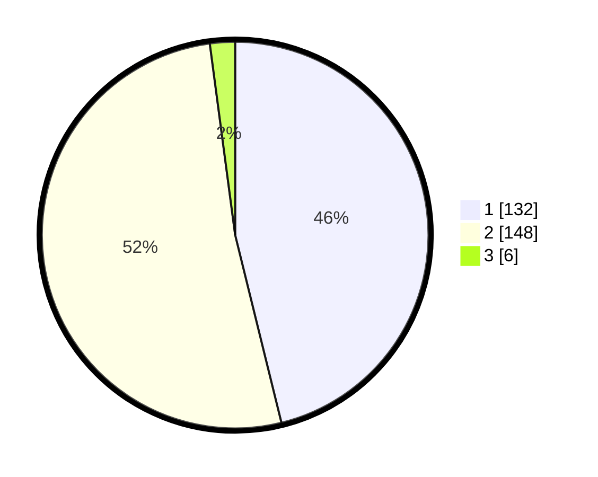

# Hasil

## Grafik

## Tabel

| No. | Nama Paslon    | Suara | Suara (raw) | Persentase |
|:--- |:-------------- | -----:| -----------:| ----------:|
| 1   | ANIES MUHAIMIN | 132   | [132][p-1]  | 46,15      |
| 2   | PRABOWO GIBRAN | 148   | [148][p-2]  | 51,75      |
| 3   | GANJAR MAHFUD  | 6     | [6][p-3]    | 2,10       |

[p-1]: https://github.com/gigit-pemilu/pemilu-2024/blob/main/pilpres/hitung-suara/sub/52-nusa-tenggara-barat/sub/07-sumbawa-barat/sub/04-sekongkang/sub/2002-sekongkang-bawah/sub/001-tps/sub/paslon-1.txt
[p-2]: https://github.com/gigit-pemilu/pemilu-2024/blob/main/pilpres/hitung-suara/sub/52-nusa-tenggara-barat/sub/07-sumbawa-barat/sub/04-sekongkang/sub/2002-sekongkang-bawah/sub/001-tps/sub/paslon-2.txt
[p-3]: https://github.com/gigit-pemilu/pemilu-2024/blob/main/pilpres/hitung-suara/sub/52-nusa-tenggara-barat/sub/07-sumbawa-barat/sub/04-sekongkang/sub/2002-sekongkang-bawah/sub/001-tps/sub/paslon-3.txt

## Foto C Plano

https://sirekap-obj-formc.kpu.go.id/509b/pemilu/ppwp/52/07/04/20/02/5207042002001-20240216-190408--58812464-a0c2-4f29-9ad8-80832af6b7b1.jpg

https://sirekap-obj-formc.kpu.go.id/509b/pemilu/ppwp/52/07/04/20/02/5207042002001-20240216-190410--454b3525-ff3a-4e02-a63f-e78474334285.jpg

https://sirekap-obj-formc.kpu.go.id/509b/pemilu/ppwp/52/07/04/20/02/5207042002001-20240216-190409--28e6f962-2f31-41f7-a1b6-26269935dc28.jpg

## Metadata

| Key        | Value               |
| ---------- | ------------------- |
| Time Stamp | 2024-02-20 16:00:00 |

## DATA PEMILIH TETAP

Jumlah pemilih dalam DPT: **293**.
 * L: **162**.
 * P: **131**.

## DATA PENGGUNA HAK PILIH

Jumlah pengguna hak pilih dalam DPT: **250**.
 * L: **140**.
 * P: **110**.

Jumlah pengguna hak pilih dalam DPTb: **15**.
 * L: **12**.
 * P: **3**.

Jumlah pengguna hak pilih dalam DPK: **30**.
 * L: **19**.
 * P: **11**.

Jumlah pengguna hak pilih: **295**.
 * L: **171**.
 * P: **124**.

## JUMLAH SUARA SAH DAN TIDAK SAH

JUMLAH SELURUH SUARA SAH: **286**.

JUMLAH SUARA TIDAK SAH: **9**.

JUMLAH SELURUH SUARA SAH DAN SUARA TIDAK SAH: **295**.

