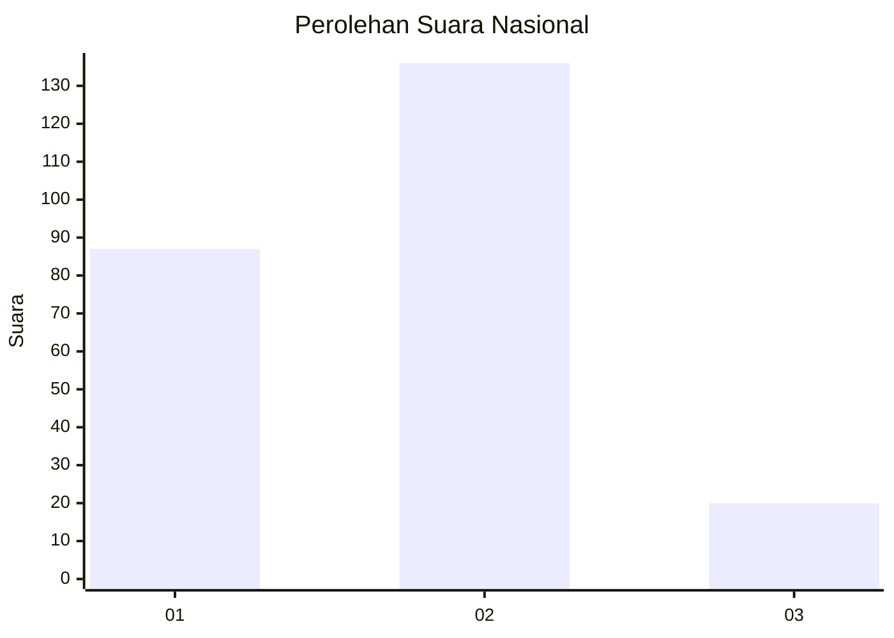

# Hasil

## Grafik

## Tabel

| No. | Nama Paslon    | Suara | Suara (raw) | Persentase |
|:--- |:-------------- | -----:| -----------:| ----------:|
| 1   | ANIES MUHAIMIN | 87    | [87][p-1]   | 35,80      |
| 2   | PRABOWO GIBRAN | 136   | [136][p-2]  | 55,97      |
| 3   | GANJAR MAHFUD  | 20    | [20][p-3]   | 8,23       |

[p-1]: https://github.com/gigit-pemilu/pemilu-2024/blob/main/pilpres/hitung-suara/sub/52-nusa-tenggara-barat/sub/07-sumbawa-barat/sub/06-poto-tano/sub/2001-senayan/sub/004-tps/sub/paslon-1.txt
[p-2]: https://github.com/gigit-pemilu/pemilu-2024/blob/main/pilpres/hitung-suara/sub/52-nusa-tenggara-barat/sub/07-sumbawa-barat/sub/06-poto-tano/sub/2001-senayan/sub/004-tps/sub/paslon-2.txt
[p-3]: https://github.com/gigit-pemilu/pemilu-2024/blob/main/pilpres/hitung-suara/sub/52-nusa-tenggara-barat/sub/07-sumbawa-barat/sub/06-poto-tano/sub/2001-senayan/sub/004-tps/sub/paslon-3.txt

## Foto C Plano

https://sirekap-obj-formc.kpu.go.id/9993/pemilu/ppwp/52/07/06/20/01/5207062001004-20240223-163820--fb650d8f-88cd-4571-a34a-97dc2ba31a94.jpg

https://sirekap-obj-formc.kpu.go.id/9993/pemilu/ppwp/52/07/06/20/01/5207062001004-20240223-163931--d74f0a9d-863e-47f9-9998-6e99de71b0c9.jpg

https://sirekap-obj-formc.kpu.go.id/9993/pemilu/ppwp/52/07/06/20/01/5207062001004-20240223-164043--1cd738c6-bb8e-400c-bfd4-02e76d2ee592.jpg

## Metadata

| Key        | Value               |
| ---------- | ------------------- |
| Time Stamp | 2024-02-26 08:00:00 |

