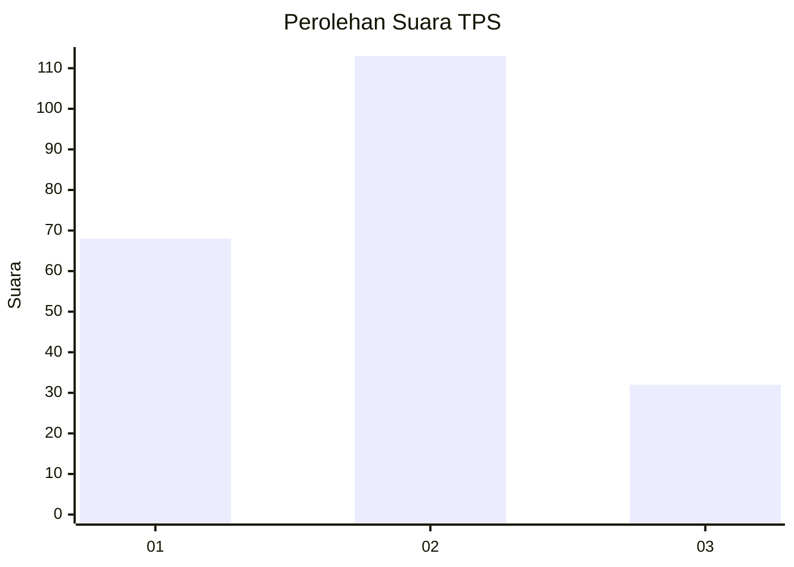
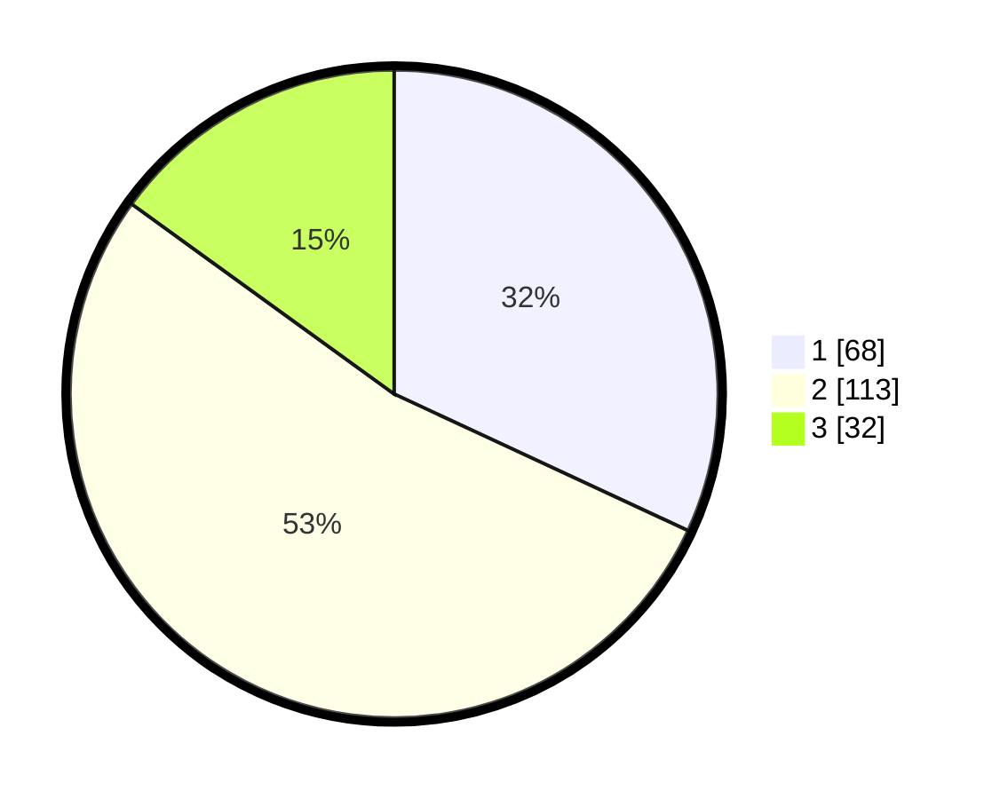

# Hasil

## Grafik

## Tabel

| No. | Nama Paslon    | Suara | Suara (raw) | Persentase |
|:--- |:-------------- | -----:| -----------:| ----------:|
| 1   | ANIES MUHAIMIN | 68    | [68][p-1]   | 31,92      |
| 2   | PRABOWO GIBRAN | 113   | [113][p-2]  | 53,05      |
| 3   | GANJAR MAHFUD  | 32    | [32][p-3]   | 15,02      |

[p-1]: https://github.com/gigit-pemilu/pemilu-2024-52-nusa-tenggara-barat/blob/main/pilpres/hitung-suara/sub/52-nusa-tenggara-barat/sub/07-sumbawa-barat/sub/07-brang-ene/sub/2001-mura/sub/004-tps/sub/paslon-1.txt
[p-2]: https://github.com/gigit-pemilu/pemilu-2024-52-nusa-tenggara-barat/blob/main/pilpres/hitung-suara/sub/52-nusa-tenggara-barat/sub/07-sumbawa-barat/sub/07-brang-ene/sub/2001-mura/sub/004-tps/sub/paslon-2.txt
[p-3]: https://github.com/gigit-pemilu/pemilu-2024-52-nusa-tenggara-barat/blob/main/pilpres/hitung-suara/sub/52-nusa-tenggara-barat/sub/07-sumbawa-barat/sub/07-brang-ene/sub/2001-mura/sub/004-tps/sub/paslon-3.txt

## Foto C Plano

https://sirekap-obj-formc.kpu.go.id/d490/pemilu/ppwp/52/07/07/20/01/5207072001004-20240215-001520--c58fcf44-3fd4-49dd-adbb-0e7ea8813911.jpg

https://sirekap-obj-formc.kpu.go.id/d490/pemilu/ppwp/52/07/07/20/01/5207072001004-20240215-001640--20e70691-3270-41f4-bddb-833594e82bce.jpg

https://sirekap-obj-formc.kpu.go.id/d490/pemilu/ppwp/52/07/07/20/01/5207072001004-20240215-001747--3b8c981c-93e3-4f8a-b13e-2cbd827b7c6c.jpg

## Metadata

| Key        | Value               |
| ---------- | ------------------- |
| Time Stamp | 2024-02-15 22:40:13 |

