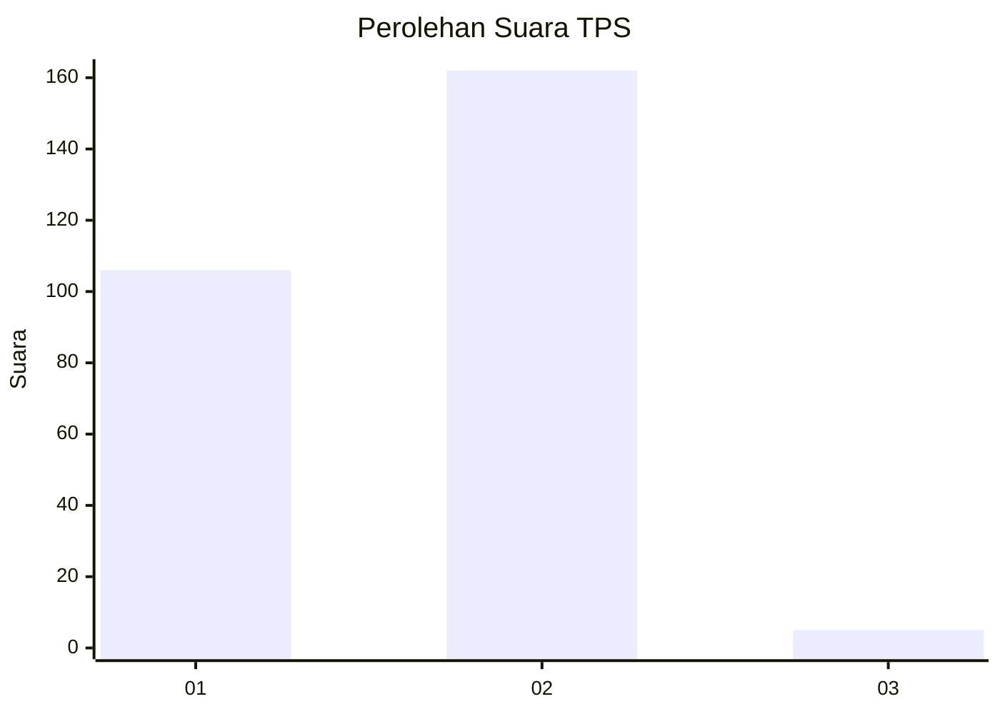
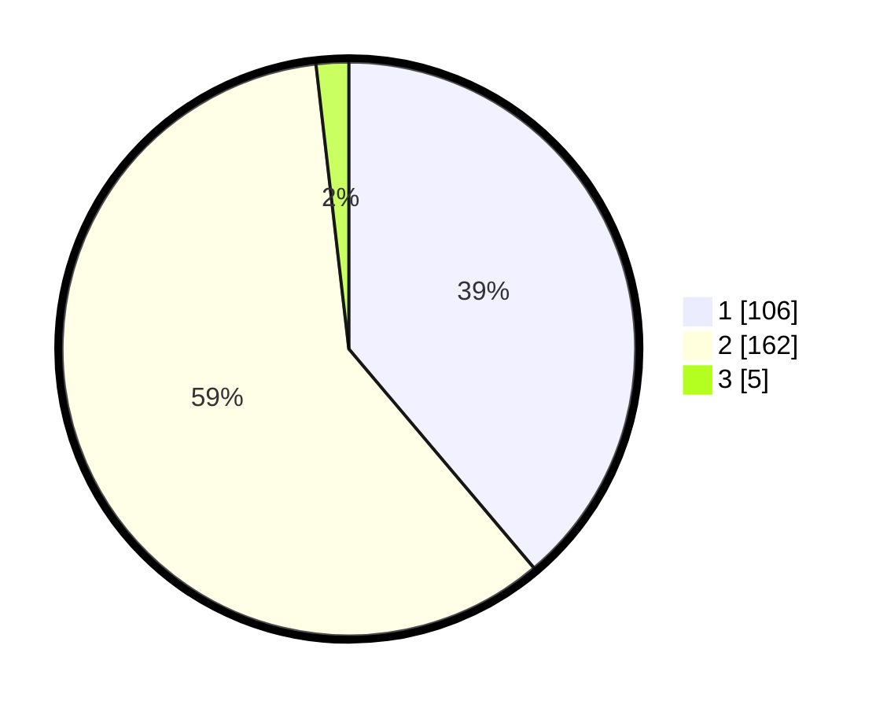

# Hasil

## Grafik

## Tabel

| No. | Nama Paslon    | Suara | Suara (raw) | Persentase |
|:--- |:-------------- | -----:| -----------:| ----------:|
| 1   | ANIES MUHAIMIN | 106   | [106][p-1]  | 38,83      |
| 2   | PRABOWO GIBRAN | 162   | [162][p-2]  | 59,34      |
| 3   | GANJAR MAHFUD  | 5     | [5][p-3]    | 1,83       |

[p-1]: https://github.com/gigit-pemilu/pemilu-2024-52-nusa-tenggara-barat/blob/main/pilpres/hitung-suara/sub/52-nusa-tenggara-barat/sub/07-sumbawa-barat/sub/08-maluk/sub/2001-maluk/sub/003-tps/sub/paslon-1.txt
[p-2]: https://github.com/gigit-pemilu/pemilu-2024-52-nusa-tenggara-barat/blob/main/pilpres/hitung-suara/sub/52-nusa-tenggara-barat/sub/07-sumbawa-barat/sub/08-maluk/sub/2001-maluk/sub/003-tps/sub/paslon-2.txt
[p-3]: https://github.com/gigit-pemilu/pemilu-2024-52-nusa-tenggara-barat/blob/main/pilpres/hitung-suara/sub/52-nusa-tenggara-barat/sub/07-sumbawa-barat/sub/08-maluk/sub/2001-maluk/sub/003-tps/sub/paslon-3.txt

## Foto C Plano

https://sirekap-obj-formc.kpu.go.id/7cfd/pemilu/ppwp/52/07/08/20/01/5207082001003-20240221-115217--825ccb54-8e05-4e35-9bb3-6a5c4d64dec7.jpg

https://sirekap-obj-formc.kpu.go.id/7cfd/pemilu/ppwp/52/07/08/20/01/5207082001003-20240220-151525--6ee2d950-8f98-41d9-b30f-aeafa9bba6bc.jpg

https://sirekap-obj-formc.kpu.go.id/7cfd/pemilu/ppwp/52/07/08/20/01/5207082001003-20240220-151217--6be5ede0-76ac-45e9-8939-68434bb83422.jpg

## Metadata

| Key        | Value               |
| ---------- | ------------------- |
| Time Stamp | 2024-02-21 12:00:00 |

## DATA PEMILIH TETAP

Jumlah pemilih dalam DPT: **257**.
 * L: **135**.
 * P: **122**.

## DATA PENGGUNA HAK PILIH

Jumlah pengguna hak pilih dalam DPT: **207**.
 * L: **108**.
 * P: **99**.

Jumlah pengguna hak pilih dalam DPTb: **32**.
 * L: **26**.
 * P: **6**.

Jumlah pengguna hak pilih dalam DPK: **24**.
 * L: **18**.
 * P: **6**.

Jumlah pengguna hak pilih: **263**.
 * L: **152**.
 * P: **111**.

## JUMLAH SUARA SAH DAN TIDAK SAH

JUMLAH SELURUH SUARA SAH: **273**.

JUMLAH SUARA TIDAK SAH: **12**.

JUMLAH SELURUH SUARA SAH DAN SUARA TIDAK SAH: **285**.

