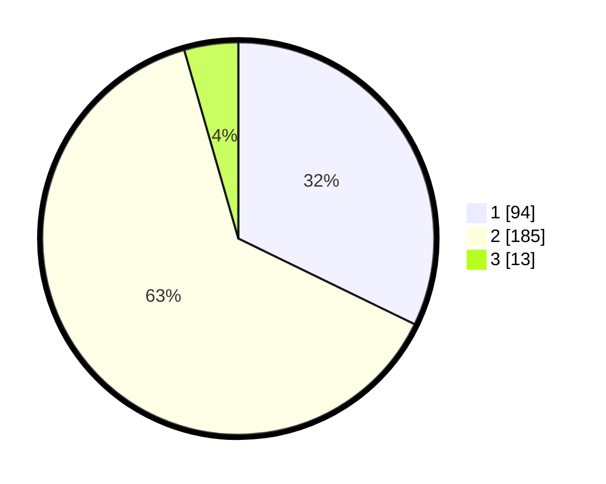

# Hasil

## Grafik

## Tabel

| No. | Nama Paslon    | Suara | Suara (raw) | Persentase |
|:--- |:-------------- | -----:| -----------:| ----------:|
| 1   | ANIES MUHAIMIN | 94    | [94][p-1]   | 32,19      |
| 2   | PRABOWO GIBRAN | 185   | [185][p-2]  | 63,36      |
| 3   | GANJAR MAHFUD  | 13    | [13][p-3]   | 4,45       |

[p-1]: https://github.com/gigit-pemilu/pemilu-2024-52-nusa-tenggara-barat/blob/main/pilpres/hitung-suara/sub/52-nusa-tenggara-barat/sub/07-sumbawa-barat/sub/08-maluk/sub/2004-mantun/sub/004-tps/sub/paslon-1.txt
[p-2]: https://github.com/gigit-pemilu/pemilu-2024-52-nusa-tenggara-barat/blob/main/pilpres/hitung-suara/sub/52-nusa-tenggara-barat/sub/07-sumbawa-barat/sub/08-maluk/sub/2004-mantun/sub/004-tps/sub/paslon-2.txt
[p-3]: https://github.com/gigit-pemilu/pemilu-2024-52-nusa-tenggara-barat/blob/main/pilpres/hitung-suara/sub/52-nusa-tenggara-barat/sub/07-sumbawa-barat/sub/08-maluk/sub/2004-mantun/sub/004-tps/sub/paslon-3.txt

## Foto C Plano

https://sirekap-obj-formc.kpu.go.id/269d/pemilu/ppwp/52/07/08/20/04/5207082004004-20240215-070212--3a651174-03d8-4df6-8814-a22832d08379.jpg

https://sirekap-obj-formc.kpu.go.id/269d/pemilu/ppwp/52/07/08/20/04/5207082004004-20240214-231716--143c62c1-b0c8-4c3f-a3b2-82363da31324.jpg

https://sirekap-obj-formc.kpu.go.id/269d/pemilu/ppwp/52/07/08/20/04/5207082004004-20240215-035842--0cb6f857-8942-4d09-af14-ad9314ab7545.jpg

## Metadata

| Key        | Value               |
| ---------- | ------------------- |
| Time Stamp | 2024-02-15 19:30:26 |

## DATA PEMILIH TETAP

Jumlah pemilih dalam DPT: **296**.
 * L: **156**.
 * P: **140**.

## DATA PENGGUNA HAK PILIH

Jumlah pengguna hak pilih dalam DPT: **226**.
 * L: **117**.
 * P: **109**.

Jumlah pengguna hak pilih dalam DPTb: **27**.
 * L: **18**.
 * P: **9**.

Jumlah pengguna hak pilih dalam DPK: **43**.
 * L: **34**.
 * P: **9**.

Jumlah pengguna hak pilih: **296**.
 * L: **169**.
 * P: **127**.

## JUMLAH SUARA SAH DAN TIDAK SAH

JUMLAH SELURUH SUARA SAH: **292**.

JUMLAH SUARA TIDAK SAH: **4**.

JUMLAH SELURUH SUARA SAH DAN SUARA TIDAK SAH: **296**.

