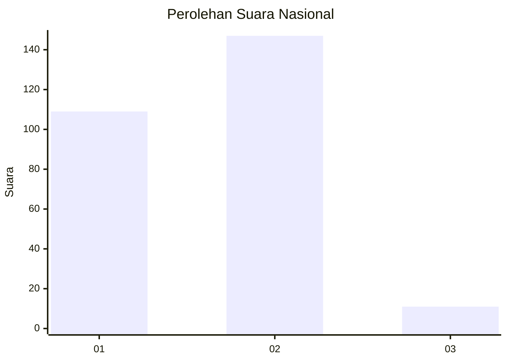
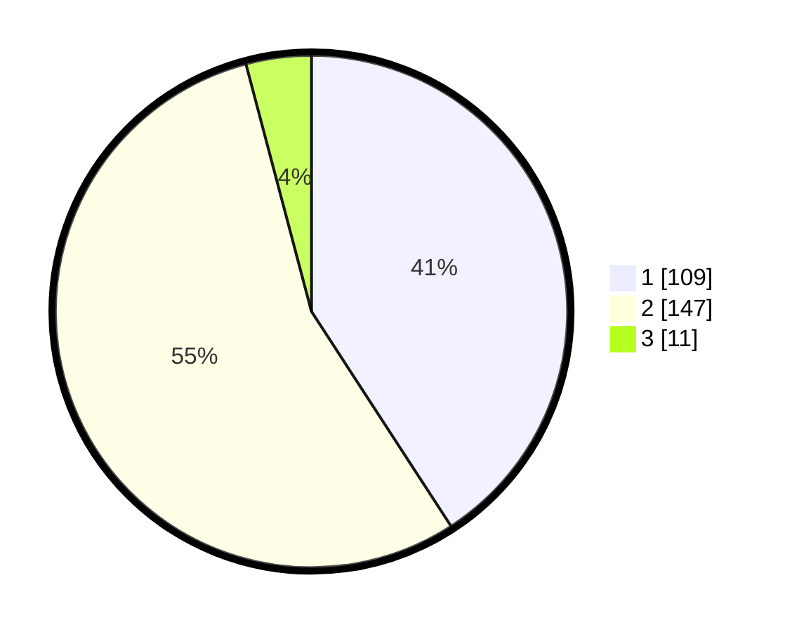

# Hasil

## Grafik

## Tabel

| No. | Nama Paslon    | Suara | Suara (raw) | Persentase |
|:--- |:-------------- | -----:| -----------:| ----------:|
| 1   | ANIES MUHAIMIN | 109   | [109][p-1]  | 40,82      |
| 2   | PRABOWO GIBRAN | 147   | [147][p-2]  | 55,06      |
| 3   | GANJAR MAHFUD  | 11    | [11][p-3]   | 4,12       |

[p-1]: https://github.com/gigit-pemilu/pemilu-2024/blob/main/pilpres/hitung-suara/sub/52-nusa-tenggara-barat/sub/71-kota-mataram/sub/01-ampenan/sub/1005-ampenan-tengah/sub/032-tps/sub/paslon-1.txt
[p-2]: https://github.com/gigit-pemilu/pemilu-2024/blob/main/pilpres/hitung-suara/sub/52-nusa-tenggara-barat/sub/71-kota-mataram/sub/01-ampenan/sub/1005-ampenan-tengah/sub/032-tps/sub/paslon-2.txt
[p-3]: https://github.com/gigit-pemilu/pemilu-2024/blob/main/pilpres/hitung-suara/sub/52-nusa-tenggara-barat/sub/71-kota-mataram/sub/01-ampenan/sub/1005-ampenan-tengah/sub/032-tps/sub/paslon-3.txt

## Foto C Plano

https://sirekap-obj-formc.kpu.go.id/a71a/pemilu/ppwp/52/71/01/10/05/5271011005032-20240214-230650--1aff9c1c-df0f-4f63-a7d5-f821afa8d544.jpg

https://sirekap-obj-formc.kpu.go.id/a71a/pemilu/ppwp/52/71/01/10/05/5271011005032-20240215-042732--38e54d95-dff3-445c-84b3-af05c41083f7.jpg

https://sirekap-obj-formc.kpu.go.id/a71a/pemilu/ppwp/52/71/01/10/05/5271011005032-20240214-223705--9660b05c-8a38-406b-9a90-ab3401073f9a.jpg

## Metadata

| Key        | Value               |
| ---------- | ------------------- |
| Time Stamp | 2024-02-19 06:16:00 |

