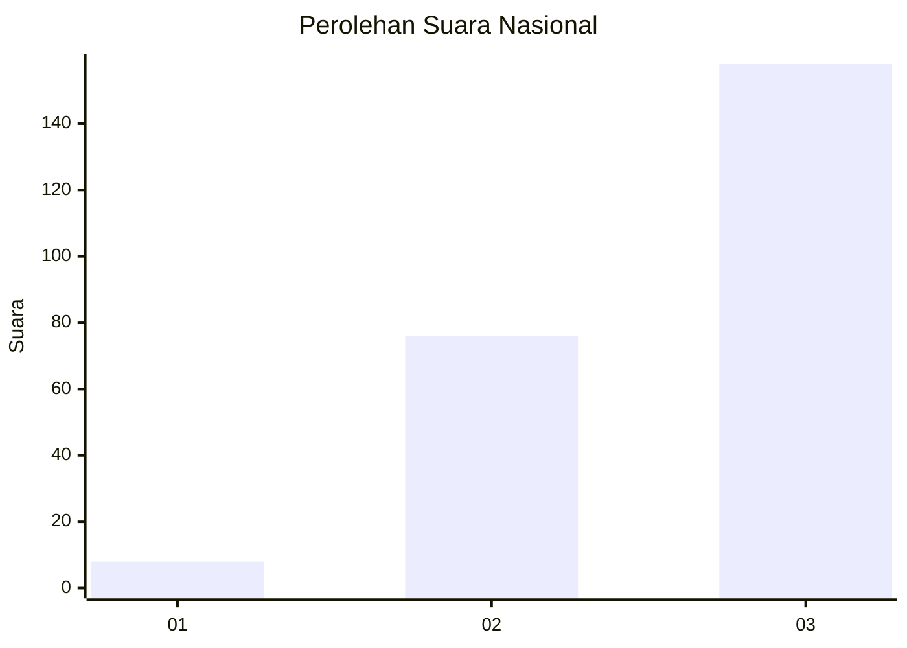
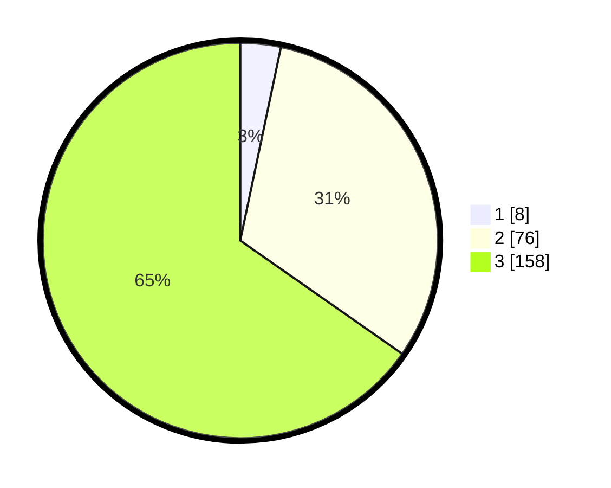

# Hasil

## Grafik

## Tabel

| No. | Nama Paslon    | Suara | Suara (raw) | Persentase |
|:--- |:-------------- | -----:| -----------:| ----------:|
| 1   | ANIES MUHAIMIN | 8     | [8][p-1]    | 3,31       |
| 2   | PRABOWO GIBRAN | 76    | [76][p-2]   | 31,40      |
| 3   | GANJAR MAHFUD  | 158   | [158][p-3]  | 65,29      |

[p-1]: https://github.com/gigit-pemilu/pemilu-2024/blob/main/pilpres/hitung-suara/sub/52-nusa-tenggara-barat/sub/71-kota-mataram/sub/02-mataram/sub/1014-pagutan-barat/sub/028-tps/sub/paslon-1.txt
[p-2]: https://github.com/gigit-pemilu/pemilu-2024/blob/main/pilpres/hitung-suara/sub/52-nusa-tenggara-barat/sub/71-kota-mataram/sub/02-mataram/sub/1014-pagutan-barat/sub/028-tps/sub/paslon-2.txt
[p-3]: https://github.com/gigit-pemilu/pemilu-2024/blob/main/pilpres/hitung-suara/sub/52-nusa-tenggara-barat/sub/71-kota-mataram/sub/02-mataram/sub/1014-pagutan-barat/sub/028-tps/sub/paslon-3.txt

## Foto C Plano

https://sirekap-obj-formc.kpu.go.id/7626/pemilu/ppwp/52/71/02/10/14/5271021014028-20240215-010434--f5beed88-b214-46b7-944e-698f58d3a049.jpg

https://sirekap-obj-formc.kpu.go.id/7626/pemilu/ppwp/52/71/02/10/14/5271021014028-20240215-010611--776cc3b2-14c3-43d9-8ea1-5c4401cac4c4.jpg

https://sirekap-obj-formc.kpu.go.id/7626/pemilu/ppwp/52/71/02/10/14/5271021014028-20240215-010731--b15b3b20-8de1-4158-bc14-5b9236a91619.jpg

## Metadata

| Key        | Value               |
| ---------- | ------------------- |
| Time Stamp | 2024-02-19 06:16:00 |

