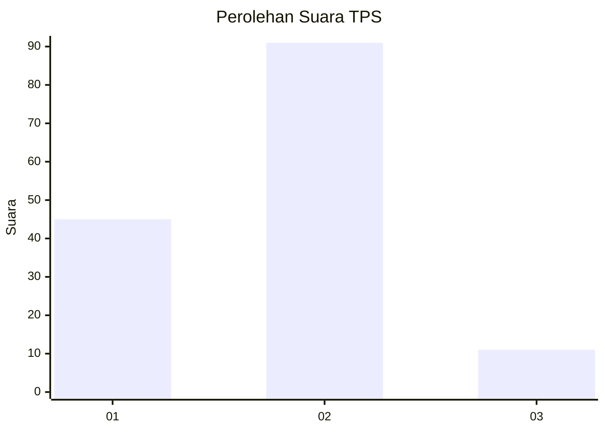
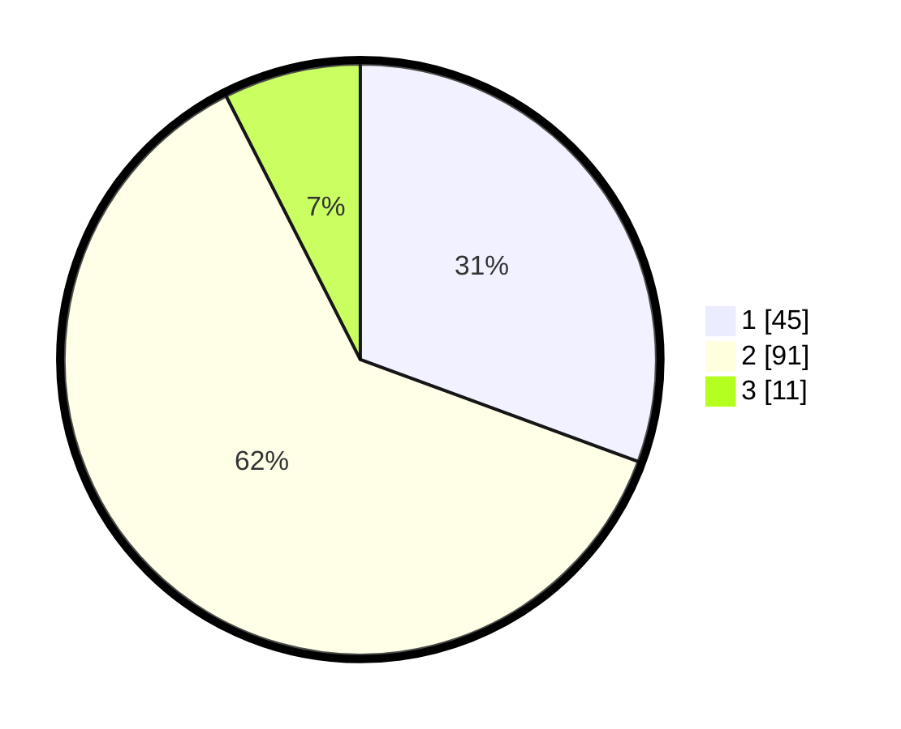

# Hasil

## Grafik

## Tabel

| No. | Nama Paslon    | Suara | Suara (raw) | Persentase |
|:--- |:-------------- | -----:| -----------:| ----------:|
| 1   | ANIES MUHAIMIN | 45    | [45][p-1]   | 30,61      |
| 2   | PRABOWO GIBRAN | 91    | [91][p-2]   | 61,90      |
| 3   | GANJAR MAHFUD  | 11    | [11][p-3]   | 7,48       |

[p-1]: https://github.com/gigit-pemilu/pemilu-2024-52-nusa-tenggara-barat/blob/main/pilpres/hitung-suara/sub/52-nusa-tenggara-barat/sub/71-kota-mataram/sub/03-cakranegara/sub/1004-cakranegara-selatan/sub/001-tps/sub/paslon-1.txt
[p-2]: https://github.com/gigit-pemilu/pemilu-2024-52-nusa-tenggara-barat/blob/main/pilpres/hitung-suara/sub/52-nusa-tenggara-barat/sub/71-kota-mataram/sub/03-cakranegara/sub/1004-cakranegara-selatan/sub/001-tps/sub/paslon-2.txt
[p-3]: https://github.com/gigit-pemilu/pemilu-2024-52-nusa-tenggara-barat/blob/main/pilpres/hitung-suara/sub/52-nusa-tenggara-barat/sub/71-kota-mataram/sub/03-cakranegara/sub/1004-cakranegara-selatan/sub/001-tps/sub/paslon-3.txt

## Foto C Plano

https://sirekap-obj-formc.kpu.go.id/dbb1/pemilu/ppwp/52/71/03/10/04/5271031004001-20240214-155049--6d9f5a12-7a1d-4e0f-a70c-ecfac456468c.jpg

https://sirekap-obj-formc.kpu.go.id/dbb1/pemilu/ppwp/52/71/03/10/04/5271031004001-20240214-160101--05711765-f7eb-4f50-8d1e-59b835fa1506.jpg

https://sirekap-obj-formc.kpu.go.id/dbb1/pemilu/ppwp/52/71/03/10/04/5271031004001-20240214-155318--e1ef06c8-7953-4bac-8b0d-d1fb448b0577.jpg

## Metadata

| Key        | Value               |
| ---------- | ------------------- |
| Time Stamp | 2024-02-15 19:00:26 |

