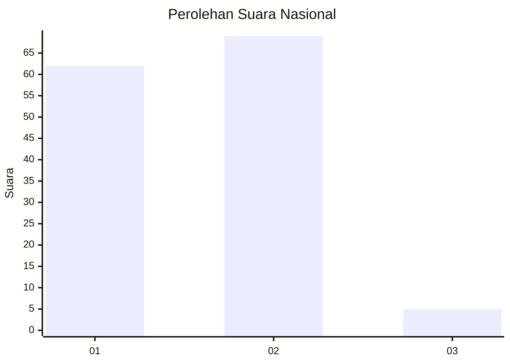
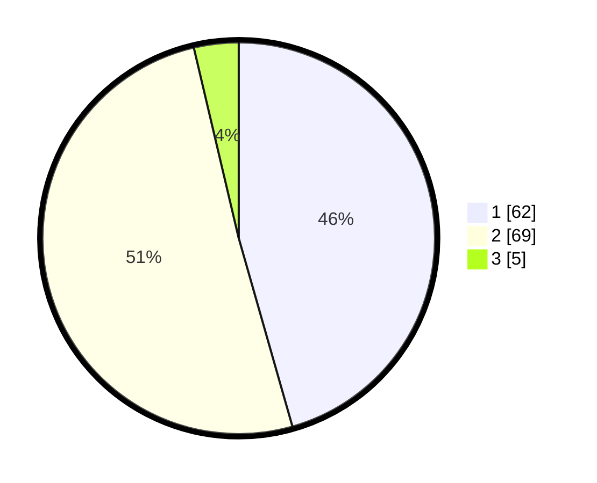

# Hasil

## Grafik

## Tabel

| No. | Nama Paslon    | Suara | Suara (raw) | Persentase |
|:--- |:-------------- | -----:| -----------:| ----------:|
| 1   | ANIES MUHAIMIN | 62    | [62][p-1]   | 45,59      |
| 2   | PRABOWO GIBRAN | 69    | [69][p-2]   | 50,74      |
| 3   | GANJAR MAHFUD  | 5     | [5][p-3]    | 3,68       |

[p-1]: https://github.com/gigit-pemilu/pemilu-2024/blob/main/pilpres/hitung-suara/sub/52-nusa-tenggara-barat/sub/71-kota-mataram/sub/03-cakranegara/sub/1004-cakranegara-selatan/sub/004-tps/sub/paslon-1.txt
[p-2]: https://github.com/gigit-pemilu/pemilu-2024/blob/main/pilpres/hitung-suara/sub/52-nusa-tenggara-barat/sub/71-kota-mataram/sub/03-cakranegara/sub/1004-cakranegara-selatan/sub/004-tps/sub/paslon-2.txt
[p-3]: https://github.com/gigit-pemilu/pemilu-2024/blob/main/pilpres/hitung-suara/sub/52-nusa-tenggara-barat/sub/71-kota-mataram/sub/03-cakranegara/sub/1004-cakranegara-selatan/sub/004-tps/sub/paslon-3.txt

## Foto C Plano

https://sirekap-obj-formc.kpu.go.id/540d/pemilu/ppwp/52/71/03/10/04/5271031004004-20240214-201014--6c500864-64e6-4b86-8b86-cfdd1006b4ad.jpg

https://sirekap-obj-formc.kpu.go.id/540d/pemilu/ppwp/52/71/03/10/04/5271031004004-20240214-201016--47cf7d50-2f2e-4f20-b809-f763340a1a9a.jpg

https://sirekap-obj-formc.kpu.go.id/540d/pemilu/ppwp/52/71/03/10/04/5271031004004-20240214-201024--900fd847-6d4e-4798-9e18-a43e9fe60e90.jpg

## Metadata

| Key        | Value               |
| ---------- | ------------------- |
| Time Stamp | 2024-02-19 06:16:00 |

