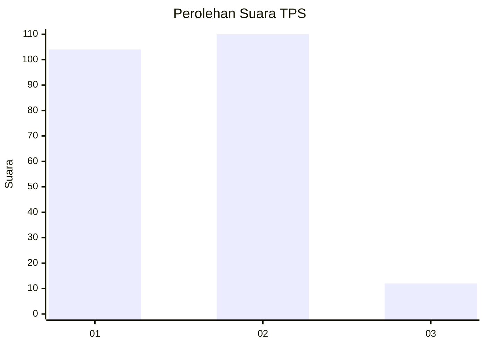
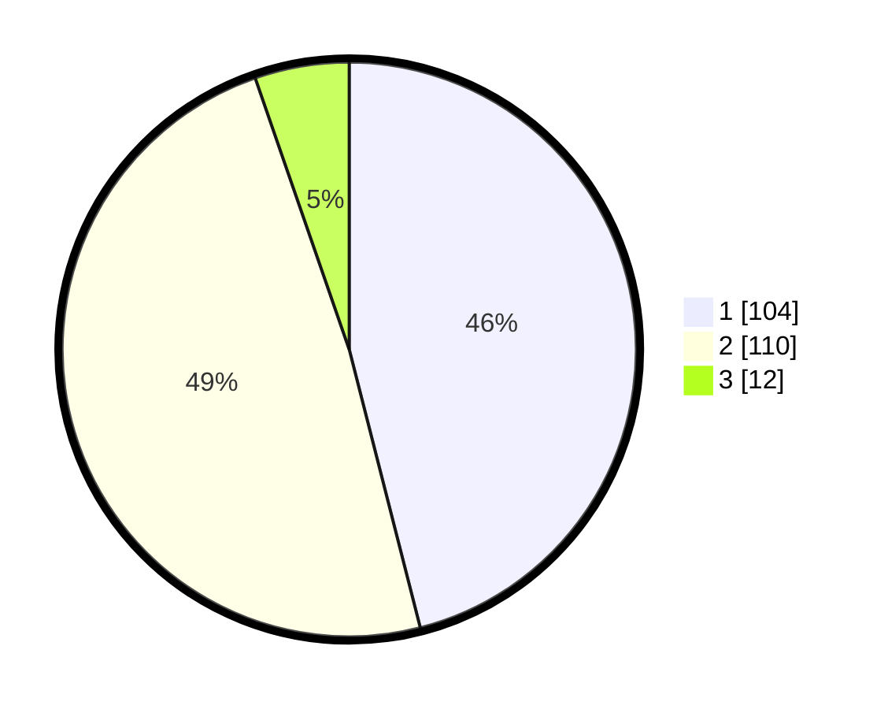

# Hasil

## Grafik

## Tabel

| No. | Nama Paslon    | Suara | Suara (raw) | Persentase |
|:--- |:-------------- | -----:| -----------:| ----------:|
| 1   | ANIES MUHAIMIN | 104   | [104][p-1]  | 46,02      |
| 2   | PRABOWO GIBRAN | 110   | [110][p-2]  | 48,67      |
| 3   | GANJAR MAHFUD  | 12    | [12][p-3]   | 5,31       |

[p-1]: https://github.com/gigit-pemilu/pemilu-2024-52-nusa-tenggara-barat/blob/main/pilpres/hitung-suara/sub/52-nusa-tenggara-barat/sub/71-kota-mataram/sub/03-cakranegara/sub/1004-cakranegara-selatan/sub/007-tps/sub/paslon-1.txt
[p-2]: https://github.com/gigit-pemilu/pemilu-2024-52-nusa-tenggara-barat/blob/main/pilpres/hitung-suara/sub/52-nusa-tenggara-barat/sub/71-kota-mataram/sub/03-cakranegara/sub/1004-cakranegara-selatan/sub/007-tps/sub/paslon-2.txt
[p-3]: https://github.com/gigit-pemilu/pemilu-2024-52-nusa-tenggara-barat/blob/main/pilpres/hitung-suara/sub/52-nusa-tenggara-barat/sub/71-kota-mataram/sub/03-cakranegara/sub/1004-cakranegara-selatan/sub/007-tps/sub/paslon-3.txt

## Foto C Plano

https://sirekap-obj-formc.kpu.go.id/ca0e/pemilu/ppwp/52/71/03/10/04/5271031004007-20240215-010921--b90092d3-5b82-4467-8125-f0bc9f3c0af3.jpg

https://sirekap-obj-formc.kpu.go.id/ca0e/pemilu/ppwp/52/71/03/10/04/5271031004007-20240215-011247--280db559-d019-488c-a4aa-8434800eb3a0.jpg

https://sirekap-obj-formc.kpu.go.id/ca0e/pemilu/ppwp/52/71/03/10/04/5271031004007-20240215-011400--d722457d-c70f-48ef-a4e1-9301958e16db.jpg

## Metadata

| Key        | Value               |
| ---------- | ------------------- |
| Time Stamp | 2024-02-19 06:16:00 |

