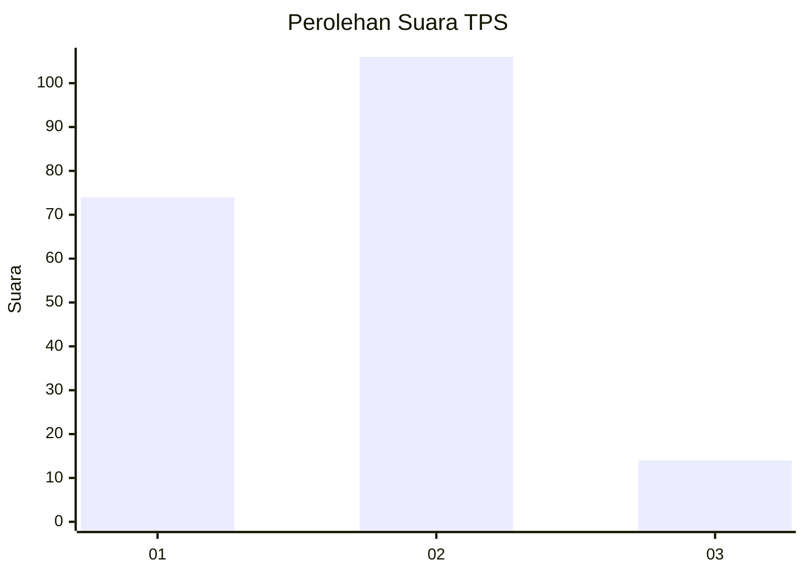

# Hasil

## Grafik

## Tabel

| No. | Nama Paslon    | Suara | Suara (raw) | Persentase |
|:--- |:-------------- | -----:| -----------:| ----------:|
| 1   | ANIES MUHAIMIN | 74    | [74][p-1]   | 38,14      |
| 2   | PRABOWO GIBRAN | 106   | [106][p-2]  | 54,64      |
| 3   | GANJAR MAHFUD  | 14    | [14][p-3]   | 7,22       |

[p-1]: https://github.com/gigit-pemilu/pemilu-2024-52-nusa-tenggara-barat/blob/main/pilpres/hitung-suara/sub/52-nusa-tenggara-barat/sub/71-kota-mataram/sub/03-cakranegara/sub/1004-cakranegara-selatan/sub/008-tps/sub/paslon-1.txt
[p-2]: https://github.com/gigit-pemilu/pemilu-2024-52-nusa-tenggara-barat/blob/main/pilpres/hitung-suara/sub/52-nusa-tenggara-barat/sub/71-kota-mataram/sub/03-cakranegara/sub/1004-cakranegara-selatan/sub/008-tps/sub/paslon-2.txt
[p-3]: https://github.com/gigit-pemilu/pemilu-2024-52-nusa-tenggara-barat/blob/main/pilpres/hitung-suara/sub/52-nusa-tenggara-barat/sub/71-kota-mataram/sub/03-cakranegara/sub/1004-cakranegara-selatan/sub/008-tps/sub/paslon-3.txt

## Foto C Plano

https://sirekap-obj-formc.kpu.go.id/48bd/pemilu/ppwp/52/71/03/10/04/5271031004008-20240215-033235--b4003ea9-ae08-48df-b68f-becf156bd8f9.jpg

https://sirekap-obj-formc.kpu.go.id/48bd/pemilu/ppwp/52/71/03/10/04/5271031004008-20240215-012653--4c52da5a-2670-428b-a4ba-f4e0b7ff8d33.jpg

https://sirekap-obj-formc.kpu.go.id/48bd/pemilu/ppwp/52/71/03/10/04/5271031004008-20240215-012749--a676ad72-1557-4df0-8389-d302e30c9fca.jpg

## Metadata

| Key        | Value               |
| ---------- | ------------------- |
| Time Stamp | 2024-02-19 06:16:00 |

