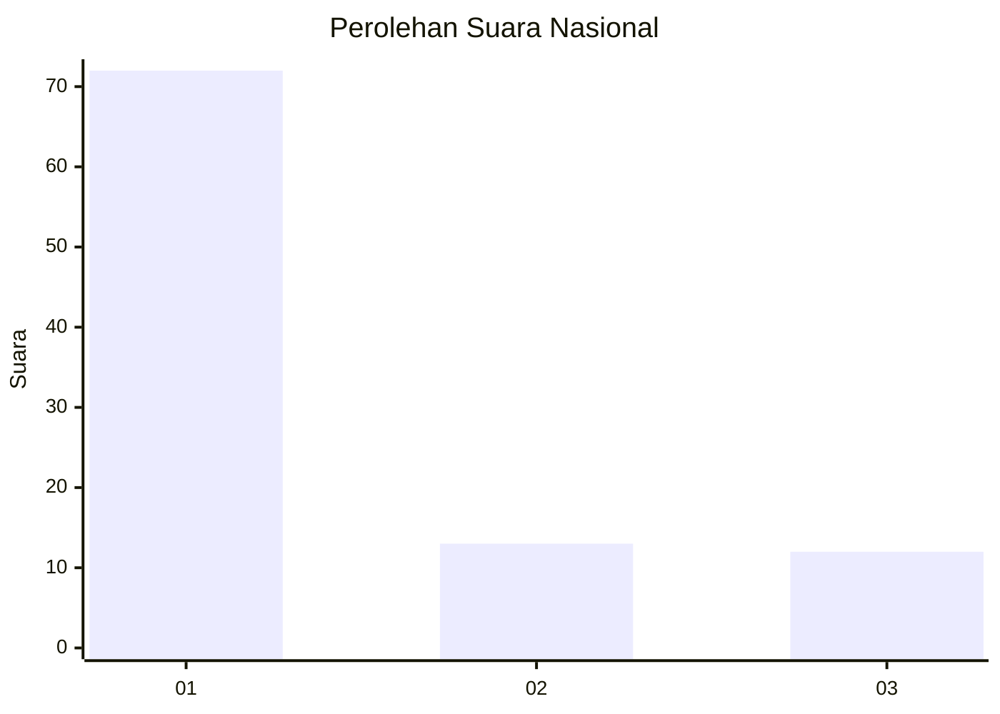
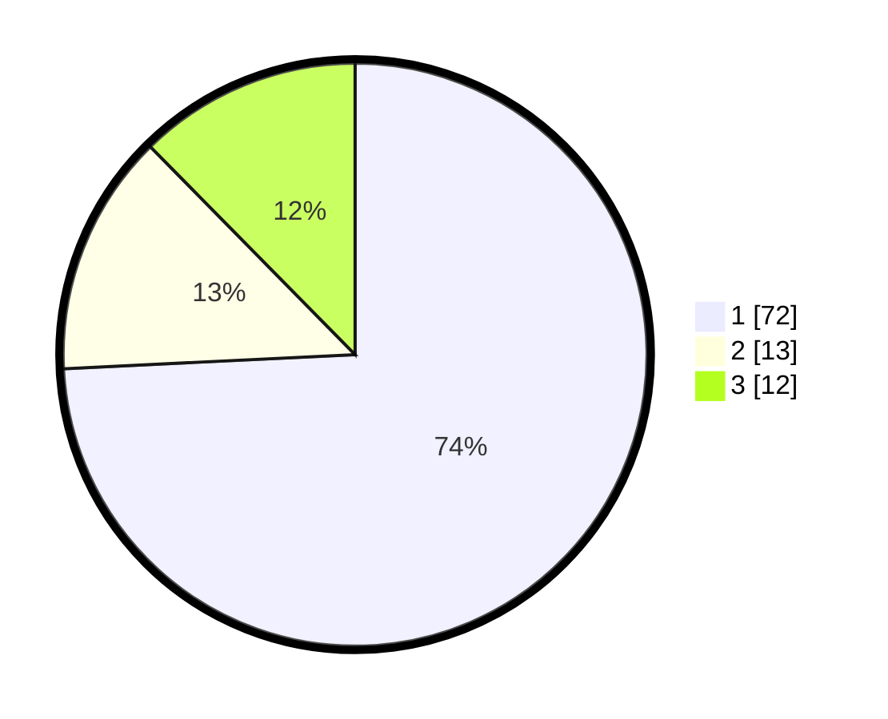

# Hasil

## Grafik

## Tabel

| No. | Nama Paslon    | Suara | Suara (raw) | Persentase |
|:--- |:-------------- | -----:| -----------:| ----------:|
| 1   | ANIES MUHAIMIN | 72    | [72][p-1]   | 74,23      |
| 2   | PRABOWO GIBRAN | 13    | [13][p-2]   | 13,40      |
| 3   | GANJAR MAHFUD  | 12    | [12][p-3]   | 12,37      |

[p-1]: https://github.com/gigit-pemilu/pemilu-2024/blob/main/pilpres/hitung-suara/sub/52-nusa-tenggara-barat/sub/71-kota-mataram/sub/03-cakranegara/sub/1013-mayura/sub/018-tps/sub/paslon-1.txt
[p-2]: https://github.com/gigit-pemilu/pemilu-2024/blob/main/pilpres/hitung-suara/sub/52-nusa-tenggara-barat/sub/71-kota-mataram/sub/03-cakranegara/sub/1013-mayura/sub/018-tps/sub/paslon-2.txt
[p-3]: https://github.com/gigit-pemilu/pemilu-2024/blob/main/pilpres/hitung-suara/sub/52-nusa-tenggara-barat/sub/71-kota-mataram/sub/03-cakranegara/sub/1013-mayura/sub/018-tps/sub/paslon-3.txt

## Foto C Plano

https://sirekap-obj-formc.kpu.go.id/5b76/pemilu/ppwp/52/71/03/10/13/5271031013018-20240215-075534--9e4c867f-d197-42f3-b5ce-2182aaee32f3.jpg

https://sirekap-obj-formc.kpu.go.id/5b76/pemilu/ppwp/52/71/03/10/13/5271031013018-20240215-075609--3e473bd0-2c3a-476c-93cc-a62e364d2f43.jpg

https://sirekap-obj-formc.kpu.go.id/5b76/pemilu/ppwp/52/71/03/10/13/5271031013018-20240215-075910--84b3a48a-7d42-4434-beb8-08e792af06e4.jpg

## Metadata

| Key        | Value               |
| ---------- | ------------------- |
| Time Stamp | 2024-02-19 06:16:00 |

