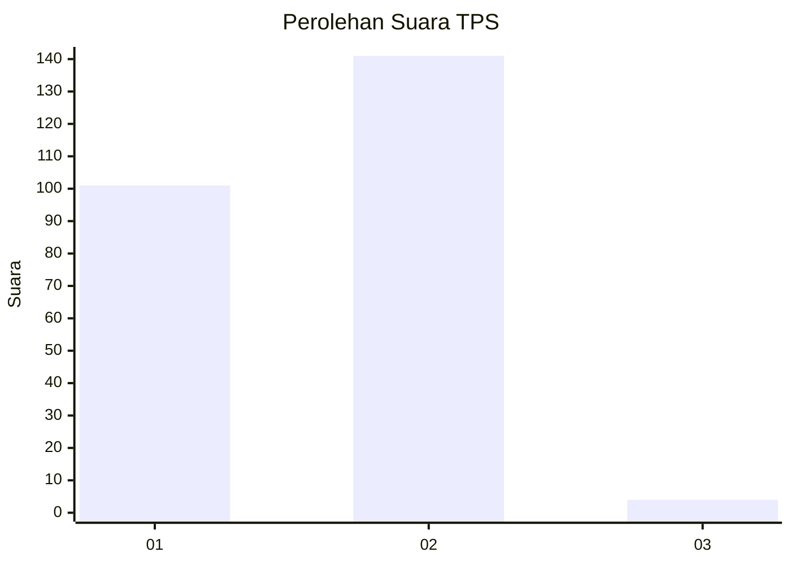

# Hasil

## Grafik

## Tabel

| No. | Nama Paslon    | Suara | Suara (raw) | Persentase |
|:--- |:-------------- | -----:| -----------:| ----------:|
| 1   | ANIES MUHAIMIN | 101   | [101][p-1]  | 41,06      |
| 2   | PRABOWO GIBRAN | 141   | [141][p-2]  | 57,32      |
| 3   | GANJAR MAHFUD  | 4     | [4][p-3]    | 1,63       |

[p-1]: https://github.com/gigit-pemilu/pemilu-2024-52-nusa-tenggara-barat/blob/main/pilpres/hitung-suara/sub/52-nusa-tenggara-barat/sub/71-kota-mataram/sub/04-sekarbela/sub/1001-karang-pule/sub/004-tps/sub/paslon-1.txt
[p-2]: https://github.com/gigit-pemilu/pemilu-2024-52-nusa-tenggara-barat/blob/main/pilpres/hitung-suara/sub/52-nusa-tenggara-barat/sub/71-kota-mataram/sub/04-sekarbela/sub/1001-karang-pule/sub/004-tps/sub/paslon-2.txt
[p-3]: https://github.com/gigit-pemilu/pemilu-2024-52-nusa-tenggara-barat/blob/main/pilpres/hitung-suara/sub/52-nusa-tenggara-barat/sub/71-kota-mataram/sub/04-sekarbela/sub/1001-karang-pule/sub/004-tps/sub/paslon-3.txt

## Foto C Plano

https://sirekap-obj-formc.kpu.go.id/5ad6/pemilu/ppwp/52/71/04/10/01/5271041001004-20240319-112457--cfde69f5-f2bc-458e-aeae-7a62a1c7e6cc.jpg

https://sirekap-obj-formc.kpu.go.id/5ad6/pemilu/ppwp/52/71/04/10/01/5271041001004-20240214-231611--45cff2be-379e-4874-a30e-1ad5fa7032df.jpg

https://sirekap-obj-formc.kpu.go.id/5ad6/pemilu/ppwp/52/71/04/10/01/5271041001004-20240214-231306--40d8e5c0-6be2-41aa-a600-de80c7632bc0.jpg

## Metadata

| Key        | Value               |
| ---------- | ------------------- |
| Time Stamp | 2024-03-19 11:30:00 |

