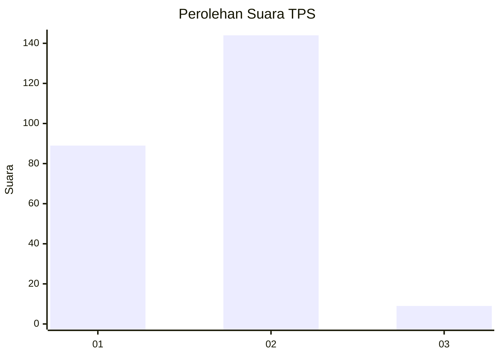
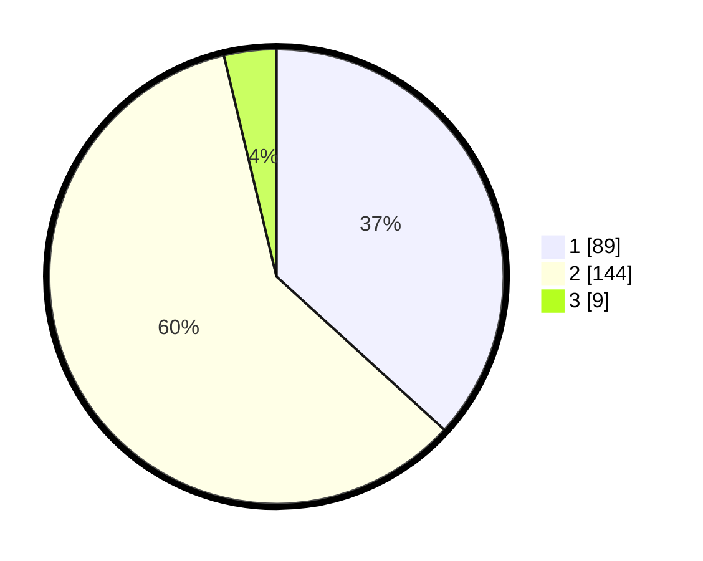

# Hasil

## Grafik

## Tabel

| No. | Nama Paslon    | Suara | Suara (raw) | Persentase |
|:--- |:-------------- | -----:| -----------:| ----------:|
| 1   | ANIES MUHAIMIN | 89    | [89][p-1]   | 36,78      |
| 2   | PRABOWO GIBRAN | 144   | [144][p-2]  | 59,50      |
| 3   | GANJAR MAHFUD  | 9     | [9][p-3]    | 3,72       |

[p-1]: https://github.com/gigit-pemilu/pemilu-2024-52-nusa-tenggara-barat/blob/main/pilpres/hitung-suara/sub/52-nusa-tenggara-barat/sub/71-kota-mataram/sub/04-sekarbela/sub/1001-karang-pule/sub/005-tps/sub/paslon-1.txt
[p-2]: https://github.com/gigit-pemilu/pemilu-2024-52-nusa-tenggara-barat/blob/main/pilpres/hitung-suara/sub/52-nusa-tenggara-barat/sub/71-kota-mataram/sub/04-sekarbela/sub/1001-karang-pule/sub/005-tps/sub/paslon-2.txt
[p-3]: https://github.com/gigit-pemilu/pemilu-2024-52-nusa-tenggara-barat/blob/main/pilpres/hitung-suara/sub/52-nusa-tenggara-barat/sub/71-kota-mataram/sub/04-sekarbela/sub/1001-karang-pule/sub/005-tps/sub/paslon-3.txt

## Foto C Plano

https://sirekap-obj-formc.kpu.go.id/cfef/pemilu/ppwp/52/71/04/10/01/5271041001005-20240319-112520--34db57fb-79e4-47c3-a9d5-5dfb3aa84e55.jpg

https://sirekap-obj-formc.kpu.go.id/cfef/pemilu/ppwp/52/71/04/10/01/5271041001005-20240214-230401--ecce4d9f-6144-4787-9f3a-5dd594a0ae13.jpg

https://sirekap-obj-formc.kpu.go.id/cfef/pemilu/ppwp/52/71/04/10/01/5271041001005-20240319-112537--816f92ab-c6d3-468e-ac9d-8157ac97799a.jpg

## Metadata

| Key        | Value               |
| ---------- | ------------------- |
| Time Stamp | 2024-03-19 11:30:00 |

