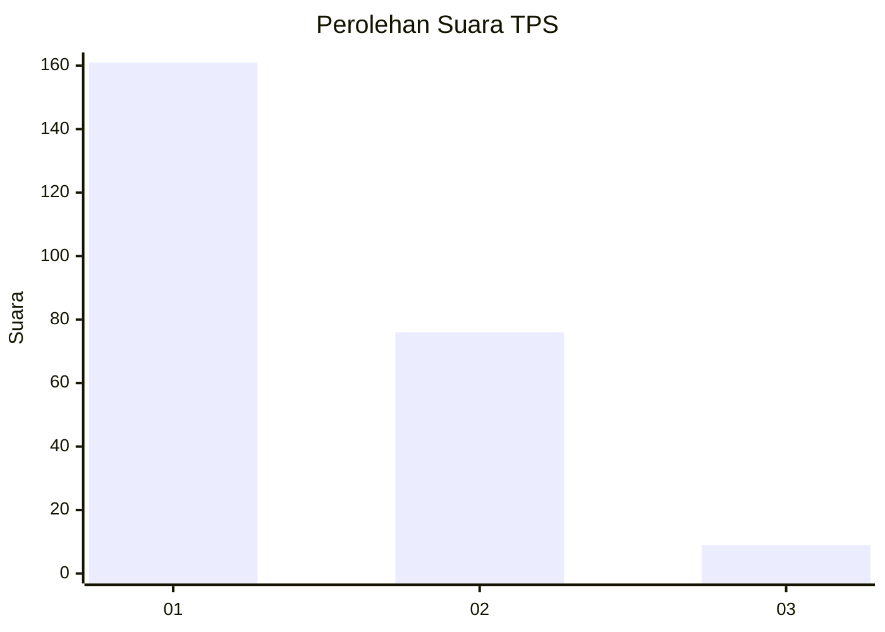
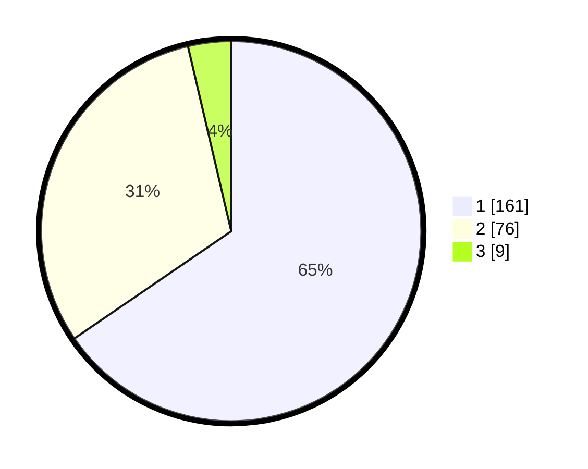

# Hasil

## Grafik

## Tabel

| No. | Nama Paslon    | Suara | Suara (raw) | Persentase |
|:--- |:-------------- | -----:| -----------:| ----------:|
| 1   | ANIES MUHAIMIN | 161   | [161][p-1]  | 65,45      |
| 2   | PRABOWO GIBRAN | 76    | [76][p-2]   | 30,89      |
| 3   | GANJAR MAHFUD  | 9     | [9][p-3]    | 3,66       |

[p-1]: https://github.com/gigit-pemilu/pemilu-2024-52-nusa-tenggara-barat/blob/main/pilpres/hitung-suara/sub/52-nusa-tenggara-barat/sub/71-kota-mataram/sub/04-sekarbela/sub/1001-karang-pule/sub/021-tps/sub/paslon-1.txt
[p-2]: https://github.com/gigit-pemilu/pemilu-2024-52-nusa-tenggara-barat/blob/main/pilpres/hitung-suara/sub/52-nusa-tenggara-barat/sub/71-kota-mataram/sub/04-sekarbela/sub/1001-karang-pule/sub/021-tps/sub/paslon-2.txt
[p-3]: https://github.com/gigit-pemilu/pemilu-2024-52-nusa-tenggara-barat/blob/main/pilpres/hitung-suara/sub/52-nusa-tenggara-barat/sub/71-kota-mataram/sub/04-sekarbela/sub/1001-karang-pule/sub/021-tps/sub/paslon-3.txt

## Foto C Plano

https://sirekap-obj-formc.kpu.go.id/35c7/pemilu/ppwp/52/71/04/10/01/5271041001021-20240215-000520--bfd62183-cb29-4e2c-9e1d-e750501e56b6.jpg

https://sirekap-obj-formc.kpu.go.id/35c7/pemilu/ppwp/52/71/04/10/01/5271041001021-20240215-000625--6440521c-2b04-4760-9a53-7ea75d8afebe.jpg

https://sirekap-obj-formc.kpu.go.id/35c7/pemilu/ppwp/52/71/04/10/01/5271041001021-20240215-001601--c0839a9b-f4c4-4813-a31c-d216858defe3.jpg

## Metadata

| Key        | Value               |
| ---------- | ------------------- |
| Time Stamp | 2024-02-19 06:16:00 |

