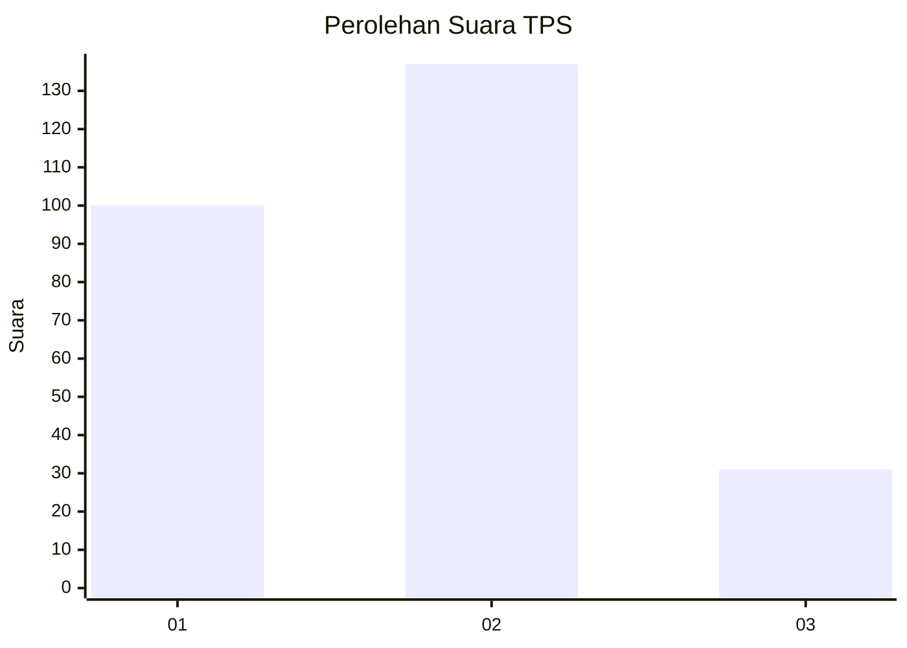
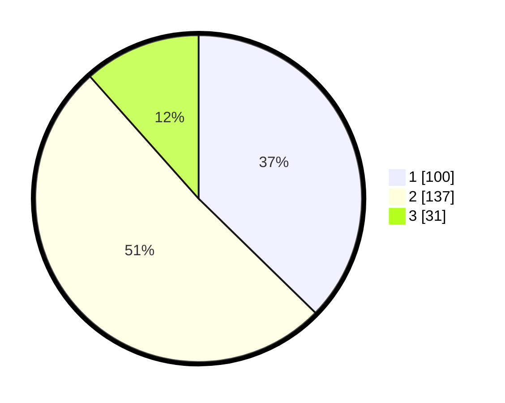

# Hasil

## Grafik

## Tabel

| No. | Nama Paslon    | Suara | Suara (raw) | Persentase |
|:--- |:-------------- | -----:| -----------:| ----------:|
| 1   | ANIES MUHAIMIN | 100   | [100][p-1]  | 37,31      |
| 2   | PRABOWO GIBRAN | 137   | [137][p-2]  | 51,12      |
| 3   | GANJAR MAHFUD  | 31    | [31][p-3]   | 11,57      |

[p-1]: https://github.com/gigit-pemilu/pemilu-2024-52-nusa-tenggara-barat/blob/main/pilpres/hitung-suara/sub/52-nusa-tenggara-barat/sub/71-kota-mataram/sub/04-sekarbela/sub/1003-jempong-baru/sub/022-tps/sub/paslon-1.txt
[p-2]: https://github.com/gigit-pemilu/pemilu-2024-52-nusa-tenggara-barat/blob/main/pilpres/hitung-suara/sub/52-nusa-tenggara-barat/sub/71-kota-mataram/sub/04-sekarbela/sub/1003-jempong-baru/sub/022-tps/sub/paslon-2.txt
[p-3]: https://github.com/gigit-pemilu/pemilu-2024-52-nusa-tenggara-barat/blob/main/pilpres/hitung-suara/sub/52-nusa-tenggara-barat/sub/71-kota-mataram/sub/04-sekarbela/sub/1003-jempong-baru/sub/022-tps/sub/paslon-3.txt

## Foto C Plano

https://sirekap-obj-formc.kpu.go.id/9a70/pemilu/ppwp/52/71/04/10/03/5271041003022-20240214-205936--3af4a06d-af1f-41b8-8f0e-ccfa90b00203.jpg

https://sirekap-obj-formc.kpu.go.id/9a70/pemilu/ppwp/52/71/04/10/03/5271041003022-20240214-210106--874bb6f0-543b-4c89-8c8e-594adb7cf553.jpg

https://sirekap-obj-formc.kpu.go.id/9a70/pemilu/ppwp/52/71/04/10/03/5271041003022-20240214-210206--131ef55f-8b7a-48c5-bab9-fe3a3f8a3565.jpg

## Metadata

| Key        | Value               |
| ---------- | ------------------- |
| Time Stamp | 2024-02-19 06:16:00 |

