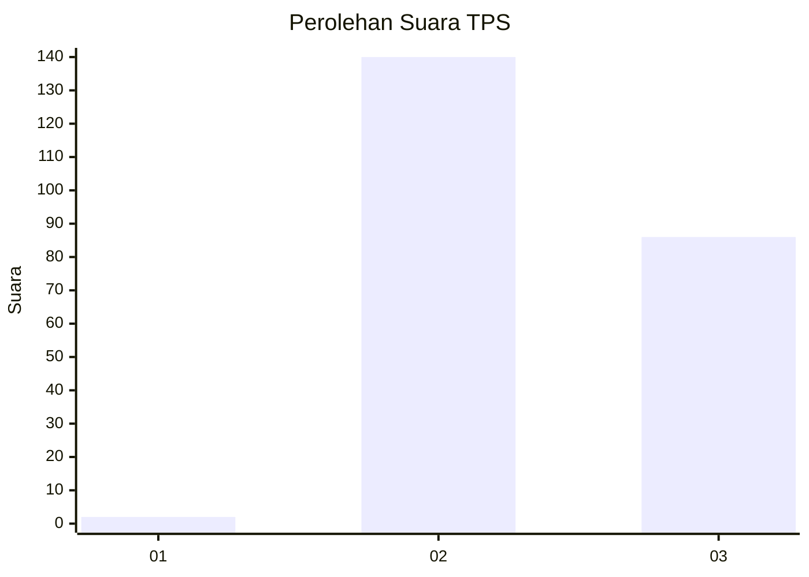
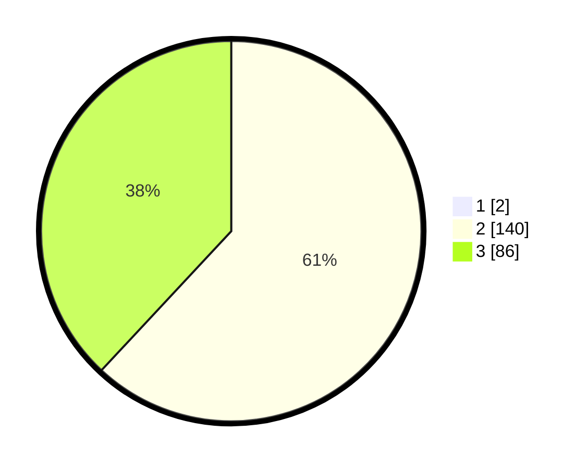

# Hasil

## Grafik

## Tabel

| No. | Nama Paslon    | Suara | Suara (raw) | Persentase |
|:--- |:-------------- | -----:| -----------:| ----------:|
| 1   | ANIES MUHAIMIN | 2     | [2][p-1]    | 0,88       |
| 2   | PRABOWO GIBRAN | 140   | [140][p-2]  | 61,40      |
| 3   | GANJAR MAHFUD  | 86    | [86][p-3]   | 37,72      |

[p-1]: https://github.com/gigit-pemilu/pemilu-2024-52-nusa-tenggara-barat/blob/main/pilpres/hitung-suara/sub/52-nusa-tenggara-barat/sub/71-kota-mataram/sub/05-selaparang/sub/1001-mataram-barat/sub/003-tps/sub/paslon-1.txt
[p-2]: https://github.com/gigit-pemilu/pemilu-2024-52-nusa-tenggara-barat/blob/main/pilpres/hitung-suara/sub/52-nusa-tenggara-barat/sub/71-kota-mataram/sub/05-selaparang/sub/1001-mataram-barat/sub/003-tps/sub/paslon-2.txt
[p-3]: https://github.com/gigit-pemilu/pemilu-2024-52-nusa-tenggara-barat/blob/main/pilpres/hitung-suara/sub/52-nusa-tenggara-barat/sub/71-kota-mataram/sub/05-selaparang/sub/1001-mataram-barat/sub/003-tps/sub/paslon-3.txt

## Foto C Plano

https://sirekap-obj-formc.kpu.go.id/0117/pemilu/ppwp/52/71/05/10/01/5271051001003-20240214-222953--ff6efcd2-7c4d-43b4-afe9-1a0f0011bf8a.jpg

https://sirekap-obj-formc.kpu.go.id/0117/pemilu/ppwp/52/71/05/10/01/5271051001003-20240214-203636--68687739-ad49-4fbb-abed-9f9cbf7c1dbc.jpg

https://sirekap-obj-formc.kpu.go.id/0117/pemilu/ppwp/52/71/05/10/01/5271051001003-20240214-203653--2b688249-8acd-4de3-a48d-d160065e2b7c.jpg

## Metadata

| Key        | Value               |
| ---------- | ------------------- |
| Time Stamp | 2024-02-15 21:01:18 |

