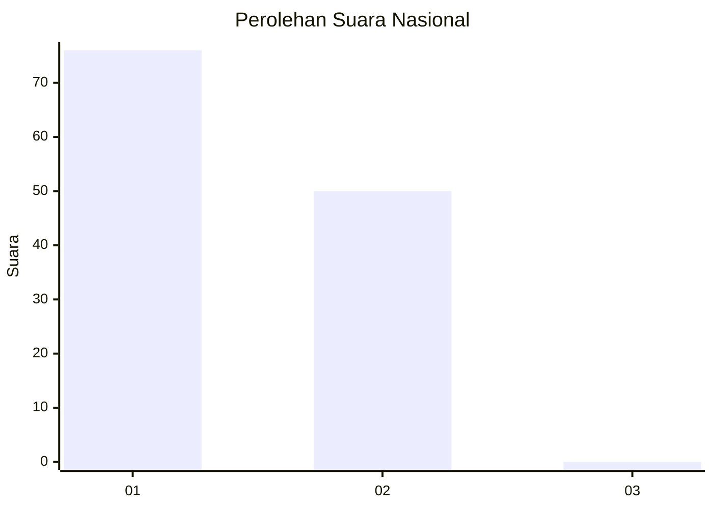
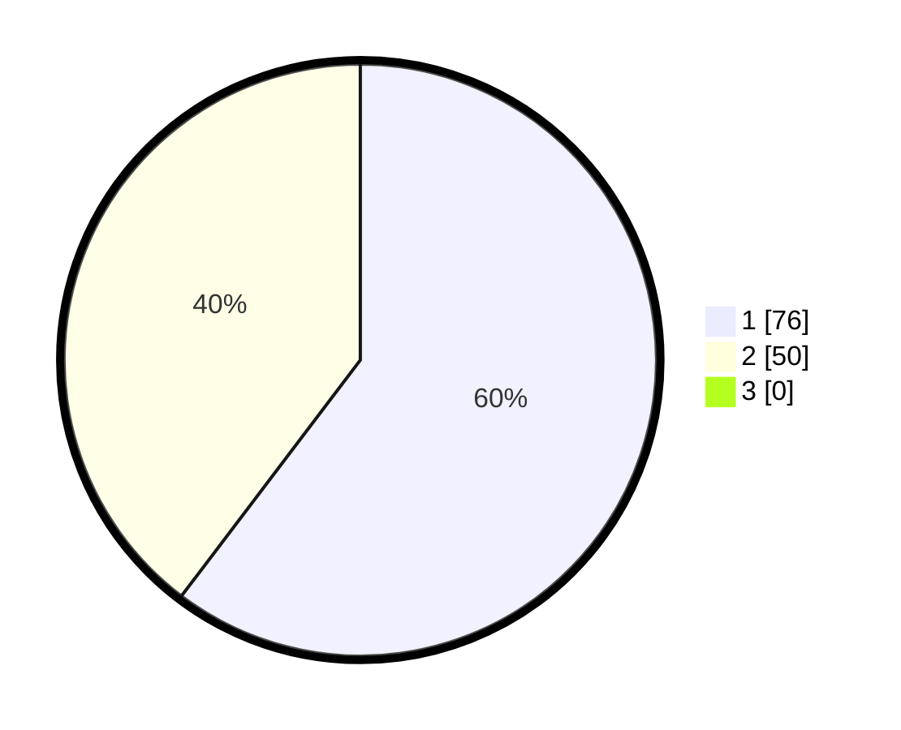

# Hasil

## Grafik

## Tabel

| No. | Nama Paslon    | Suara | Suara (raw) | Persentase |
|:--- |:-------------- | -----:| -----------:| ----------:|
| 1   | ANIES MUHAIMIN | 76    | [76][p-1]   | 60,32      |
| 2   | PRABOWO GIBRAN | 50    | [50][p-2]   | 39,68      |
| 3   | GANJAR MAHFUD  | 0     | [0][p-3]    | 0,00       |

[p-1]: https://github.com/gigit-pemilu/pemilu-2024/blob/main/pilpres/hitung-suara/sub/52-nusa-tenggara-barat/sub/71-kota-mataram/sub/05-selaparang/sub/1002-dasan-agung/sub/012-tps/sub/paslon-1.txt
[p-2]: https://github.com/gigit-pemilu/pemilu-2024/blob/main/pilpres/hitung-suara/sub/52-nusa-tenggara-barat/sub/71-kota-mataram/sub/05-selaparang/sub/1002-dasan-agung/sub/012-tps/sub/paslon-2.txt
[p-3]: https://github.com/gigit-pemilu/pemilu-2024/blob/main/pilpres/hitung-suara/sub/52-nusa-tenggara-barat/sub/71-kota-mataram/sub/05-selaparang/sub/1002-dasan-agung/sub/012-tps/sub/paslon-3.txt

## Foto C Plano

https://sirekap-obj-formc.kpu.go.id/1d1a/pemilu/ppwp/52/71/05/10/02/5271051002012-20240220-114324--24990c34-0499-464d-ab74-abbf55558399.jpg

https://sirekap-obj-formc.kpu.go.id/1d1a/pemilu/ppwp/52/71/05/10/02/5271051002012-20240220-141454--4dcec6b5-7442-4748-ad72-88d0fa5b357d.jpg

https://sirekap-obj-formc.kpu.go.id/1d1a/pemilu/ppwp/52/71/05/10/02/5271051002012-20240220-114650--f0913583-5f00-4c00-9d0c-b42fcfd0c95d.jpg

## Metadata

| Key        | Value               |
| ---------- | ------------------- |
| Time Stamp | 2024-02-20 15:00:00 |

