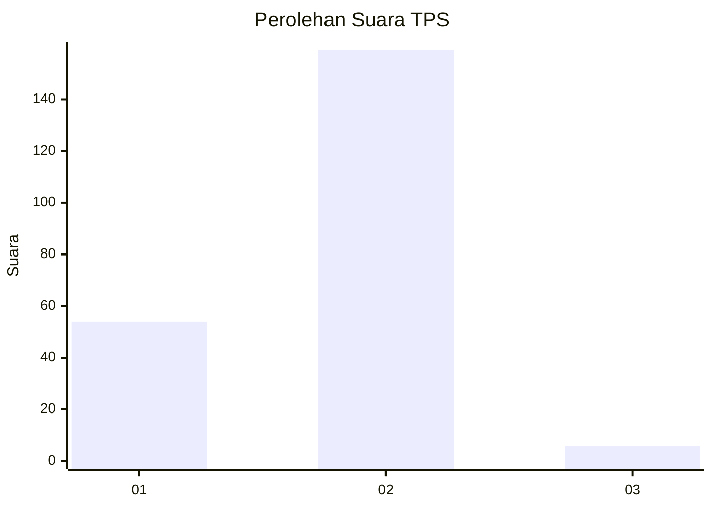
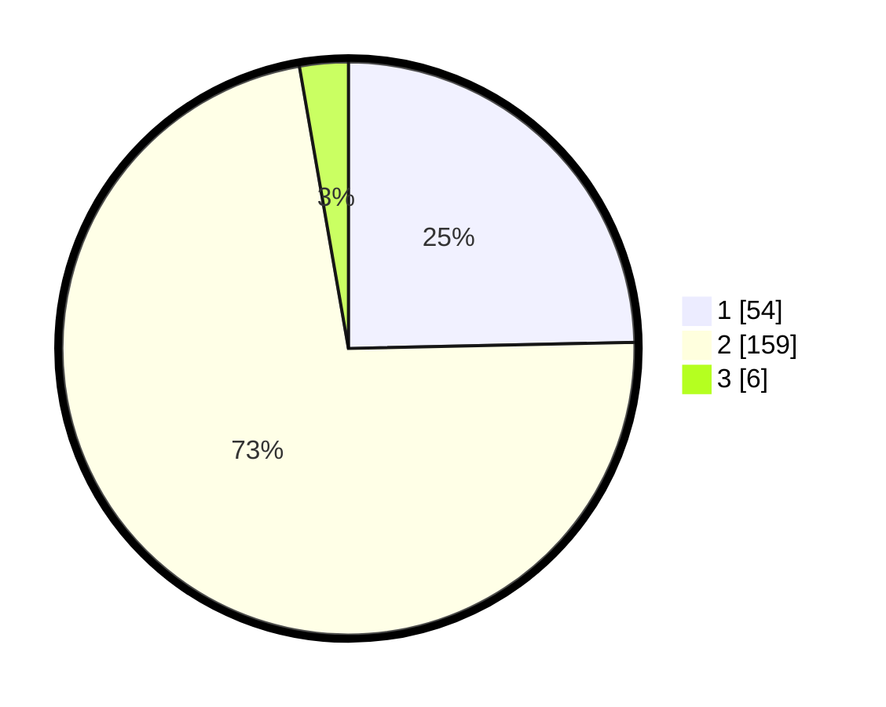

# Hasil

## Grafik

## Tabel

| No. | Nama Paslon    | Suara | Suara (raw) | Persentase |
|:--- |:-------------- | -----:| -----------:| ----------:|
| 1   | ANIES MUHAIMIN | 54    | [54][p-1]   | 24,66      |
| 2   | PRABOWO GIBRAN | 159   | [159][p-2]  | 72,60      |
| 3   | GANJAR MAHFUD  | 6     | [6][p-3]    | 2,74       |

[p-1]: https://github.com/gigit-pemilu/pemilu-2024-52-nusa-tenggara-barat/blob/main/pilpres/hitung-suara/sub/52-nusa-tenggara-barat/sub/71-kota-mataram/sub/06-sandubaya/sub/1001-dasan-cermen/sub/001-tps/sub/paslon-1.txt
[p-2]: https://github.com/gigit-pemilu/pemilu-2024-52-nusa-tenggara-barat/blob/main/pilpres/hitung-suara/sub/52-nusa-tenggara-barat/sub/71-kota-mataram/sub/06-sandubaya/sub/1001-dasan-cermen/sub/001-tps/sub/paslon-2.txt
[p-3]: https://github.com/gigit-pemilu/pemilu-2024-52-nusa-tenggara-barat/blob/main/pilpres/hitung-suara/sub/52-nusa-tenggara-barat/sub/71-kota-mataram/sub/06-sandubaya/sub/1001-dasan-cermen/sub/001-tps/sub/paslon-3.txt

## Foto C Plano

https://sirekap-obj-formc.kpu.go.id/102e/pemilu/ppwp/52/71/06/10/01/5271061001001-20240215-061013--e47b0006-8af3-4865-afd6-b883743e11ca.jpg

https://sirekap-obj-formc.kpu.go.id/102e/pemilu/ppwp/52/71/06/10/01/5271061001001-20240215-061136--174398c9-a1f9-4c6a-9ee9-3b6efe802914.jpg

https://sirekap-obj-formc.kpu.go.id/102e/pemilu/ppwp/52/71/06/10/01/5271061001001-20240215-061633--0474bf76-e455-49d1-88f9-246cf56ebf1f.jpg

## Metadata

| Key        | Value               |
| ---------- | ------------------- |
| Time Stamp | 2024-02-19 06:16:00 |

